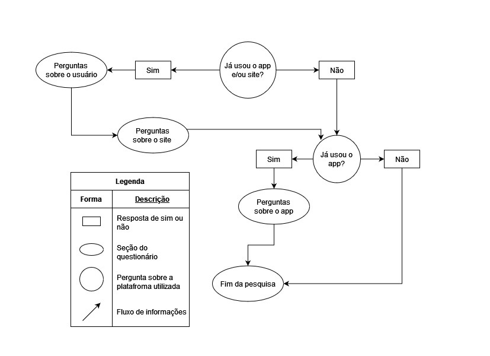

## Introdução

O uso de questionários online está entre as técnicas mais usadas para coleta de dados de usuários, devido a realização remota, em que o participante escolhe o momento que lhe for mais favorável para responder, e a possibilidade de investigar usuários que residem além do local de formulação do próprio questionário, ele pode ser composto por uma mesclagem de perguntas abertas - em que os usuários emitem sua opinião de forma mais livre - e fechadas - onde o usuário possui uma quantidade limitada de opções pré-definidas para escolher como resposta - que podem ser feitas para um grande volume de participantes (Barbosa et al. , 2021, páginas 149 a 151).

## Metodologia

O questionário elaborado foi enviado em grupos de telegram e whatsapp, com destaque para os grupos de alunos do campus da Faculdade do Gama (FGA) pelo o seu grande número de usuários. O período de aceitação de respostas para o questionário foi do dia 12/04/2024 ao 16/04/2024, porém, apenas 26 respostas foram coletadas e dentre estas, apenas 23 concordaram com o termo de consentimento e realizaram a pesquisa. O questionário começa com a apresentação do grupo e objetivo do mesmo, logo em seguida, é apresentado o [termo de consentimento](../../assets/perguntas_questionario/Termo_de_consentimento.pdf), caso o participante esolha a opção de não aceitá-lo, a página seguinte será a de encerramento da pesquisa, caso contrário, o usuário seguirá o fluxo presente na figura 1.

Figura 01 - Fluxo de seções do questionário.

Fonte: [Gabriel F. J. Silva](https://github.com/MMcLovin), 2024 

## Perguntas/Respostas

### Pergunta 1 

Figura 02 - Gráfico pergunta 1 do questionário.

Fonte: [Gabriel B. Bertolazi](https://github.com/BErtolazi), 2024 

### Pergunta 2

Figura 03 - Gráfico pergunta 2 do questionário.

Fonte: [Gabriel B. Bertolazi](https://github.com/BErtolazi), 2024  

### Pergunta 3

Figura 04 - Gráfico pergunta 3 do questionário.

Fonte: [Gabriel B. Bertolazi](https://github.com/BErtolazi), 2024  

### Pergunta 4

Figura 05 - Gráfico pergunta 4 do questionário.

Fonte: [Gabriel B. Bertolazi](https://github.com/BErtolazi), 2024  

### Pergunta 5

Figura 06 - Gráfico pergunta 5 do questionário.

Fonte: [Gabriel B. Bertolazi](https://github.com/BErtolazi), 2024  

### Pergunta 6

Figura 07 - Gráfico pergunta 6 do questionário.

Fonte: [Gabriel B. Bertolazi](https://github.com/BErtolazi), 2024  

### Pergunta 7

Figura 08 - Gráfico pergunta 7 do questionário.

Fonte: [Gabriel B. Bertolazi](https://github.com/BErtolazi), 2024  

### Pergunta 8

Figura 09 - Gráfico pergunta 8 do questionário.

Fonte: [Gabriel B. Bertolazi](https://github.com/BErtolazi), 2024  

### Pergunta 9

Figura 10 - Gráfico pergunta 9i do questionário.

Fonte: [Gabriel B. Bertolazi](https://github.com/BErtolazi), 2024  

### Pergunta 10

Figura 11 - Gráfico pergunta 10 do questionário.

Fonte: [Gabriel B. Bertolazi](https://github.com/BErtolazi), 2024  

## Resultados

Pela imagem 01 e 02 percebemos que 60.9% dos entrevistados usam o sistema e em sua maioria (exatamenete 92.9%) dos usuários utilizam o aplicativo de forma ocasional, nossa pesquisa também nos mostrou que nenhum usuário acessa o aplicativo diariamente ou semanalmente, ou seja, os outros 7.1% dos usuários acessa mensalmente. 
Pela imagem 3 percebemos que ninguém usa o aplicativo do correio para compra de produtos nas lojas, nem para adiquirir produtos na loja do correios. Percebemos também que 100% dos usuários utilizam a função de rastrear encomendas. e que apenas 7.1% dos entrevistados utilizam as outras funções mencionadas na pesquisa. Além disso nas outras figuras percebemos que a insatisfação em todas as funcionalidades menos na de status da encomenda são insatisfatórios.

## Requisitos Elicitados

Legenda Requisitos das tabelas:

- RFx: Requisito Funcional nºx
- RNFx: Requisito Não-Funcional nºx
- Qx: Requisito nºx elicitado pelo questionário.

Tabela 1 - Requisitos funcionais.

| <a id="anchor_BS" style="color:black;"> ID</a> | Descrição| Código | Implementado |
| :-: | --- | :-: | :-: |
| Q01 | As informçãoes na página de reastreio | RF01 | Sim |
| Q02 | Filtrar o tipo de encomenda pelo tipo de entrega | RF02 | Não |
| Q03 | Assistente virtual dos correios | RF03 | Não |
| Q04 | Chat para se comunicar diretamente com o fornecedor | RF04 | Não |
| Q05 | Chat para se comunicar diretamente com o entregador | RF05 | Não |
| Q06 | Pagamento de tributos e taxas de importação | RF06 | Não 

Fonte: [Gabriel B. Bertolazi](https://github.com/Bertolazi), 2024 

<!-- ****************************        Tabela 2        ****************************** -->

Tabela 2 - Requisitos não funcionais.

| <a id="anchor_BS" style="color:black;"> ID</a> | Descrição| Código | Implementado |
| :-: | --- | :-: | :-: |
| Q07 | A opção de filtrar encomendas deve ser de fácil acesso (até 2 frames de ajuda a partir da página de encomendas) | RNF01 | Sim |
| Q08 | O aplicativo deve notificar o usuário com eficácia (deve enviar uma notificação 100% das vezes em que houver uma atualização sobre qualquer encomenda) | RFN02 | Não |
| Q09 | As informações sobre o rastreio de encomendas devem ser precisas (fornecem data, hora e local em cada atualização da encomenda) | RNF03 | Sim |
| Q10 | O usuário deve estar satisfeito com a aplicação (Caso seja solicitado, mais de 70% dos usuários devem atribuir uma nota igual ou maior que 3 - em uma escala de 1 a 5 - ao recomendar o aplicativo dos Correios a um amigo) | RNF04 | Sim |
| Q11 | A opção de rastrear encomendas deve ser de fácil acesso (deve estar na página principal e o usuário não deve demorar mais de 2 minutos para achá-la) | RNF05 | Sim |
| Q12 | O chat com o entregador deve ser confiável (as mensagens devem ser arquivadas por um período de até 1 ano) | RNF06 | Não |

Fonte: [Gabriel F. J. Silva](https://github.com/MMcLovin), 2024 

## Referências

>1. Barbosa, S. D. J.; Silva, B. S. da; Silveira, M. S.; Gasparini, I.; Darin, T.; Barbosa, G. D. J. (2021) Interação Humano-Computador e Experiência do usuário. Autopublicação. ISBN: 978-65-00-19677-1.

## Bibliografia

>* Sommerville, Ian. Engenharia de software, Edição 9. Editora Pearson Prentice Hall, 2011. Disponível em: <https://www.facom.ufu.br/~william/Disciplinas%202018-2/BSI-GSI030-EngenhariaSoftware/Livro/engenhariaSoftwareSommerville.pdf>. Acesso em: 16 de Abril de 2024 
>* Grupo 01 de Requisitos de Software 2023.1. Projeto do aplicativo  Bilheteria Digital. Disponível em :  <https://requisitos-de-software.github.io/2023.1-BilheteriaDigital/>. Acesso em: 16 de Abril de 2024

## Histórico de Versões

| Versão | Data | Descrição | Autor(es) | Revisor(es) |
| :----: | :--: | --------- | ----------- | ------ |
| `1.0`  | 15/04/2024 | Criação do documento | [Gabriel F. J. Silva](https://github.com/MMcLovin) |  |
| `1.1` | 17/04/2024 | Adicionando imagens e texto | [Gabriel B. Bertolazi](https://github.com/BErtolazi) |