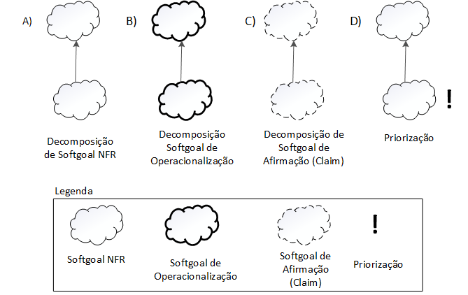
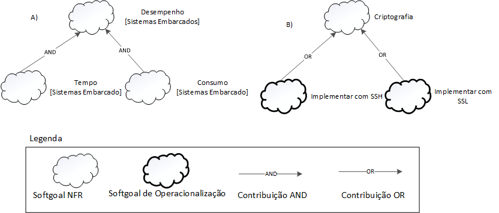

# NFR Framework

## Introdução

O NFR Framework é uma abordagem conceitual projetada para representar e analisar os Requisitos Não-Funcionais (RNFs) em sistemas de software. Utilizando o conceito de "softgoals", que são objetivos que não possuem uma clara definição nem critérios de satisfação precisos, o framework permite a representação das características do sistema e do domínio, considerando inter-relações entre esses softgoals. Além disso, oferece um método qualitativo para analisar o status dos softgoals, com base na satisfação de outros softgoals relacionados.

Com catálogos de requisitos organizados, o NFR Framework auxilia os desenvolvedores na escolha de alternativas de desenvolvimento, considerando interdependências e trade-offs entre os RNFs específicos. Essa estrutura flexível contribui para a implementação de soluções personalizadas que atendam às necessidades do sistema e do usuário.

### SIG - Softgoal Interdependency Graph

Gráfico de interdependências entre softgoals é um gráfico que registra as considerações do desenvolvedor sobre os softgoals, como também armazenam um registro completo das decisões de desenvolvimento e da lógica do projeto de forma gráfica e concisa. Esse registro inclui Requisitos Não-funcionais e suas alternativas, decisões e justificativas associadas às decisões

### Tipos de softgoals

- **Softgoals NFR**: Característica abstrata, a qual se deseja considerar na análise, visando saber se a mesma será cumprida ou não cumprida. Representam requisitos não-funcionais em um sistema de software. Eles geralmente não possuem critérios de satisfação precisos e são expressos de forma qualitativa.

- **Softgoals de Operacionalização**: Representam as soluções de implementação de forma concreta para viabilizar ou não as características abstratas, como os softgoals NFR ou outros softgoals de operacionalização. Essencialmente os softgoals de operacionalização são as funcionalidades.

- **Softgoals de Afirmação**: Anotações que podem ser acrescentadas ao modelo, argumentando algo sobre um ponto específico da modelagem. Os softgoals de afirmação fornecem as razões para as decisões de desenvolvimento, facilitando a revisão, a justificativa e a mudança do sistema, bem como o aprimoramento da rastreabilidade.

Figura 1 - Tipos de softgoals.

Fonte: (CHUNG et al., 2000)

A figura 1 ilustra as representações dos tipos de softgoals utilizados no nfr framework, eles são representados por nuvens podendo ter linhas mais claras, mais escuras e linhas tracejadas.

## Interdependências

As interdependências representam as ligações entre os softgoals e os tipos de interdependência utilizadas pelo framework são: os refinamentos e as contribuições(CHUNG et al., 2000).Os refinamentos são o tipo de interdependência que se sucede de cima para baixo com um softgoal pai que produz softgoals filhos aos quais se conectam com seu ancestral. Os tipos de refinamento são: decomposição, operacionalização e afirmação.

### Decomposições
As decomposições realizam o refinamento dos softgoals obtendo softgoals mais específicos e especializados contribuindo para o projeto. Os quatro tipos de decomposição são descritos abaixo:

* **Decomposição de Softgoal NFR:** Realiza o refinamento de softgoals subdivindindo em softgoals mais específicos, o que auxilia a separar problemas grandes em tarefas menores.
* **Decomposição de Operacionalização:** Refina um softgoal de operacionalização dividindo-o em softgoals menores. Operacionalizações são adequadas para criar uma solução geral e a refinar em soluções menores.
* **Decomposição de Afirmação:** Refina um softgoal de afirmação em softgoals menores. A decomposição de afirmação é útil para afirmar ou negar justificativas mais específicas do projeto.
* **Priorização**: Sendo um tipo especial de decomposição, a priorização aprimora um softgoal em outro com as mesmas características e tópicos, mas com uma prioridade associada.

Abaixo temos os tipos de decomposições na figura 02:

Figura 02 - Tipos de Decomposições

Fonte: (CHUNG et al., 2000) 

### Contribuições

No NFR Framework pode-se utilizar de vários tipos de contribuições que explicam de que maneira a satisfação ou não de um softgoal descendente auxilia a satisfação do softgoal ascendente. Abaixo estão os tipo de contribuições:

* **AND:** Define que se os softgoals descendentes são satisfeitos os ascendentes também serão.
* **OR:** Afirma que se pelomenos um softgoal descendente for satisfeito o ascendente também será.
* **MAKE(++):** Concede uma contribuição razoavelmente positiva entre o softgoal ascendente e o descendente. Assim, em caso de utilizar MAKE se o softgoal descendente for satisfeito o ascendente também será.
* **BREAK(--):** Concede uma contribuição razoavelmente negativa entre um softgoal descendente e um ascendente. Ao utilizar o BREAK caso o softgoal descendente for suficientemente satisfeito o ascendente será negado.
* **HELP(+):**  Concede uma contribuição moderadamente positiva entre um softgoal anscendente e um descendente. Assim ao usar o HELP em caso do softgoal descentente for moderadamente satisfeito o ascendente também será. 
* **HURT(-):** Concede uma contribuição moderadamente negativa entre um softgoal anscendente e um descendente. Assim ao usar o HELP em caso do softgoal descentente for moderadamente satisfeito o ascendente será moderadamente negado.
* **UNKNOWN(?):** Concede uma contribuição desconhecida entre o softgoal ascendente e o descendente, podendo ser negativa ou positiva.
* **EQUALS:** Afirma que se o softgoal ascendente for satisfeito o descendente definitivamente também será e em caso do ascendente ser negado o descendente também será.
* **SOME:**  É utilizado em caso se conhecer o sinal de uma contribuição mas não sabendo se é parcial ou total, então ficando a dúvida de se utilizar HELP ou Make, HURT ou BREAK, utiliza-se o SOME.

Abaixo nas figuras 03 e 04 encontra-se respectivamente exemplos das contribuições " AND ", " OR " e " MAKE ", "BREAK", " HELP " e " HURT ".

**Figura 03** - Tipos de Decomposições

**Fonte:** (SILVA, Reinaldo Antônio. NFR4ES).

**Figura 04** - Tipos de Decomposições

**Fonte:** (SILVA, Reinaldo Antônio. NFR4ES).

## Propagação de Impactos

A propagação de impactos denota a relação entre os requisitos não-funcionais e como a mudança em um requisito pode provocar mudanças em requisitos relacionados. São utilizados para representar esses impactos os softgoals de impacto. Abaixo estão representados a notação com a qual eles são utilizados:

* **✓** (Satisfeito): Mostra que que o requisitos não-funcional colabora positivamente para a satisfação de outro requisitos;
* **𝒲+** (Minimamente Satisfeito): Mostra uma relação positiva mas em menor grau.
* **X** (Negado): Denota um requisitos não funcional que influencia negativamente outro requisito, gerando contradição na relação de ambos.
* **𝒲-** (Minimamente Negado): Mostra uma relação negativa entre requisitos não funcionais, mas com um grau menor.
* **🗲** (Conflitante): Denota uma relação conflitante entre dois requisitos não funcionais, isso acontece quando um requisito que possui característica positiva se relaciona com um que possui característica negativa.
* **u** (Indeterminado): Ocorre quando não há informações suficientemente para afirmar a qual o impacto de um requisito para com outro.

## Cartão de Especificação

O uso de cartões de especificação oferece uma maneira organizada e concisa de descrever cada requisito não funcional, fornecendo informações essenciais, como descrição, justificativa, origem, critério de ajuste, dependências, prioridade, conflitos e histórico de modificações. A tabela 1 oferece uma visão abrangente e acessível dos RNFs, descrevendo cada tópico a ser elaborado no cartão de especificação.

Tabela 1 - Cartão de especificação utilizado para exemplificar os RNFs.

| **NR Requisito** | Um número sequencial + sua classificação |
|-|-|
| **Descrição** | Declaração única do significado do requisito |
| **Justificativa** | Justificativa sobre a criação do requisito |
| **Origem** | Origem do requisito (stackeholder, norma técnica, etc) |
| **Critério de ajuste** | Métrica do requisito que possa ser testada e que deve ser satisfeita |
| **Dependências** | Requisitos relacionados a este |
| **Prioridade** | Um número usado para decidir a importância relativa deste requisito entre os outros RNFs. Número variando de 1 a 10 onde 1 é a prioridade mínima e 10 a máxima |
| **Conflitos** | Requisitos conflitantes com este |
| **História** | Data de criação e de modificações |

Fonte: SILVA, Reinaldo Antônio, 2024

## Metodologia

Para a definiçaõ dos softgoals NFRs utilizados no artefato, foram utilizados os requisitos não funcionais elicitados pela técnica de [elicitação suplementar](../especificacao_suplementar.md), que utiliza na técnica FURPS+. Dentro dos requisitos não funcionais elicitados, foram escolhidos alguns presentes em cada tópico (usabilidade, confiabilidade, desempenho e suportabilidade) para a elaboração dos SIGs e dos cartões de especificação. Os requisitos não funcionais escolhidos estão representados na tabela 2.

Tabela 2 - Requisitos não funcionais.

| Requisito | Classificação | ID |
|-|-|-|
| O aplicativo deve manter a privacidade dos dados do usuário. | Confiabilidade | RNFxx |
| O acesso aos pagamentos deve ser protegido por autenticação do usuário. | Confiabilidade | RNFxx |

Fonte: [Ricardo][RicardoGH] e [Elias][EliasGH], 2024

## NFR Usabilidade

## NFR Confiabilidade

Tabela x - .

| **NR Requisito** | RNFxx |
|-|-|
| **Descrição** | O aplicativo deve manter a privacidade dos dados do usuário. |
| **Justificativa** | Garantir a segurança e privacidade das informações pessoais dos usuários, cumprindo normas e regulamentações de proteção de dados. |
| **Origem** | Equipe de desenvolvimento |
| **Critério de ajuste** | Verificação de que os dados do usuário são protegidos contra acesso não autorizado e utilizados apenas para os fins previstos, conforme políticas de privacidade. |
| **Dependências** | Requisitos de segurança e normas de proteção de dados. |
| **Prioridade** | 10 |
| **Conflitos** | Requisitos que comprometam a segurança ou privacidade dos dados do usuário. |
| **História** | Criado em [data de criação], modificado pela última vez em [data de modificação]. |

Fonte: [Ricardo Augusto][RicardoGH], 2024

Tabela x - .

| **NR Requisito** | RNFxx |
|-|-|
| **Descrição** | O acesso aos pagamentos deve ser protegido por autenticação do usuário. |
| **Justificativa** | Garantir a segurança das transações financeiras dos usuários, prevenindo acesso não autorizado e fraudes. |
| **Origem** | Equipe de desenvolvimento |
| **Critério de ajuste** | Verificação de que o acesso aos pagamentos requer autenticação do usuário antes de permitir transações financeiras. |
| **Dependências** | Requisitos de segurança e privacidade do sistema. |
| **Prioridade** | 9 |
| **Conflitos** | Requisitos que comprometam a segurança do sistema ou a integridade dos dados financeiros dos usuários. |
| **História** | Criado em [data de criação], modificado pela última vez em [data de modificação]. |

Fonte: [Ricardo Augusto][RicardoGH], 2024

## NFR Desempenho

## NFR Suportabilidade

## Bibliografia

> 1. SILVA, Reinaldo Antônio. NFR4ES: Um Catálogo de Requisitos Não-Funcionais para Sistemas Embarcados. 2019. Dissertação (Mestrado em Ciência da Computação) - Centro de Informática da Universidade Federal de Pernambuco, [S. l.], 2019.

## Histórico de Versões

| Versão | Data | Descrição | Autor(es) | Revisor(es) |
| :----: | :--: | --------- | ----------- | ------ |
| `1.0`  | 23/05/2024 | Criação do documento | [Ricardo Augusto][RicardoGH] e [Elias F. Oliveira][EliasGH] |   |

[ClaudioGH]: https://github.com/claudiohsc
[DaniloGH]: https://github.com/Danilo-Carvalho-Antunes
[EliasGH]: https://github.com/EliasOliver21
[GabrielBGH]: https://github.com/Bertolazi
[GabrielFGH]: https://github.com/MMcLovin
[PabloGH]: https://github.com/pabloheika
[RicardoGH]: https://www.github.com/avmricardo
