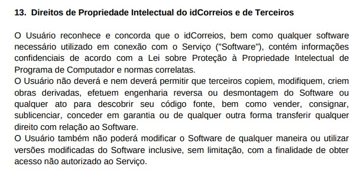

# Introdução

- A cópia do termos de uso e pólitica de privacidade tem como objetivo mostrar a declaração que autoriza o desenvolvimento do projeto da disciplina sobre o aplicativo em específico.

# Cópia do Termos de Uso e Política de Privacidade do Correios

 Figura 1: Termos de uso do aplicativo 

 Fonte: <a href="https://apps.correios.com.br/cas/termo/termo_pt_BR.pdf">Correios Termo de uso</a>  

- Data de acesso: 09/04/2024

- De acordo com a interpretação do grupo sobre o termo de uso, foi concluído que poderemos usar o aplicativos do correio para o projeto da disciplina, visto que ele restringe qualquer uso que tenha como objetivo de descobrir o código fonte do aplicativo, que não é o nosso caso.

- Na data de 09/04/2024, o site oficial do aplicativo do Correios não está com um material disponível sobre os Termo de Uso, esse assunto é abordado [nesse arquivo](https://apps.correios.com.br/cas/termo/termo_pt_BR.pdf).
- Link do site : <https://www.correios.com.br/idcorreios/termos>

## Bibliografia
> 1. Termos de uso dos serviços e privacidade
digital. Disponível em: <https://apps.correios.com.br/cas/termo/termo_pt_BR.pdf>. Acesso em: 09 de Abril de 2024.
## Histórico de Versões

| Versão |     Data    | Descrição   | Autor(es) | Revisor(es) |
| ------ | ----------- | ----------- | --------- | ----------- |
| `1.0`  | 31/03/2024  | copiando termos de uso | [Danilo Carvalho](https://github.com/Danilo-Carvalho-Antunes)|[Pablo S. Costa](https://github.com/pabloheika)|
| `1.1`  | 01/04/2024  | arrumando o histórico de versões | [Danilo Carvalho](https://github.com/Danilo-Carvalho-Antunes)| [Ricardo](https://www.github.com/avmricardo)|
| `1.2`  | 01/04/2024  | Ajustando os tópicos | [Danilo Carvalho](https://github.com/Danilo-Carvalho-Antunes)|[Pablo S. Costa](https://github.com/pabloheika)|
| `2.0`  | 09/04/2024  | Troca de aplicativo, Serasa -> Correios  | [Danilo Carvalho](https://github.com/Danilo-Carvalho-Antunes)|[Ricardo Augusto](https://www.github.com/avmricardo)|