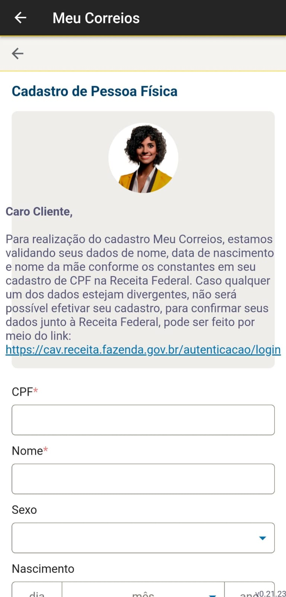
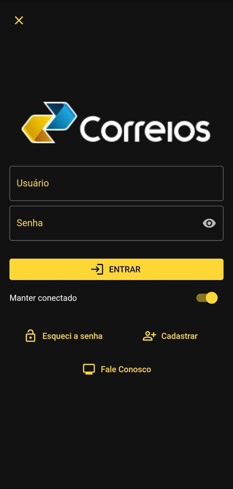
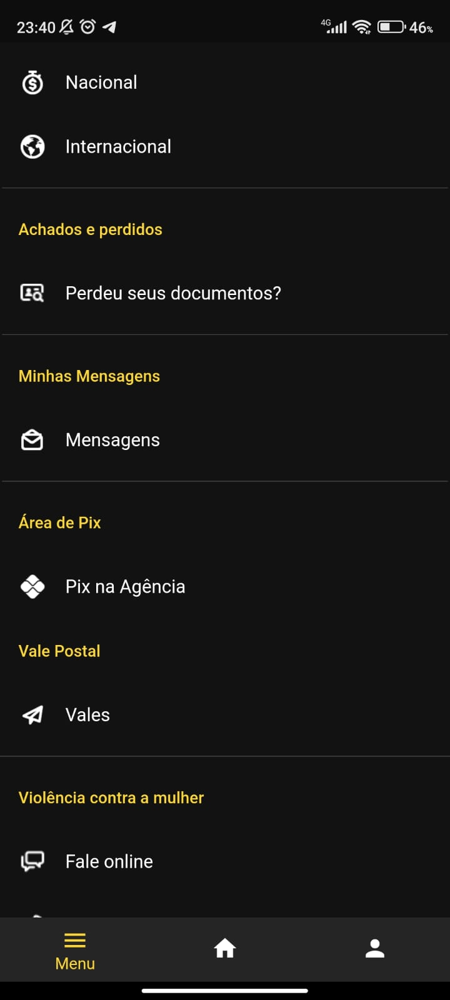
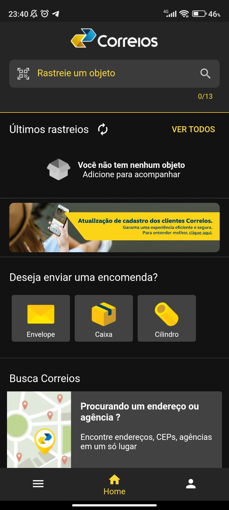

## Introdução

A rastreabilidade é a técnica utilizada para apresentar o relacionamento entre os requisitos, arquitetura e implementação final do sistema, em suma a rastreabilidade conta a história do requisito desde sua fonte na fase de elicitação até a implementação final e o gerenciamento na pre e  pós-rastreabilidade. A rastreabilidade nos ajuda a entender e compreender melhor os relacionamentos já existentes entre os requisitos ou artefatos de requisitos, arquitetura e implementação. A pós-rastreabilidade liga os requisitos ao desenho e implementação do sistema.A rastreabilidade forward-from conecta os requisitos a artefatos de desenho e implementação.

## Metodologia

O método utilizado para fazer o gerenciamento dos requisitos será utilizando o meta-modelo de Toranzo, onde ele elenca quatro níveis de classificação que são:

- Ambiental
- Organizacional
- Gerencial
- Desenvolvimento

Será utilizada somente a classificação a nível de desenvolvimento, visto que estamos realizando um projeto para a disciplina de Requisitos de software analisando um aplicativo, então será utilizado somente teremos como base de informações os artefatos produzidos pelo grupo para a estruturação dos requisitos e suas relações com o material analisado. Será utilizado como descrito por Toranzo a criação de elos que irão interligar os requisitos aos artefatos criados pelo grupo. Abaixo temos a classificação dos tipos para a classificaçãp dos elos criados:

- **Satisfação:** indica que a classe de origem tem dependência de satisfação com classe de destino; 

- **Recurso**: indica que a classe de origem tem dependência de recurso com classe de destino;

- **Responsabilidade**: registra a participação, responsabilidade e ação de pessoas sobre artefatos; 

- **Representação**: captura a representação ou modelagem dos requisitos em outras linguagens; 

- **Alocado**: classe de origem está relacionada à classe de destino, que representa um subsistema; 

- **Agregação**: indica composição de elementos.

Teremos abaixo na tabela 01 a listagem dos requisitos elicitados com a relação de cada artefato produzido pelo grupo, e com suas respectivas siglas para melhormente serem identificados nas tabelas:  

- Legenda:
    - Personas - PS
    - Cenários - CN
    - Léxicos - LX
    - Casos de uso - CSO
    - Tema - TM
    - Épico - EP
    - Histórias de Usuário - US
    - NFR Framework - NFR

## Requisitos Funcionais

Na tabela 01 abaixo temos os requisitos funcionais elicitados e suas relações com os artefatos que foram produzidos na fase de desenvolvimento.

Tabela 01 : Requisitos Funcionais 

Requisito | Descrição | Implementado | Cenário | Léxico | Caso de Uso | Tema | Épico | História de Usuário | NFR Framework |
|  :---:  |  :---:  |  :---:  |  :---:  |  :---:  |  :---:  |  :---:  |  :---:  |  :---:  |  :---:  |
| RF01 | O usuário deve poder realizar cadastro pelo app | Sim | [CN-02](https://requisitos-de-software.github.io/2024.1-Correios/modelagem/cenarios/) | [LX-10](https://requisitos-de-software.github.io/2024.1-Correios/modelagem/lexicos/) | [CSO-02]( https://requisitos-de-software.github.io/2024.1-Correios/modelagem/casos_de_uso/) | [TM-06]( https://requisitos-de-software.github.io/2024.1-Correios/modelagem/agil/backlog/) | [EP-11]([https://requisitos-de-software.github.io/2024.1-Correios/modelagem/agil/backlog/) | [US-17](https://requisitos-de-software.github.io/2024.1-Correios/modelagem/agil/historias_de_usuario/) | - | 
| RF02 | O usuário deve poder realizar login pelo app | Sim | [CN-02](https://requisitos-de-software.github.io/2024.1-Correios/modelagem/cenarios/) | [LX-18](https://requisitos-de-software.github.io/2024.1-Correios/modelagem/lexicos/) | [CSO-02]( https://requisitos-de-software.github.io/2024.1-Correios/modelagem/casos_de_uso/), [CSO-03]( https://requisitos-de-software.github.io/2024.1-Correios/modelagem/casos_de_uso/), [CSO-04]( https://requisitos-de-software.github.io/2024.1-Correios/modelagem/casos_de_uso/) | [TM-06]( https://requisitos-de-software.github.io/2024.1-Correios/modelagem/agil/backlog/) | [EP-11]([https://requisitos-de-software.github.io/2024.1-Correios/modelagem/agil/backlog/) | [US-18](https://requisitos-de-software.github.io/2024.1-Correios/modelagem/agil/historias_de_usuario/) | - | 
| RF03 | O usuário deve poder acessar o histórico de notificações do objeto | Não | [CN-04](https://requisitos-de-software.github.io/2024.1-Correios/modelagem/cenarios/) | [LX-21](https://requisitos-de-software.github.io/2024.1-Correios/modelagem/lexicos/) | [CSO-05]( https://requisitos-de-software.github.io/2024.1-Correios/modelagem/casos_de_uso/) | - | [EP-11]([https://requisitos-de-software.github.io/2024.1-Correios/modelagem/agil/backlog/) | - | | 
| RF04 | O usuário deve poder ativar bloqueio do aplicativo em caso de furto do dispositivo | Não | - | [LX-10](https://requisitos-de-software.github.io/2024.1-Correios/modelagem/lexicos/) | - | - | - | - | [Desempenho](https://requisitos-de-software.github.io/2024.1-Correios/modelagem/agil/nfr-framework/) | 
| RF05 | O usuário deve ter a opção de utilização de chip de localização para rastreamento da encomenda | Não | - | [LX-08](https://requisitos-de-software.github.io/2024.1-Correios/modelagem/lexicos/), [LX-10](https://requisitos-de-software.github.io/2024.1-Correios/modelagem/lexicos/) | - | - | - | - | - | 
| RF06 | O usuário deve visualizar a estipulação de prazo de entrega | Sim | [CN-01](https://requisitos-de-software.github.io/2024.1-Correios/modelagem/cenarios/) | [LX-18](https://requisitos-de-software.github.io/2024.1-Correios/modelagem/lexicos/) | [CSO-01]( https://requisitos-de-software.github.io/2024.1-Correios/modelagem/casos_de_uso/), [CSO-05]( https://requisitos-de-software.github.io/2024.1-Correios/modelagem/casos_de_uso/), [CSO-06]( https://requisitos-de-software.github.io/2024.1-Correios/modelagem/casos_de_uso/) | [TM-02]( https://requisitos-de-software.github.io/2024.1-Correios/modelagem/agil/backlog/) | [EP-03]([https://requisitos-de-software.github.io/2024.1-Correios/modelagem/agil/backlog/), [EP-02]([https://requisitos-de-software.github.io/2024.1-Correios/modelagem/agil/backlog/) | [US-05](https://requisitos-de-software.github.io/2024.1-Correios/modelagem/agil/historias_de_usuario/) | [Usabilidade](https://requisitos-de-software.github.io/2024.1-Correios/modelagem/agil/nfr-framework/) | 
| RF07 | O usuário deve visualizar a atualização do prazo de entrega caso ocorram variações | Não | [CN-01](https://requisitos-de-software.github.io/2024.1-Correios/modelagem/cenarios/) | [LX-18](https://requisitos-de-software.github.io/2024.1-Correios/modelagem/lexicos/) | [CSO-01]( https://requisitos-de-software.github.io/2024.1-Correios/modelagem/casos_de_uso/), [CSO-05]( https://requisitos-de-software.github.io/2024.1-Correios/modelagem/casos_de_uso/), [CSO-06]( https://requisitos-de-software.github.io/2024.1-Correios/modelagem/casos_de_uso/) | [TM-02]( https://requisitos-de-software.github.io/2024.1-Correios/modelagem/agil/backlog/) | [EP-02]([https://requisitos-de-software.github.io/2024.1-Correios/modelagem/agil/backlog/) | [US-17](https://requisitos-de-software.github.io/2024.1-Correios/modelagem/agil/historias_de_usuario/) | [Desempenho](https://requisitos-de-software.github.io/2024.1-Correios/modelagem/agil/nfr-framework/) | 
| RF08 | O usuário deve ter acesso a uma aba para contatos das empresas que postaram a encomenda | Não | - | [LX-04](https://requisitos-de-software.github.io/2024.1-Correios/modelagem/lexicos/) | - | [TM-03]( https://requisitos-de-software.github.io/2024.1-Correios/modelagem/agil/backlog/) | - | [US-17](https://requisitos-de-software.github.io/2024.1-Correios/modelagem/agil/historias_de_usuario/) | - | 
| RF09 | O usuário deve receber notificações push pelo aplicativo | Sim | [CN-04](https://requisitos-de-software.github.io/2024.1-Correios/modelagem/cenarios/) | [LX-10](https://requisitos-de-software.github.io/2024.1-Correios/modelagem/lexicos/), [LX-01](https://requisitos-de-software.github.io/2024.1-Correios/modelagem/lexicos/) | [CSO-05]( https://requisitos-de-software.github.io/2024.1-Correios/modelagem/casos_de_uso/), [CSO-06]( https://requisitos-de-software.github.io/2024.1-Correios/modelagem/casos_de_uso/) | - | - | [US-03](https://requisitos-de-software.github.io/2024.1-Correios/modelagem/agil/historias_de_usuario/) | | 
| RF10 | O usuário deve receber notificações SMS | Sim | [CN-04](https://requisitos-de-software.github.io/2024.1-Correios/modelagem/cenarios/) | [LX-21](https://requisitos-de-software.github.io/2024.1-Correios/modelagem/lexicos/), [LX-01](https://requisitos-de-software.github.io/2024.1-Correios/modelagem/lexicos/) | [CSO-05]( https://requisitos-de-software.github.io/2024.1-Correios/modelagem/casos_de_uso/), [CSO-06]( https://requisitos-de-software.github.io/2024.1-Correios/modelagem/casos_de_uso/) | [TM-03]( https://requisitos-de-software.github.io/2024.1-Correios/modelagem/agil/backlog/) | [EP-06]([https://requisitos-de-software.github.io/2024.1-Correios/modelagem/agil/backlog/), [EP-07]([https://requisitos-de-software.github.io/2024.1-Correios/modelagem/agil/backlog/) | - | [Desempenho](https://requisitos-de-software.github.io/2024.1-Correios/modelagem/agil/nfr-framework/) | 
| RF11 | O usuário deve receber notificações pelo Whatsapp | Não | [CN-04](https://requisitos-de-software.github.io/2024.1-Correios/modelagem/cenarios/) | [LX-21](https://requisitos-de-software.github.io/2024.1-Correios/modelagem/lexicos/), [LX-01](https://requisitos-de-software.github.io/2024.1-Correios/modelagem/lexicos/) | [CSO-05]( https://requisitos-de-software.github.io/2024.1-Correios/modelagem/casos_de_uso/), [CSO-06]( https://requisitos-de-software.github.io/2024.1-Correios/modelagem/casos_de_uso/) | [TM-03]( https://requisitos-de-software.github.io/2024.1-Correios/modelagem/agil/backlog/) | [EP-06]([https://requisitos-de-software.github.io/2024.1-Correios/modelagem/agil/backlog/) | | [EP-06]([https://requisitos-de-software.github.io/2024.1-Correios/modelagem/agil/backlog/), [EP-07](https://requisitos-de-software.github.io/2024.1-Correios/modelagem/agil/backlog/) | [US-11](https://requisitos-de-software.github.io/2024.1-Correios/modelagem/agil/historias_de_usuario/) | [Desempenho](https://requisitos-de-software.github.io/2024.1-Correios/modelagem/agil/nfr-framework/) | 
| RF12 | O usuário deve ter acesso a um Chatbot para suporte ao cliente | Não | - | [LX-10](https://requisitos-de-software.github.io/2024.1-Correios/modelagem/lexicos/) | - | - |  [EP-06]([https://requisitos-de-software.github.io/2024.1-Correios/modelagem/agil/backlog/) | [US-11](https://requisitos-de-software.github.io/2024.1-Correios/modelagem/agil/historias_de_usuario/) | | 
| RF13 | O usuário deve poder visualizar um tutorial para realizar o rastreamento | Não | - | [LX-10](https://requisitos-de-software.github.io/2024.1-Correios/modelagem/lexicos/) | - | - | [EP-09]([https://requisitos-de-software.github.io/2024.1-Correios/modelagem/agil/backlog/) | - | - | 
| RF14 | O usuário deve poder receber o status da encomenda pelo WhatsApp | Não | [CN-04](https://requisitos-de-software.github.io/2024.1-Correios/modelagem/cenarios/) | [LX-03](https://requisitos-de-software.github.io/2024.1-Correios/modelagem/lexicos/), [LX-05](https://requisitos-de-software.github.io/2024.1-Correios/modelagem/lexicos/), [LX-06](https://requisitos-de-software.github.io/2024.1-Correios/modelagem/lexicos/) | [CSO-05]( https://requisitos-de-software.github.io/2024.1-Correios/modelagem/casos_de_uso/), [CSO-06]( https://requisitos-de-software.github.io/2024.1-Correios/modelagem/casos_de_uso/) | [TM-03]( https://requisitos-de-software.github.io/2024.1-Correios/modelagem/agil/backlog/) | [EP-06]([https://requisitos-de-software.github.io/2024.1-Correios/modelagem/agil/backlog/), [EP-07](https://requisitos-de-software.github.io/2024.1-Correios/modelagem/agil/backlog/) | [US-11](https://requisitos-de-software.github.io/2024.1-Correios/modelagem/agil/historias_de_usuario/) | - | 
| RF15 | O usuário deve poder aumentar e diminuir a fonte | Não | - | [LX-16](https://requisitos-de-software.github.io/2024.1-Correios/modelagem/lexicos/) | - | [TM-04]( https://requisitos-de-software.github.io/2024.1-Correios/modelagem/agil/backlog/) | [EP-08](https://requisitos-de-software.github.io/2024.1-Correios/modelagem/agil/backlog/) | - | [Usabilidade](https://requisitos-de-software.github.io/2024.1-Correios/modelagem/agil/nfr-framework/) | 
| RF16 | O usuário deve ter a opção de falar com um atendente para obter ajuda | Não | - | [LX-18](https://requisitos-de-software.github.io/2024.1-Correios/modelagem/lexicos/) | - | [TM-04]( https://requisitos-de-software.github.io/2024.1-Correios/modelagem/agil/backlog/) | [EP-08](https://requisitos-de-software.github.io/2024.1-Correios/modelagem/agil/backlog/) | - | [Usabilidade](https://requisitos-de-software.github.io/2024.1-Correios/modelagem/agil/nfr-framework/) | 
| RF17 | O usuário deve ter acesso a uma página de FAQ (Perguntas Frequentes) | Não | - | [LX-18](https://requisitos-de-software.github.io/2024.1-Correios/modelagem/lexicos/) | - |  [TM-04]( https://requisitos-de-software.github.io/2024.1-Correios/modelagem/agil/backlog/) | [EP-08](https://requisitos-de-software.github.io/2024.1-Correios/modelagem/agil/backlog/) | [US-14](https://requisitos-de-software.github.io/2024.1-Correios/modelagem/agil/historias_de_usuario/) | [Usabilidade](https://requisitos-de-software.github.io/2024.1-Correios/modelagem/agil/nfr-framework/) | 
| RF18 | O usuário deve poder visualizar sua encomenda no mapa | Não | [CN-05](https://requisitos-de-software.github.io/2024.1-Correios/modelagem/cenarios/) | [LX-01](https://requisitos-de-software.github.io/2024.1-Correios/modelagem/lexicos/),  [LX-03](https://requisitos-de-software.github.io/2024.1-Correios/modelagem/lexicos/), [LX-04](https://requisitos-de-software.github.io/2024.1-Correios/modelagem/lexicos/), [LX-05](https://requisitos-de-software.github.io/2024.1-Correios/modelagem/lexicos/), [LX-06](https://requisitos-de-software.github.io/2024.1-Correios/modelagem/lexicos/), [LX-08](https://requisitos-de-software.github.io/2024.1-Correios/modelagem/lexicos/) | [CSO-03]( https://requisitos-de-software.github.io/2024.1-Correios/modelagem/casos_de_uso/), [CSO-06]( https://requisitos-de-software.github.io/2024.1-Correios/modelagem/casos_de_uso/),  |  [TM-01]( https://requisitos-de-software.github.io/2024.1-Correios/modelagem/agil/backlog/) | [EP-02](https://requisitos-de-software.github.io/2024.1-Correios/modelagem/agil/backlog/) | [US-01](https://requisitos-de-software.github.io/2024.1-Correios/modelagem/agil/historias_de_usuario/) | [Usabilidade](https://requisitos-de-software.github.io/2024.1-Correios/modelagem/agil/nfr-framework/) | 
| RF19 | O usuário deve poder visualizar detalhes da situação do produto | Sim | [CN-05](https://requisitos-de-software.github.io/2024.1-Correios/modelagem/cenarios/) | [LX-05](https://requisitos-de-software.github.io/2024.1-Correios/modelagem/lexicos/), [LX-06](https://requisitos-de-software.github.io/2024.1-Correios/modelagem/lexicos/), [LX-03](https://requisitos-de-software.github.io/2024.1-Correios/modelagem/lexicos/) | [CSO-05]( https://requisitos-de-software.github.io/2024.1-Correios/modelagem/casos_de_uso/), [CSO-06]( https://requisitos-de-software.github.io/2024.1-Correios/modelagem/casos_de_uso/) | [TM-03]( https://requisitos-de-software.github.io/2024.1-Correios/modelagem/agil/backlog/) | [EP-06](https://requisitos-de-software.github.io/2024.1-Correios/modelagem/agil/backlog/) | - | [Usabilidade](https://requisitos-de-software.github.io/2024.1-Correios/modelagem/agil/nfr-framework/) | 
| RF20 | O usuário deve poder realizar o rastreio por código mais simples | Não | [CN-05](https://requisitos-de-software.github.io/2024.1-Correios/modelagem/cenarios/) | [LX-12](https://requisitos-de-software.github.io/2024.1-Correios/modelagem/lexicos/) | [CSO-06]( https://requisitos-de-software.github.io/2024.1-Correios/modelagem/casos_de_uso/) |[TM-01]( https://requisitos-de-software.github.io/2024.1-Correios/modelagem/agil/backlog/) | [EP-02](https://requisitos-de-software.github.io/2024.1-Correios/modelagem/agil/backlog/) | - | [Usabilidade](https://requisitos-de-software.github.io/2024.1-Correios/modelagem/agil/nfr-framework/) | 
| RF21 | O usuário deve poder realizar o rastreio por QR Code | Sim | - | [LX-12](https://requisitos-de-software.github.io/2024.1-Correios/modelagem/lexicos/) | [CSO-05]( https://requisitos-de-software.github.io/2024.1-Correios/modelagem/casos_de_uso/), [CSO-06]( https://requisitos-de-software.github.io/2024.1-Correios/modelagem/casos_de_uso/) | - | - | - | - | 
| RF22 | O usuário deve receber notificação pelo e-mail | Não | [CN-04](https://requisitos-de-software.github.io/2024.1-Correios/modelagem/cenarios/) | [LX-21](https://requisitos-de-software.github.io/2024.1-Correios/modelagem/lexicos/) | [CSO-05]( https://requisitos-de-software.github.io/2024.1-Correios/modelagem/casos_de_uso/), [CSO-06]( https://requisitos-de-software.github.io/2024.1-Correios/modelagem/casos_de_uso/)|  [TM-03]( https://requisitos-de-software.github.io/2024.1-Correios/modelagem/agil/backlog/) | [EP-06](https://requisitos-de-software.github.io/2024.1-Correios/modelagem/agil/backlog/) | [US-03](https://requisitos-de-software.github.io/2024.1-Correios/modelagem/agil/historias_de_usuario/), [US-12](https://requisitos-de-software.github.io/2024.1-Correios/modelagem/agil/historias_de_usuario/) | [Usabilidade](https://requisitos-de-software.github.io/2024.1-Correios/modelagem/agil/nfr-framework/) | 
| RF23 | O usuário deve poder realizar o pagamento de impostos/taxas de importação pelo aplicativo | Não | [CN-03](https://requisitos-de-software.github.io/2024.1-Correios/modelagem/cenarios/) | [LX-20](https://requisitos-de-software.github.io/2024.1-Correios/modelagem/lexicos/), [LX-16](https://requisitos-de-software.github.io/2024.1-Correios/modelagem/lexicos/) | - |  [TM-05]( https://requisitos-de-software.github.io/2024.1-Correios/modelagem/agil/backlog/) | [EP-10](https://requisitos-de-software.github.io/2024.1-Correios/modelagem/agil/backlog/) | [US-16](https://requisitos-de-software.github.io/2024.1-Correios/modelagem/agil/historias_de_usuario/) | [Desempenho](https://requisitos-de-software.github.io/2024.1-Correios/modelagem/agil/nfr-framework/) | 
| RF24 | O usuário deve poder realizar a simulação de envio com as informações do objeto | Sim | [CN-03](https://requisitos-de-software.github.io/2024.1-Correios/modelagem/cenarios/) | [LX-03](https://requisitos-de-software.github.io/2024.1-Correios/modelagem/lexicos/), [LX-11](https://requisitos-de-software.github.io/2024.1-Correios/modelagem/lexicos/), [LX-13](https://requisitos-de-software.github.io/2024.1-Correios/modelagem/lexicos/), [LX-15](https://requisitos-de-software.github.io/2024.1-Correios/modelagem/lexicos/)| [CSO-01]( https://requisitos-de-software.github.io/2024.1-Correios/modelagem/casos_de_uso/) |  [TM-03]( https://requisitos-de-software.github.io/2024.1-Correios/modelagem/agil/backlog/) | [EP-06](https://requisitos-de-software.github.io/2024.1-Correios/modelagem/agil/backlog/) | [US-05](https://requisitos-de-software.github.io/2024.1-Correios/modelagem/agil/historias_de_usuario/) | [Usabilidade](https://requisitos-de-software.github.io/2024.1-Correios/modelagem/agil/nfr-framework/) | 
| RF24 | O usuário deve poder realizar a simulação de envio com as informações do objeto | Sim | [CN-03](https://requisitos-de-software.github.io/2024.1-Correios/modelagem/cenarios/) | [LX-03](https://requisitos-de-software.github.io/2024.1-Correios/modelagem/lexicos/), [LX-11](https://requisitos-de-software.github.io/2024.1-Correios/modelagem/lexicos/), [LX-13](https://requisitos-de-software.github.io/2024.1-Correios/modelagem/lexicos/), [LX-15](https://requisitos-de-software.github.io/2024.1-Correios/modelagem/lexicos/)| [CSO-01]( https://requisitos-de-software.github.io/2024.1-Correios/modelagem/casos_de_uso/) |  [TM-03]( https://requisitos-de-software.github.io/2024.1-Correios/modelagem/agil/backlog/) | [EP-06](https://requisitos-de-software.github.io/2024.1-Correios/modelagem/agil/backlog/) | [US-05](https://requisitos-de-software.github.io/2024.1-Correios/modelagem/agil/historias_de_usuario/) | [Usabilidade](https://requisitos-de-software.github.io/2024.1-Correios/modelagem/agil/nfr-framework/) | 
| RF25 | O aplicativo permite realizar login com sua conta | Sim | [CN-02](https://requisitos-de-software.github.io/2024.1-Correios/modelagem/cenarios/) | [LX-18](https://requisitos-de-software.github.io/2024.1-Correios/modelagem/lexicos/), [LX-01](https://requisitos-de-software.github.io/2024.1-Correios/modelagem/lexicos/) | [CSO-02]( https://requisitos-de-software.github.io/2024.1-Correios/modelagem/casos_de_uso/), [CSO-03]( https://requisitos-de-software.github.io/2024.1-Correios/modelagem/casos_de_uso/), [CSO-04]( https://requisitos-de-software.github.io/2024.1-Correios/modelagem/casos_de_uso/) |  [TM-06]( https://requisitos-de-software.github.io/2024.1-Correios/modelagem/agil/backlog/) | [EP-11](https://requisitos-de-software.github.io/2024.1-Correios/modelagem/agil/backlog/) | [US-18](https://requisitos-de-software.github.io/2024.1-Correios/modelagem/agil/historias_de_usuario/) | [Desempenho](https://requisitos-de-software.github.io/2024.1-Correios/modelagem/agil/nfr-framework/) | 
| RF26 | O aplicativo permite rastreamento de encomendas por código. | Sim | [CN-05](https://requisitos-de-software.github.io/2024.1-Correios/modelagem/cenarios/) | [LX-08](https://requisitos-de-software.github.io/2024.1-Correios/modelagem/lexicos/), [LX-10](https://requisitos-de-software.github.io/2024.1-Correios/modelagem/lexicos/), [LX-17](https://requisitos-de-software.github.io/2024.1-Correios/modelagem/lexicos/), [LX-24](https://requisitos-de-software.github.io/2024.1-Correios/modelagem/lexicos/) | [CSO-06]( https://requisitos-de-software.github.io/2024.1-Correios/modelagem/casos_de_uso/) | - | - | [US-01](https://requisitos-de-software.github.io/2024.1-Correios/modelagem/agil/historias_de_usuario/)  | [Desempenho](https://requisitos-de-software.github.io/2024.1-Correios/modelagem/agil/nfr-framework/) | 
| RF27 | O aplicativo permite enviar encomendas (envelope, caixa, cilindro) | Sim | [CN-03](https://requisitos-de-software.github.io/2024.1-Correios/modelagem/cenarios/) | [LX-01](https://requisitos-de-software.github.io/2024.1-Correios/modelagem/lexicos/), [LX-03](https://requisitos-de-software.github.io/2024.1-Correios/modelagem/lexicos/), [LX-04](https://requisitos-de-software.github.io/2024.1-Correios/modelagem/lexicos/), [LX-10](https://requisitos-de-software.github.io/2024.1-Correios/modelagem/lexicos/) | [CSO-01]( https://requisitos-de-software.github.io/2024.1-Correios/modelagem/casos_de_uso/) | [TM-02]( https://requisitos-de-software.github.io/2024.1-Correios/modelagem/agil/backlog/) | [EP-02](https://requisitos-de-software.github.io/2024.1-Correios/modelagem/agil/backlog/) | - | [Usabilidade](https://requisitos-de-software.github.io/2024.1-Correios/modelagem/agil/nfr-framework/) | 
| RF28 | O aplicativo possibilite ver seus pagamentos | Sim | [CN-02](https://requisitos-de-software.github.io/2024.1-Correios/modelagem/cenarios/) | - | [CSO-02]( https://requisitos-de-software.github.io/2024.1-Correios/modelagem/casos_de_uso/) | [TM-03]( https://requisitos-de-software.github.io/2024.1-Correios/modelagem/agil/backlog/) | [EP-10](https://requisitos-de-software.github.io/2024.1-Correios/modelagem/agil/backlog/) | - | [Usabilidade](https://requisitos-de-software.github.io/2024.1-Correios/modelagem/agil/nfr-framework/) | 
| RF29 | O aplicativo oferece uma busca por agências próximas ao seu endereço | Sim | [CN-06](https://requisitos-de-software.github.io/2024.1-Correios/modelagem/cenarios/) | [LX-20](https://requisitos-de-software.github.io/2024.1-Correios/modelagem/lexicos/), [LX-16](https://requisitos-de-software.github.io/2024.1-Correios/modelagem/lexicos/) | [CSO-03]( https://requisitos-de-software.github.io/2024.1-Correios/modelagem/casos_de_uso/), [CSO-07]( https://requisitos-de-software.github.io/2024.1-Correios/modelagem/casos_de_uso/) | - | - | [US-19](https://requisitos-de-software.github.io/2024.1-Correios/modelagem/agil/historias_de_usuario/)  | [Usabilidade](https://requisitos-de-software.github.io/2024.1-Correios/modelagem/agil/nfr-framework/) | 
| RF30 | O aplicativo possibilita o cálculo de preços e prazos de encomendas nacionais e internacionais | Sim | [CN-01](https://requisitos-de-software.github.io/2024.1-Correios/modelagem/cenarios/) | [LX-20](https://requisitos-de-software.github.io/2024.1-Correios/modelagem/lexicos/), [LX-16](https://requisitos-de-software.github.io/2024.1-Correios/modelagem/lexicos/) | [CSO-01]( https://requisitos-de-software.github.io/2024.1-Correios/modelagem/casos_de_uso/) | [TM-03]( https://requisitos-de-software.github.io/2024.1-Correios/modelagem/agil/backlog/) | [EP-10](https://requisitos-de-software.github.io/2024.1-Correios/modelagem/agil/backlog/) | [US-05](https://requisitos-de-software.github.io/2024.1-Correios/modelagem/agil/historias_de_usuario/)  | [Usabilidade](https://requisitos-de-software.github.io/2024.1-Correios/modelagem/agil/nfr-framework/) | 
| RF31 | O aplicativo possibilita a compra de certificados digitais dos correios | Sim | - | - | - | - | - | - | - | 
| RF32 | O aplicativo oferece o acompanhamento da sua conta e realizar recargas pelo aplicativo | Sim | - | - | - | - | - | - | - | 
| RF33 | O aplicativo permite visualização de mensagens | Sim | [CN-04](https://requisitos-de-software.github.io/2024.1-Correios/modelagem/cenarios/) | [LX-10](https://requisitos-de-software.github.io/2024.1-Correios/modelagem/lexicos/), [LX-18](https://requisitos-de-software.github.io/2024.1-Correios/modelagem/lexicos/) | [CSO-06]( https://requisitos-de-software.github.io/2024.1-Correios/modelagem/casos_de_uso/), [CSO-05]( https://requisitos-de-software.github.io/2024.1-Correios/modelagem/casos_de_uso/) | [TM-03]( https://requisitos-de-software.github.io/2024.1-Correios/modelagem/agil/backlog/) | [EP-06](https://requisitos-de-software.github.io/2024.1-Correios/modelagem/agil/backlog/) | [US-10](https://requisitos-de-software.github.io/2024.1-Correios/modelagem/agil/historias_de_usuario/)  | [Usabilidade](https://requisitos-de-software.github.io/2024.1-Correios/modelagem/agil/nfr-framework/) | 
| RF34 | O aplicativo oferece a visualização de vales postais | Sim | - | [LX-18](https://requisitos-de-software.github.io/2024.1-Correios/modelagem/lexicos/) | - | - | - | - | - | 
| RF35 | O aplicativo oferece uma área de busca por objetos perdidos em envios | Sim | [CN-06](https://requisitos-de-software.github.io/2024.1-Correios/modelagem/cenarios/) | [LX-12](https://requisitos-de-software.github.io/2024.1-Correios/modelagem/lexicos/) | [CSO-07]( https://requisitos-de-software.github.io/2024.1-Correios/modelagem/casos_de_uso/) | [TM-07]( https://requisitos-de-software.github.io/2024.1-Correios/modelagem/agil/backlog/) | [EP-12](https://requisitos-de-software.github.io/2024.1-Correios/modelagem/agil/backlog/) | [US-21](https://requisitos-de-software.github.io/2024.1-Correios/modelagem/agil/historias_de_usuario/)  | [Usabilidade](https://requisitos-de-software.github.io/2024.1-Correios/modelagem/agil/nfr-framework/) | 
| RF36 | O aplicativo fornece uma área de contato sobre violência contra a mulher | Sim | - | - | - | - | - | [US-22](https://requisitos-de-software.github.io/2024.1-Correios/modelagem/agil/historias_de_usuario/)  | [Segurança](https://requisitos-de-software.github.io/2024.1-Correios/modelagem/agil/nfr-framework/) | 
| RF37 | As informações das entregas ativas e completas na página de rastreio | Sim |
| RF38 | Filtrar o tipo de encomenda pelo tipo de entrega| Não |
| RF39 | Assistente virtual dos correios para ajudar a executar tarefas e achar opções muitas vezes de difícil acesso pelo site.| Não |
| RF40 | Ter um chat para se comunicar diretamente com o fornecedor, e consiga ter as informações básicas do mesmo.| Não |
| RF41 | Ter um chat para se comunicar diretamente com o entregador, e consiga ter as informações dos mesmos.| Não |
| RF42 | Poder fazer os pagamentos pagamento de tributos e taxas de importação em uma página própria para essa finalidade.| Não |
| RF43 | O usuário deve conseguir mudar a opção de recebimento dentro do aplicativo, antes que sua encomenda seja enviada. | Não |
| RF44 | O usuário deve ser notificado quando o recebimento for efetuado. | Não |
| RF45 | O sistema deve permitir que o usuário reserve o locker mais perto de sua casa baseado no CEP informado, de acordo com a disponibilidade | Não |
| RF46 | O usuário deve poder mudar local de recebimento da encomenda, antes que a mesma tenha sido enviada. | Não |
| RF47 | O usuário pode optar por retirar em uma agência ou caixa postal | Não |
| RF48 | O usuário deve ser capaz de realizar uma pré-postagem pelo aplicativo | Sim |
| RF49 | O usuário deve ser capaz de gerenciar o carrinho de pré-postagens, podendo adicionar ou excluir uma pré-postagem | Sim |
| RF50 | O usuário poderá pagar uma pré-postagem com cartão de crédito, boleto ou pix | Não |
| RF51 | O usuário deve ser capaz de adicionar endereços pré-cadastrados ao preencher uma pré-postagem | Não |
| RF52 | O usuário pode escolher salvar as informações do cartão de crédito para pagamentos futuros | Sim |
| RF53 | O usuário deve ser capaz de consultar uma seção de achados e perdidos para encontrar documentos | Não |
| RF54 | O Usuário deve ser capaz de gerenciar suas importações | Não |
| RF55 | O Usuário deve ser capaz de resolver situações alfandegárias | Não |
| RF56 | O usuário deve ser capaz de visualizar histórico de situações alfandegárias | Não |
| RF57 | O usuário deve ser capaz de inserir novas importações | Não |
| RF58 | O usuário deve ter acesso a meios de pagamento de taxas | Não |
| RF59 | O usuário deve ser notificado sobre atualizações de importações | |
| RF60 | O usuário deve poder contestar taxas e tributações | Não |
| RF61 | O Usuário deve ser capaz de emitir comprovante | Não |
| RF62 | O usuário deve ser capaz de emitir DIS | Não |
| RF63 | A busca por itens deve ser o mais otimizada possível, com o usuário tendo a opção de filtragem para simplificar e diminuir o tempo de busca por produtos que antes se apresentariam em uma categoria única. | Não |
| RF64 | O usuário deve poder ter a total liberdade de editar suas informações e transitar pelas etapas que o sistema oferece. | Não |
| RF65 | O usuário deverá possuir uma opção para ordenar os itens de acordo com seus anseios, como: menor preço, maior preço, maior relevância ou menor. | Não |

 Fonte: [Elias Oliveira](https://github.com/EliasOliver21) e [Gabriel .B][GabrielBGH], 2024.

## Requisitos Não-Funcionais

Na tabela 02 abaixo temos os requisitos não-funcionais elicitados e suas relações com os artefatos que foram produzidos na fase de desenvolvimento.

Tabela 02 - Requisitos Não-Funcionais.

| Requisito | Descrição | Implementado | Cenário | Léxico | Caso de Uso | Tema | Épico | História de Usuário | NFR Framework |
|  :---:  |  :---:  |  :---:  |  :---:  |  :---:  |  :---:  |  :---:  |  :---:  |  :---:  |  :---:  |
| RNF01 | O app deve bloquear todas as funções dentro de 5 minutos após ser reportado como furtado/roubado | Não | | | | [TM-04][TM]| | |[NFR- Desempenho][NFR] |
| RNF02 | O app deve mostrar a localização da entrega com atualização em tempo real, com um atraso máximo de 10 segundos | Não |[CN-05][CN] | |[CSU-6][CSO] |[TM-01][TM] |[EP-01][EP] | [US-02][HU]| [NFR- Desempenho][NFR]|
| RNF03 | O app deve identificar encomendas através de QR Code em menos de 2 segundos após a leitura do código | Sim | [CN-05][CN] | [L-08][LX] | [CSO-06][CSO]| [TM-01][TM] | [EP-02][EP] | [US-01][HU] | [NFR- Desempenho][NFR] |
| RNF04 | O app deve identificar encomendas através de um e-mail enviado em até 5 segundos após a solicitação do usuário | Não |[CN-05][CN]| |[CSU-6][CSO] |[TM-01][TM] | | | [NFR- Desempenho][NFR]|
| RNF05 | O app deve mostrar informações na Home com um layout que possua no máximo 3 elementos principais por seção e texto legível (tamanho mínimo de 14pt) | Não | | | | | | | [NFR- Desempenho][NFR]|
| RNF06 | O app deve enviar informações de rastreio por email dentro de 1 minuto após qualquer atualização no status da entrega | Não |[CN-05][CN] | | [CSU-6][CSO]|[TM-03][TM] |[EP-07][EP] | [US-12][HU]|[NFR- Desempenho][NFR] |
| RNF07 | O app deve gerar um código de rastreio único e simples, composto por no máximo 10 caracteres alfanuméricos | Não |[CN-05][CN] | [L-08][LX] |[CSU-6][CSO] |[TM-01][TM] | | | [NFR- Desempenho][NFR]|
| RNF08 | O app deve possuir um sistema de chatbot com tempo de resposta inicial de no máximo 3 segundos e deve permitir redirecionamento a um atendente humano em no máximo 2 minutos | Não | | | |[TM-04][TM] |[EP-08][EP] | [US-13][HU]|[NFR- Suportabilidade][NFR] |
| RNF09 | O app deve ter uma tela de ajuda acessível a partir de qualquer tela em no máximo 2 cliques e um pop-up "Precisa de ajuda?" visível em todas as telas principais | Não | | | | [TM-04][TM]|[EP-09][EP] | |[NFR- Suportabilidade][NFR] |
| RNF10 | O app deve possuir tutoriaiREQerativos com duração máxima de 3 minutos cada e/ou informações claras sobre como rastrear uma encomenda, acessíveis em no máximo 2 cliques | Não |[CN-05][CN] | | |[TM-04][TM] |[EP-08][EP] | [US-15][HU]| [NFR- Suportabilidade][NFR] |
| RNF11 | O app deve ter um delay nas notificações de entrega não superior a 10 segundos após qualquer atualização de status | Não | | | | [TM-03][TM]| | | [NFR- Desempenho][NFR]|
| RNF12 | O app deve estar em conformidade com as diretrizes WCAG 2.1, nível AA, para acessibilidade | Não | | | | [TM-04][TM]| | |[NFR- Suportabilidade][NFR] |
| RNF13 | O app deve ter uma interface com tempo de resposta para qualquer interação do usuário não superior a 2 segundos e uma taxa de falha de operação inferior a 1% | Sim | | | | | | | [NFR- Desempenho][NFR]|
| RNF14 | O aplicativo deve criptografar todos os dados do usuário durante o armazenamento e transmissão | Sim | | | | | | | [NFR- Confiabilidade][NFR]|
| RNF15 | O sistema de rastreamento de encomendas deve retornar o status da encomenda em menos de 5 segundos para 95% das consultas | Sim | [CN-05][CN]| [L-017][LX] |[CSU-6][CSO] |[TM-01][TM] | | | [NFR- Desempenho][NFR]|
| RNF16 | O sistema de envio de encomendas deve suportar o envio de objetos com pesos de 1 grama até 50 quilogramas e dimensões de até 200x200x200 cm | Sim | | [L-13][LX] | |[TM-02][TM] | | |[NFR- Desempenho][NFR] |
| RNF17 | O acesso aos pagamentos deve exigir autenticação do usuário utilizando um método de autenticação de dois fatores | Não | | | | |[EP-10][EP]| | [NFR- Confiabilidade][NFR]|
| RNF18 | A busca por agências deve retornar resultados baseados na localização do usuário com um raio de precisão de 200 metros | Sim | | | | |[EP-12][EP] |[US-19][HU] | [NFR- Desempenho][NFR]|
| RNF19 | O cálculo de preços e prazos de encomendas deve ser concluído em menos de 10 segundos para 95% das consultas | Sim | | [L-11][LX]|[CSU-01][CSO] | |[EP-03][EP] | [US-05][HU]|[NFR- Desempenho][NFR] |
| RNF20 | A compra de certificados digitais deve utilizar protocolos HTTPS para todas as transações | Sim | | | | | | | [NFR- Confiabilidade][NFR]|
| RNF21 | O acompanhamento da conta e recargas deve utilizar autenticação segura e confirmar a operação com um código enviado por SMS ou email | Sim | | | | |[EP-17][EP]| |[NFR- Confiabilidade][NFR] |
| RNF22 | A interface de visualização de mensagens deve carregar em menos de 5 segundos para 95% das operações | Sim | | | | | | | [NFR- Desempenho][NFR]|
| RNF23 | A visualização de vales postais deve ser acessível apenas após autenticação do usuário com senha e um método adicional de autenticação | Sim | | | | | | | [NFR- Confiabilidade][NFR]|
| RNF24 | A busca por objetos perdidos deve retornar resultados em menos de 5 segundos para 95% das consultas | Sim |[CN-06][CN] |  [L-02][LX]|[CSU-07][CSO] | | |[US-21][HU] | [NFR- Desempenho][NFR]|
| RNF25 | A área de contato sobre violência contra a mulher deve ter opção de chat ao vivo com tempo de resposta de menos de 10 minutos durante o horário de atendimento | Sim | | | | |[EP-08][EP]|[US-22][HU] |[NFR- Desempenho][NFR] e [NFR- Suportabilidade][NFR]|
| RNF26 | O aplicativo deve possuir uma interface que permita a navegação entre diferentes seções com no máximo 5 cliques a partir da tela inicial | Sim | | | | | | | [NFR- Desempenho][NFR]|
| RNF27 | O aplicativo deve ser compatível com Android versão 8.0 ou superior e iOS versão 13.0 ou superior | Sim | | | | | | | [NFR- Desempenho][NFR]|
| RNF28 | O aplicativo deve enviar notificações sobre o status da entrega via push notifications dentro de 30 minutos após a atualização do status | Sim | | | |[TM-03][TM] |[EP-07][EP] |[US-03][HU] | [NFR- Desempenho][NFR]|
| RNF29 | A opção de filtrar encomendas deve ser de fácil acesso (até 2 frames de ajuda a partir da página de encomendas) | Sim | | | | | | | [NFR- Desempenho][NFR]|
| RNF30 | O aplicativo deve notificar o usuário com eficácia (deve haver um sistema de redundância, para que a mesma notificação seja enviada por diferentes meios - SMS, email, Whatsapp e notificação pelo aplicativo -, de acordo com a preferência do usuário) | Não | | | |[TM-03][TM] |[EP-07][EP] |[US-11][HU] e [US-12][HU] | [NFR- Desempenho][NFR]|
| RNF31 | As informações sobre o rastreio de encomendas devem ser precisas (fornecem data, hora e local em cada atualização da encomenda) | Sim | [CN-05][CN]| |[CSU-06][CSO]|[TM-01][TM] | [EP-01][EP]| | [NFR- Desempenho][NFR]|
| RNF32 | O usuário deve estar satisfeito com a aplicação (Caso seja solicitado, mais de 70% dos usuários devem atribuir uma nota igual ou maior que 3 - em uma escala de 1 a 5 - ao recomendar o aplicativo dos Correios a um amigo) | Não | | | | | | | |
| RNF33 | A opção de rastrear encomendas deve ser de fácil acesso (deve estar na página principal e o usuário não deve demorar mais de 2 minutos para achá-la) | Não | | [L-17][LX]|[CSU-06][CSO]|[TM-01][TM] | | |[NFR- Desempenho][NFR] |
| RNF34 | O chat com o entregador deve ser protegido de acessos indevidos (de acordo com as especificações de segurança do [Art. 46](#referencias-bibliograficas) da LGPD) por meio de criptografia AES-256 | Não | | | |[TM-07][TM] |[EP-08][EP] | [US-13][HU]|[NFR- Confiabilidade][NFR] |
| RNF35 | O usuário deve poder mudar o método de recebimento em até 3 cliques desde iniciar a ação. | Não ||||||||
| RNF36 | Os ícones de opção dentro dessa funcionalidade devem ser 44x44 pixels, para melhor visualização de cada um dos ícones para pessoas com leves problemas visuais. | Não ||||||||
| RNF37 | A funcionalidade deve ser aparente na página principal. | Não ||||||||
| RNF38 | O usuário deve ser perguntado sobre a confirmação de operações importantes como exclusão de itens do carrinho | Sim ||||||||
| RNF39 | As informações devem ser atualizadas em tempo de execução | Não ||||||||
| RNF40 | A liberação das encomendas deve ser automática | Não ||||||||
| RNF41 | Sempre que presente o documento destinatário na encomenda, as importações devem ser inseridas automaticamente | Não ||||||||

Fonte: [Elias Oliveira](https://github.com/EliasOliver21) e [Gabriel .B][GabrielBGH], 2024.

## Elos

Na tabela 03 abaixo são apresentadas as relações entre os requisitos definidos nos forward-from definidos acima e os artefatos desenvolvidos no projeto.

Tabela 03 - Elos dos Requisitos Funcionais.

|ELO| Requisito |Descrição| Implementação | Satisfação |Recurso |Representação| Alocado | Agregação |
|:----:| :----: | :----: | :----: | :----: | :----: | :----: |:----: |:----: |
| ELO01| REF01 | O usuário deve poder realizar cadastro pelo app | Sim | [US-17][US] | | | | |
| ELO02| REF02 | O usuário deve poder realizar login pelo app | Sim |[US-17][US]  | | | | |
| ELO03| REF03 | O usuário deve poder acessar o histórico de notificações do objeto | Não | | | | | |
| ELO04| REF04 | O usuário deve poder ativar bloqueio do aplicativo em caso de furto do dispositivo | Não | | | | | |
| ELO05| REF05 | O usuário deve ter a opção de utilização de chip de localização para rastreamento da encomenda | Não | | | | | |
| ELO06| REF06 | O usuário deve visualizar a estipulação de prazo de entrega | Sim |[US-05][US] | | | | |
| ELO07| REF07 | O usuário deve visualizar a atualização do prazo de entrega caso ocorram variações | Não | | | | | |
| ELO08| REF08 | O usuário deve ter acesso a uma aba para contatos das empresas que postaram a encomenda | Não | | | | | |
| ELO09| REF09 | O usuário deve receber notificações push pelo aplicativo | Sim |[US-17][US]| | | | |
| ELO10| REF10 | O usuário deve receber notificações SMS | Sim |[TM-03][TM] | | | | |
| ELO11| REF11 | O usuário deve receber notificações pelo Whatsapp | Não | | | | | |
| ELO12| REF12 | O usuário deve ter acesso a um Chatbot para suporte ao cliente | Não | | | | | |
| ELO13| REF13 | O usuário deve poder visualizar um tutorial para realizar o rastreamento | Não | | | | | |
| ELO14| REF14 | O usuário deve poder receber o status da encomenda pelo WhatsApp | Não | | | | | |
| ELO15| REF15 | O usuário deve poder aumentar e diminuir a fonte | Não | | | | | |
| ELO16| REF16 | O usuário deve ter a opção de falar com um atendente para obter ajuda | Não | | | | | |
| ELO17| REF17 | O usuário deve ter acesso a uma página de FAQ (Perguntas Frequentes) | Não | | | | | |
| ELO18| REF18 | O usuário deve poder visualizar sua encomenda no mapa | Não | | | | | |
| ELO19| REF19 | O usuário deve poder visualizar detalhes da situação do produto | Sim |[TM-03][TM] | | | | |
| ELO20| REF20 | O usuário deve poder realizar o rastreio por código mais simples | Não | | | | | |
| ELO21| REF21 | O usuário deve poder realizar o rastreio por QR Code | Sim |[CSO-05][CSO] e [CSO-06][CSO]  | | | | |
| ELO22| REF22 | O usuário deve receber notificação pelo e-mail | Não | | | | | |
| ELO23| REF23 | O usuário deve poder realizar o pagamento de impostos/taxas de importação pelo aplicativo | Não | | | | | |
| ELO24| REF24 | O usuário deve poder realizar a simulação de envio com as informações do objeto | Sim |[US-05][US] | | | | |
| ELO25| REF25 | O aplicativo permite realizar login com sua conta | Sim |[US-05][US]| | | | |
| ELO26| REF26 | O aplicativo permite rastreamento de encomendas por código. | Sim | [US-01][US]| | | | |
| ELO27| REF27 | O aplicativo permite enviar encomendas (envelope, caixa, cilindro) | Sim |[CN-03][CN] | | | | |
| ELO28| REF28 | O aplicativo possibilite ver seus pagamentos | Sim |[CSO-02][CSO] | | | | |
| ELO29| REF29 | O aplicativo oferece uma busca por agências próximas ao seu endereço | Sim |[US-19][US] | | | | |
| ELO30| REF30 | O aplicativo possibilita o cálculo de preços e prazos de encomendas nacionais e Eloernacionais | Sim |[US-05][US] | | | | |
| ELO31| REF31 | O aplicativo possibilita a compra de certificados digitais dos correios | Sim | | | | | |
| ELO32| REF32 | O aplicativo oferece o acompanhamento da sua conta e realizar recargas pelo aplicativo | Sim | | | | | |
| ELO33| REF33 | O aplicativo permite visualização de mensagens | Sim |[US-10][US]| | | | |
| ELO34| REF34 | O aplicativo oferece a visualização de vales postais | Sim | | | | | |
| ELO35| REF35 | O aplicativo oferece uma área de busca por objetos perdidos em envios | Sim |[US-21][US] | | | | |
| ELO36| REF36 | O aplicativo fornece uma área de contato sobre violência contra a mulher | Sim |[US-22][US]| | | | |

Fonte: [Gabriel .B][GabrielBGH], 2024. 

## Bibliografia

> 1. SAYÃO, Miriam; LEITE, Julio. Rastreabilidade de Requisitos. PUC-Rio: Departamento de Informática, ISSN 0103-9741, Rio de Janeiro, 2005. Disponível em: https://www-di.inf.puc-rio.br/~julio/rastre.pdf. Acesso em: 23 de jun de 2024.
> 2. Marco Toranzo; Jaelson F. B. Castro; Elton Mello . Uma Proposta para Melhorar o Rastreamento de Requisitos. Disponível em: http://wer.inf.puc-rio.br/WERpapers/artigos/artigos_WER02/toranzo.pdf. Acessado em: 23 de jun de 2024.

## Histórico de versões
Versão |   Data  | Descrição | Autor(es) | Revisor(es)
------ | ---- | ------ | ---------- | ----------
`1.0`| 23/06/2024 | Criação do Documento | [Elias Oliveira](https://github.com/EliasOliver21) e [Gabriel .B][GabrielBGH]| [Gabriel F.][GabrielFGH] |

[ClaudioGH]: https://github.com/claudiohsc
[DaniloGH]: https://github.com/Danilo-Carvalho-Antunes
[EliasGH]: https://github.com/EliasOliver21
[GabrielBGH]: https://github.com/Bertolazi
[GabrielFGH]: https://github.com/MMcLovin
[PabloGH]: https://github.com/pabloheika
[RicardoGH]: https://www.github.com/avmricardo

[CN]: https://requisitos-de-software.github.io/2024.1-Correios/modelagem/cenarios/
[LX]: https://requisitos-de-software.github.io/2024.1-Correios/modelagem/lexicos/
[CSO]: https://requisitos-de-software.github.io/2024.1-Correios/modelagem/casos_de_uso/
[TM]: https://requisitos-de-software.github.io/2024.1-Correios/modelagem/agil/backlog/
[EP]: https://requisitos-de-software.github.io/2024.1-Correios/modelagem/agil/backlog/
[US]: https://requisitos-de-software.github.io/2024.1-Correios/modelagem/agil/historias_de_usuario/
[NFR]: https://requisitos-de-software.github.io/2024.1-Correios/modelagem/agil/nfr-framework/