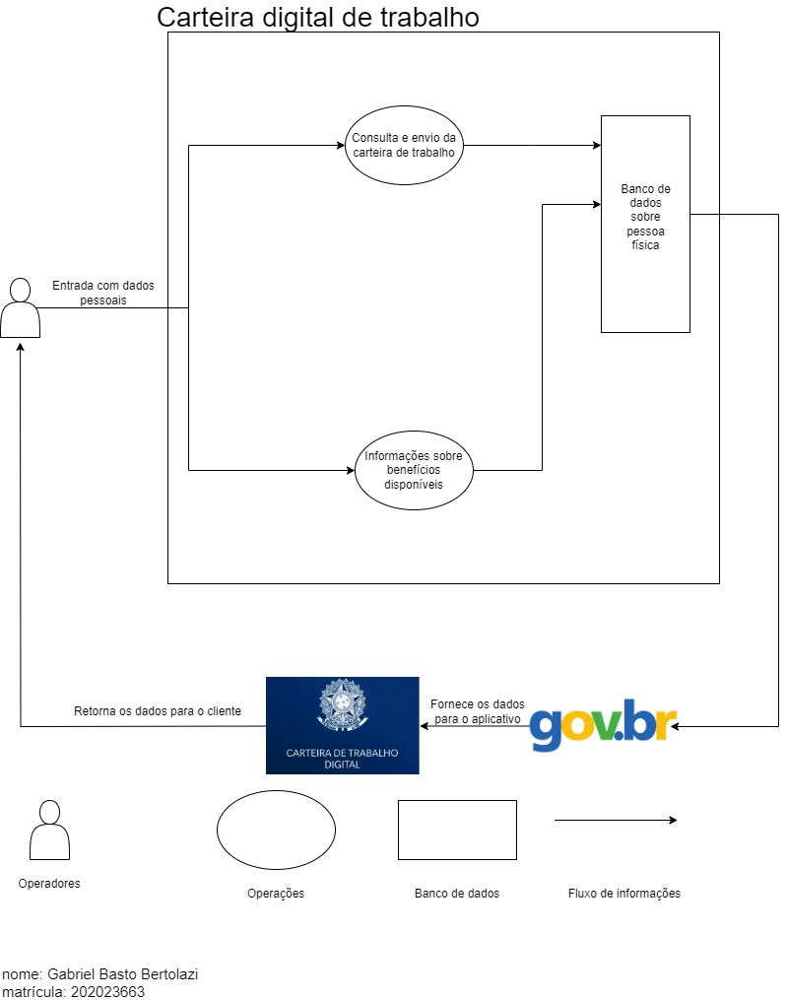
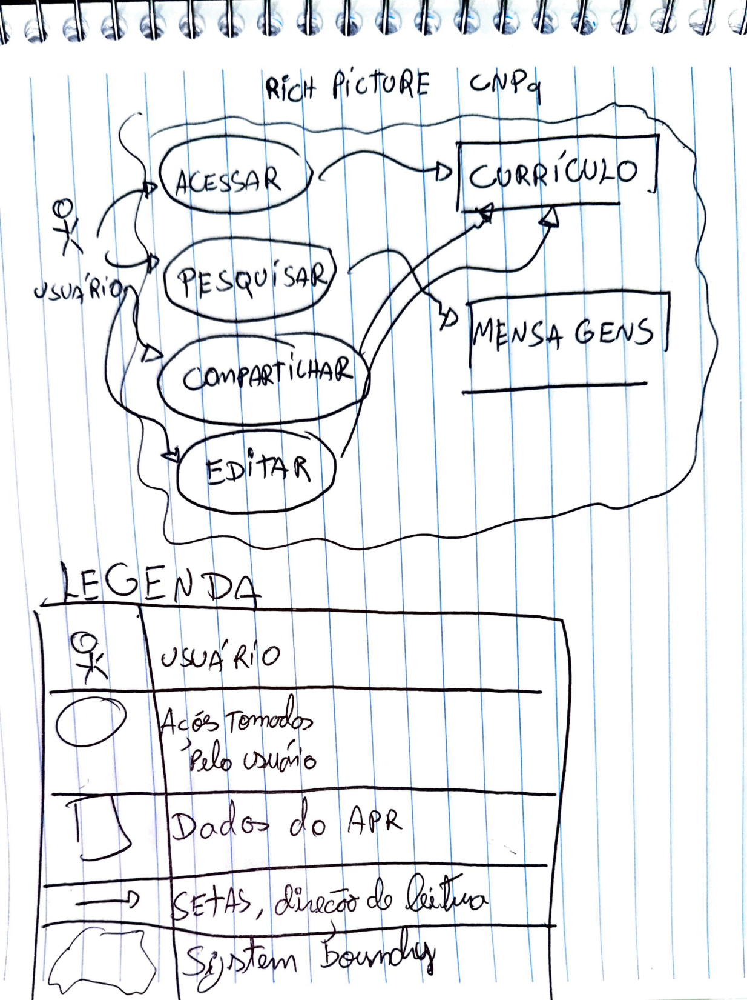
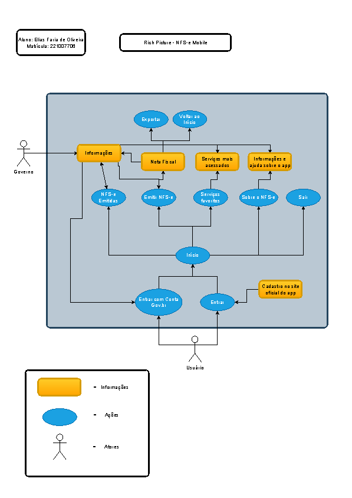
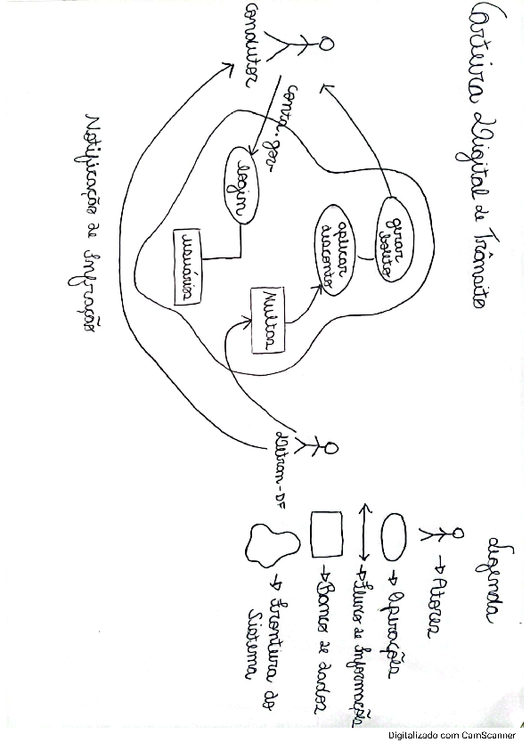
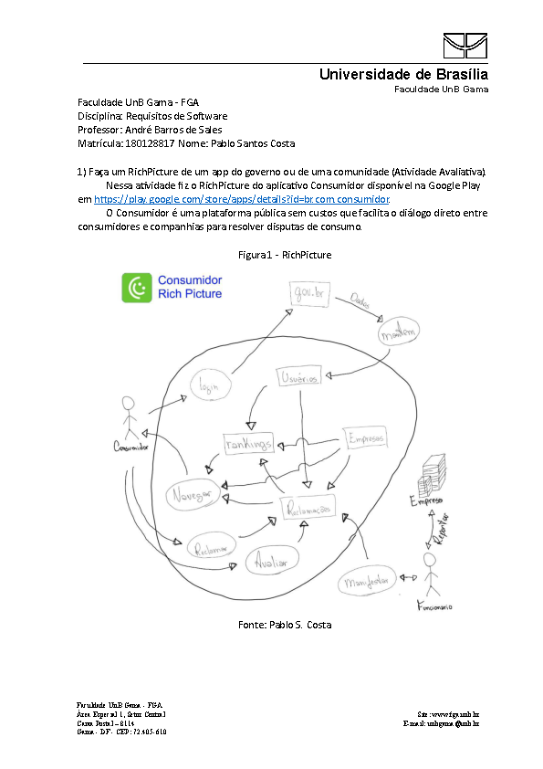
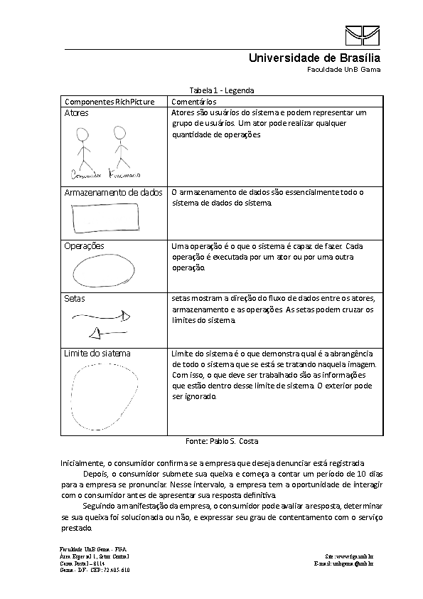
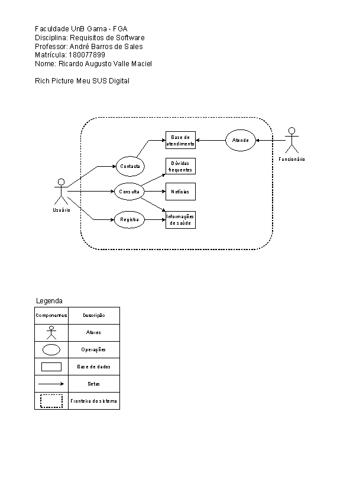

## Aplicativos

### 1. Serasa

O SuperApp da Serasa é o aplicativo que tem tudo para cuidar da sua vida financeira. Ele permite organizar todas as contas para manter o pagamento em dia, negociar dívidas em seu nome ou no CNPJ de sua empresa, solicitar crédito, consultar e melhorar o seu Score no Serasa, monitorar e protejer seu CPF.

Figura 1: Rich Picture versão 1.

Fonte: Cláudio, 2024.

Figura 2: Legenda Rich Picture versão 1.

Fonte: Cláudio, 2024.

### 2. Carteira digital de trabalho

O aplicativo do Carteira digital de Trabalho é um aplicativo onde o cliente têm a opção de acessar e enviar sua carteirade trabalho, além de consultar benefícios, como: Seguro desemprego, abono salarial, além de informações de rendimento.

Figura 3: Rich Picture versão 1.

Fonte: Gabriel B. Bertolazi, 2024.

### 3. CNPQ

Por meio do Aplicativo do CNPq, é possível receber informações sobre chamadas, prazos, concessões de bolsas e auxílios e notícias, além de acessar, atualizar e compartilhar o Currículo Lattes e acessar o informe do IRPF.

Figura 4: Rich Picture versão 1.

Fonte: Danilo, 2024.

### 4. NFS-e mobile

O APP permite que os prestadores de serviços optantes SIMEI ou Pessoas Físicas efetuem a emissão de NFS-e com padrão nacional para serviços previamente cadastrados pelo usuário como favoritos no Emissor Web da NFS-e. A nota pode ser rapidamente emitida por meio do preenchimento dos campos apresentados pelo APP na funcionalidade “Emitir NFS-e”. Também permite a consulta das últimas NFS-e emitidas pelo prestador de serviços.

Figura 5: Rich Picture versão 1.

Fonte: Elias, 2024.

### 5. Carteira digital de trânsito

O aplicativo guarda, no seu celular, sua carteira de motorista e o documento do veículo que esteja em seu nome. É uma forma segura de ter seus documentos sempre à mão, com a mesma validade dos documentos impressos. Outra funcionalidade é poder compartilhar o documento digital do veículo com as outras pessoas que o utilizam. 

Figura 6: Rich Picture versão 1.

Fonte: Gabriel F. J. Silva, 2024.

### 6. Consumidor

O aplicativo permite que você fale diretamente com as empresas para resolver problemas de consumo. As empresas se comprometem a receber, analisar e responder às reclamações de seus consumidores em até 10 dias.

Figura 7: Rich Picture versão 1.

Fonte: Pablo, 2024.

Figura 8: Legenda Rich Picture versão 1.

Fonte: Pablo, 2024.

### 7. Meu SUS Digital

É um aplicativo oficial do Ministério da Saúde que oferece acesso aos serviços do Sistema Único de Saúde (SUS) de forma digital. Com o aplicativo, você pode gerenciar sua saúde pessoal pelo Meu Diário de Saúde e acompanhar notícias seguras e confiáveis sobre saúde e bem-estar.

Figura 9: Rich Picture versão 1.

Fonte: Ricardo, 2024.

## Bibliografia

> Serasa - Disponível em < https://www.serasa.com.br/limpa-nome-online?gclid=CjwKCAjwtqmwBhBVEiwAL-WAYScXzuzNhIDz7g3JcXvUoZfeqw-SOdCSc91Fb8wniWEwS5U9Gb4yIxoCmOIQAvD_BwE >. Acesso em: 01/04/2024 
> Play Store: Carteira Digital de Trabalho - Disponívem em < https://play.google.com/store/apps/details?id=br.gov.dataprev.carteiradigital&hl=pt_BR&gl=US >. Acesso em: 01/04/2024 
> Site do governo - Disponívem em < https://www.gov.br/ >. Acesso em: 01/04/2024 
> Play Store: Serasa - Disponível em: < https://play.google.com/store/apps/details?id=br.com.serasaexperian.consumidor&hl=pt_BR&gl=US >. Acesso em: 01/04/2024 
> Play Store: CNPq - Disponível em: < https://play.google.com/store/apps/details?id=br.cnpq.app&hl=pt_BR&gl=US >. Acesso em: 01/04/2024 
> Play Store: NFSe mobile - Disponível em: < https://play.google.com/store/apps/details?id=br.gov.nfsemobileemissor&hl=pt_BR&gl=US >. Acesso em: 01/04/2024 
> Play Store: Carteira Digital de trânsito - Disponível em: < https://play.google.com/store/apps/details?id=br.gov.serpro.cnhe&hl=pt_BR&gl=US >. Acesso em 01/04/2024
> Play Store: Consumidor - Disponível em: < https://play.google.com/store/apps/details?id=br.com.consumidor&hl=pt_BR&gl=US >. Acesso em 01/04/2024 
> Play Store: Meu SUS Digital - Disponível em: < https://play.google.com/store/apps/details?id=br.gov.datasus.cnsdigital&hl=en_US >. Acesso em 01/04/2024 

## Histórico de Versões

| Versão | Data | Descrição | Autor(es) | Revisor(es) |
| :----: | :--: | --------- | ----------- | ------ |
| `1.0`  | 01/04/2024 | Criação do documento | [Gabriel B. Bertolazi](https://github.com/Bertolazi)  | [Danilo](https://github.com/Danilo-Carvalho-Antunes)  |
| :----: | :--: | --------- | ----------- | ------ |
| `1.1`  | 01/04/2024 | Correção do documento | [Gabriel B. Bertolazi](https://github.com/Bertolazi)  | [Danilo](https://github.com/Danilo-Carvalho-Antunes)  |
