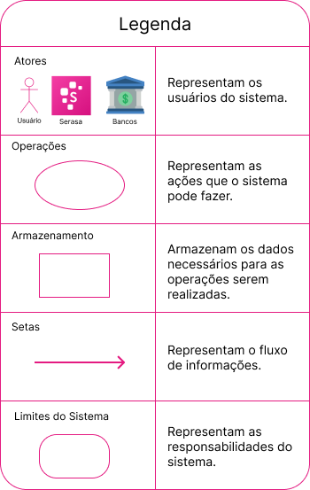

# Rich Picture

## Introdução
O Rich Picture é uma forma visual e informal para expressar ideias e analisar problemas de maneira que facilite o entendimento. No âmbito da Engenharia de Software, o Rich Picture é utilizado  a fim de desenvolver uma compreensão compartilhada dos elementos-chave e das relações de um sistema. Ele possui 5 principais elementos básicos como: atores, operações ou processos, armazenamento de dados, setas e limites do sistema. <a id="rp1" href="#ref1">1</a> 

## Metodologia e Ferramentas
 Para realizar a criação do Rich Picture foi realizado uma análise do aplicativo Serasa para assim conseguir ter uma visão geral dos elementos básicos a serem trabalhados.
 A aplicação [Draw.io](https://draw.io) foi utilizada para elaborar o Rich Picture e está apresentado na Figura 1, já a sua legenda foi feita com a aplicação [Figma](https://figma.com), e está na Figura 2. O ícone aludindo aos bancos é de autoria do site [Flaticon](https://www.flaticon.com/br/icone-gratis/banco_1138038).

Figura 1: Rich Picture versão 1.

Fonte: Claudio Henrique, 2024.

Figura 2: Legenda Rich Picture versão 1.

Fonte: Claudio Henrique, 2024.

## Bibliografia

> <a id="ref1" href="#rp1">1.</a> SERRANO, Maurício; SERRANO, Milene. Requisitos - Aula 4. **Aprender 3**. Distrito Federal, 2016. Disponível em: <<https://aprender3.unb.br/pluginfile.php/2844953/mod_resource/content/3/Requisitos%20-%20Aula%2004.pdf>>. Acesso em: 01/04/2024.

## Histórico de Versões

Versão  | Data | Descrição | Autor(es) | Revisor(es)
-------- | ------ | ------ | ---------- | ----------
`1.0` | 30/03/2024 | Primeira versão do Rich Picture  | [Claudio Henrique](https://github.com/claudiohsc) | [Ricardo](https://www.github.com/avmricardo)
`1.1` | 01/04/2024 | Adicionar nome "Bibliografia"  | [Claudio Henrique](https://github.com/claudiohsc) | [Danilo Carvalho](https://github.com/Danilo-Carvalho-Antunes)

