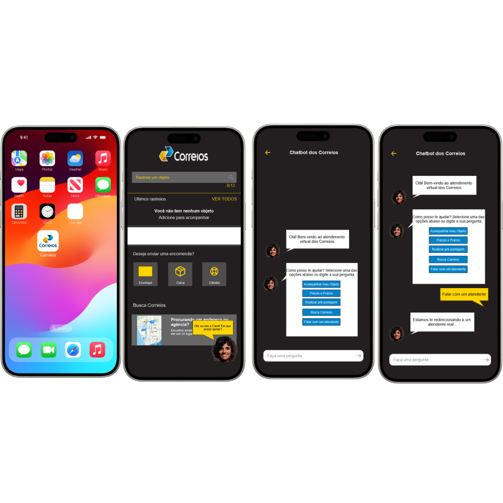
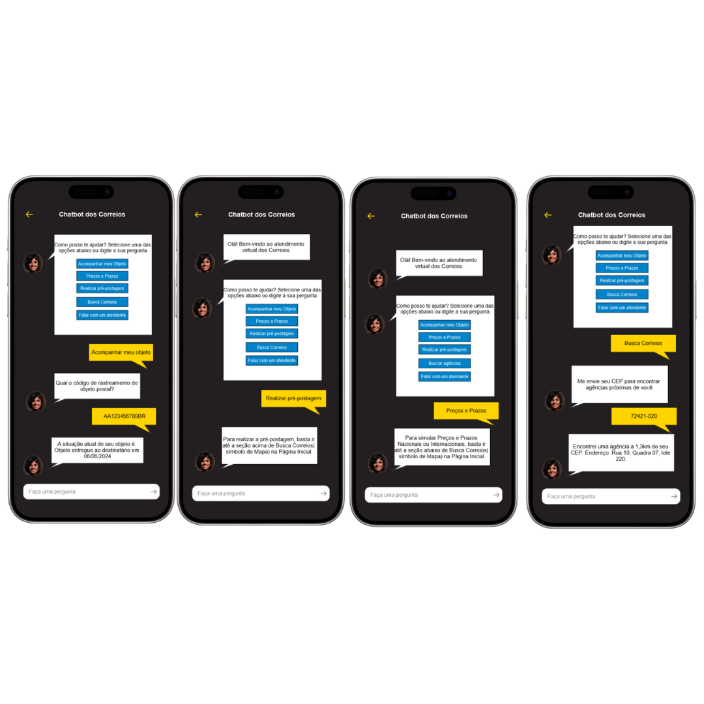

# Protótipo de Alta Fidelidade - Chatbot para Suporte

## Introdução

Um protótipo de alta fidelidade é uma representação visual e interativa de um produto ou sistema que imita de perto o produto final em questões de design e interatividade. Criados geralmente com ferramentas de design gráfico e prototipagem, esses protótipos podem incluir elementos detalhados como cores, tipografia, imagens e interações complexas.

A principal finalidade de um protótipo de alta fidelidade é proporcionar uma visão mais precisa de como o produto final se apresentará. Eles são úteis quando a equipe busca validar e aprimorar a experiência do usuário com certa funcionalidade do sistema.

## Metodologia

Neste documento está o protótipo desenvolvido na ferramenta [JustinMind](https://www.justinmind.com), e também a validação do protótipo de alta fidelidade referente ao Requisito Não Implementado: [BS12](https://requisitos-de-software.github.io/2024.1-Correios/elicitacao/tecnicas/brainstorming/#antes-da-refatoração), que estipula que "O usuário deve ter acesso a um Chatbot para suporte ao cliente" e da História de Usuário [US13](https://requisitos-de-software.github.io/2024.1-Correios/modelagem/agil/historias_de_usuario/). A validação foi feita com a usuária Isabelly Sophia, utilizando o método de entrevista. Os detalhes sobre o cronograma da entrevista estão na Tabela 1 abaixo:

Tabela 1 - Cronograma da Entrevista de Validação.

|Avaliador|Entrevistado| Horário de Início| Horário de Término| Data| Local|
|:---:|:----:|:----:|:----:|:----:|:-----:|
|[Claudio Henrique][ClaudioGH]| Isabelly Sophia| 22:00|22:05| 30/06/2024| Presencial|

Fonte: [Claudio Henrique][ClaudioGH]

Abaixo na tabela 2, está o perfil do Entrevistado:

|Nome| Idade| Ocupação| Experiência e facilidade com tecnologia|
|:---:|:----:|:----:|:----:|
| Isabelly Sophia| 18 Anos| Estudante de Direito| Muito boa|

## Protótipo de Alta Fidelidade

Na Figura 1 e 2, é possível ver imagens do protótipo de alta fidelidade feito para o Requisito Não Implementado: [BS12](https://requisitos-de-software.github.io/2024.1-Correios/elicitacao/tecnicas/brainstorming/#antes-da-refatoração).

Figura 1 - Imagens do Protótipo.

Fonte: [Claudio Henrique][ClaudioGH]

Figura 2 - Imagens do Protótipo.

Fonte: [Claudio Henrique][ClaudioGH]

[Link para a pasta com as imagens](https://github.com/Requisitos-de-Software/2024.1-Correios/tree/verificacao/grupo/docs/assets/validacao/prints-prototipo-chat/prints-individuais)

[Link para acessar o protótipo](https://cloud.justinmind.com/usernote/prototype/b68519e817616484072d2ad7b3135c6ff3dce0a5cf1fd201e8c61f532862090b)

## Aspestos Práticos

A entrevista foi conduzida pelo integrante [Claudio Henrique][ClaudioGH], e a entrevistada foi a Isabelly Sophia. A avaliação foi realizada com os seguintes materiais:

- Notebook;
- [Termo de Consentimento](../assets/Termo_de_consentimento-imagem&voz.pdf);

## Aspectos Éticos

Nessa entrevista foram seguidos os príncipios éticos de pesquisas científicas envolvendo pessoas, e o nosso [termo de consentimento livre e esclarecido](../assets/Termo_de_consentimento-imagem&voz.pdf) que foi apresentado e aceito pelo participante. Isso foi feito para que o participante estivesse ciente sobre objetivos, riscos e benefícios da pesquisa antes de começar a entrevista de validação em si.

## Validação

Vídeo 1 - Entrevista de Validação.

<iframe width="560" height="315" src="https://www.youtube.com/embed/UrTsdAYQC1s?si=ZSRafUOKzXok8v0T" title="YouTube video player" frameborder="0" allow="accelerometer; autoplay; clipboard-write; encrypted-media; gyroscope; picture-in-picture; web-share" referrerpolicy="strict-origin-when-cross-origin" allowfullscreen></iframe>

[Link direto para o vídeo](https://www.youtube.com/watch?v=UrTsdAYQC1s)

Fonte: [Claudio Henrique][ClaudioGH]

## Resultados

O protótipo foi apresentado à usuária, que interagiu com sucesso e sem problemas de usabilidade. Ao final do processo de interação com o protótipo, foram feitas algumas perguntas sobre a funcionalidade não implementada de um chatbot. As perguntas visavam saber se a usuária tinha encontrado algum tipo de dificuldade na interação e se a funcionalidade seria útil dentro do aplicativo. Com isso, obteve-se um resultado satisfatório, onde não houve dificuldades de interação com o protótipo e a funcionalidade foi considerada útil no aplicativo, tanto para responder às principais dúvidas quanto para facilitar o contato com um atendente real.

## Histórico de Versões

| Versão | Data | Descrição | Autor(es) | Revisor(es) |
| :----: | :--: | --------- | ----------- | ------ |
| `1.0`  | 29/06/2024 | Criação do documento | [Claudio Henrique][ClaudioGH] | [Elias O.][EliasGH] |

[ClaudioGH]: https://github.com/claudiohsc
[DaniloGH]: https://github.com/Danilo-Carvalho-Antunes
[EliasGH]: https://github.com/EliasOliver21
[GabrielBGH]: https://github.com/Bertolazi
[GabrielFGH]: https://github.com/MMcLovin
[PabloGH]: https://github.com/pabloheika
[RicardoGH]: https://www.github.com/avmricardo
