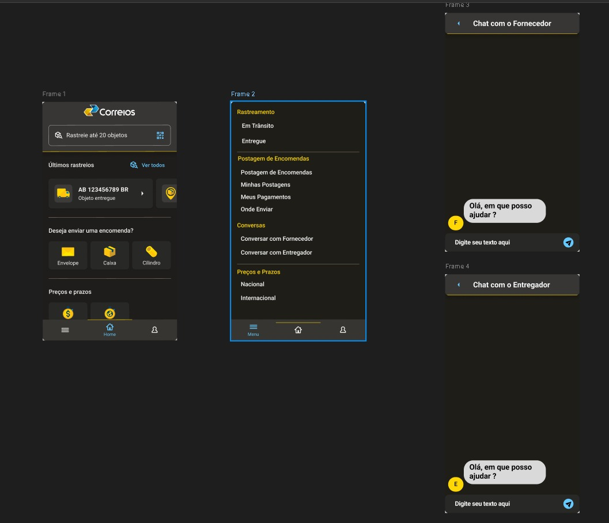

# Protótipo de Alta Fidelidade - Chat Entregador/Fornecedor

## Introdução

Um protótipo de alta fidelidade é uma representação visual e interativa de um produto ou sistema que imita de perto o produto final em questões de design e interatividade. Criados geralmente com ferramentas de design gráfico e prototipagem, esses protótipos podem incluir elementos detalhados como cores, tipografia, imagens e interações complexas.

A principal finalidade de um protótipo de alta fidelidade é proporcionar uma visão mais precisa de como o produto final se apresentará. Eles são úteis quando a equipe busca validar e aprimorar a experiência do usuário com certa funcionalidade do sistema.

## Metodologia

Neste documento está o protótipo desenvolvido na ferramenta Figma, e também a validação do protótipo de alta fidelidade referente aos  Requisitos Não Implementados: [Q04](https://requisitos-de-software.github.io/2024.1-Correios/elicitacao/tecnicas/questionario/) e [Q05](https://requisitos-de-software.github.io/2024.1-Correios/elicitacao/tecnicas/questionario/), que estipula que o usuário deve ter um Chat para se comunicar diretamente com o fornecedor e com o entrgador. A validação foi feita com o usuário Artur Rodrigues, utilizando o método de entrevista. Os detalhes sobre o cronograma da entrevista estão na Tabela 1 abaixo:

Tabela 1 - Cronograma da Entrevista de Validação.

|Avaliador|Entrevistado| Horário de Início| Horário de Término| Data| Local|
|:---:|:----:|:----:|:----:|:----:|:-----:|
|[Danilo Carvalho Antunes][DaniloGH]| Nome do Entrevistado| 23:00|23:05| 30/06/2024| Teams|

Fonte: [Danilo Carvalho Antunes][DaniloGH]

Abaixo na tabela 2, está o perfil do Entrevistado:

|Nome| Idade| Ocupação| Experiência e facilidade com tecnologia|
|Artur Rodrigues Alves| 21 anos| Estudante | Muito experiente |
 

## Protótipo de Alta Fidelidade

Na Figura 1, é possível ver imagens do protótipo de alta fidelidade feito para os requisitos [Q04](https://requisitos-de-software.github.io/2024.1-Correios/elicitacao/tecnicas/questionario/) e [Q05](https://requisitos-de-software.github.io/2024.1-Correios/elicitacao/tecnicas/questionario/).

[Link do Protótipo](https://www.figma.com/design/8G4QRE2B4StMHv8vRSvE9R/Untitled?node-id=0-1&t=70ffre8ODu4tEOsT-1)

## Aspestos Práticos

A entrevista foi conduzida pelo integrante [Danilo Carvalho Antunes][DaniloGH], e o entrevistado foi o Artur Rodrigues. A avaliação foi realizada com os seguintes materiais:

- Computador pessoal do Entrevistador;
- Computador pessoal do Entrevistado;
- Ferramenta Teams
- [Termo de Consentimento](../assets/Termo_de_consentimento-imagem&voz.pdf);

## Aspectos Éticos

Nessa entrevista foram seguidos os príncipios éticos de pesquisas científicas envolvendo pessoas, e o nosso [Termo de Consentimento](../assets/Termo_de_consentimento-imagem&voz.pdf) que foi apresentado e aceito pelo participante. Isso foi feito para que o participante estivesse ciente sobre objetivos, riscos e benefícios da pesquisa antes de começar a entrevista de validação em si.

## Validação

Vídeo 1 - Entrevista de Validação.

<iframe width="560" height="315" src="https://www.youtube.com/embed/neFLZUQDaFg?si=lirapuI67urpyqBl" title="YouTube video player" frameborder="0" allow="accelerometer; autoplay; clipboard-write; encrypted-media; gyroscope; picture-in-picture; web-share" referrerpolicy="strict-origin-when-cross-origin" allowfullscreen></iframe>

Fonte: [Danilo Carvalho Antunes][DaniloGH]

## Resultados

- Foi bem avaliado pelo entrevistado/usuário.

## Histórico de Versões

| Versão | Data | Descrição | Autor(es) | Revisor(es) |
| :----: | :--: | --------- | ----------- | ------ |
| `1.0`  | 01/07/2024 | Criação do documento | [Danilo Carvalho Antunes][DaniloGH] | [Elias Faria][EliasGH] |

[ClaudioGH]: https://github.com/claudiohsc
[DaniloGH]: https://github.com/Danilo-Carvalho-Antunes
[EliasGH]: https://github.com/EliasOliver21
[GabrielBGH]: https://github.com/Bertolazi
[GabrielFGH]: https://github.com/MMcLovin
[PabloGH]: https://github.com/pabloheika
[RicardoGH]: https://www.github.com/avmricardo
