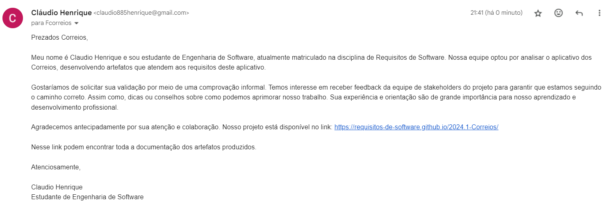

# Comprovação Informal

## Introdução

A validação de software é a confirmação de que o produto atende as demandas do usuário, e isso ocorre normalmente no fim do ciclo de vida do software, nesse caso do processo de elicitação de requisitos. Então, a comprovação informal é uma descrição em linguagem natural para que os clientes identifiquem problemas na expressão dos requisitos. No caso dos Correios, foi decidido entre o grupo em entrar em contato com a empresa para obtermos essa validação direta.

## Metodologia

É relevante mencionar que, considerando a formalidade do tema abordado, optamos por enviar um e-mail à empresa. O e-mail foi redigido de forma mais organizada e respeitosa. Optamos por essa forma de comunicação para garantir a transmissão clara de informações técnicas e detalhadas sobre os artefatos produzidos.

O e-mail foi enviado pelo sistema de atendimento ao cliente dos Correios, como pode ser visto na Figura 1 e 2.

Figura 1 - Imagem do SAC dos Correios.

Fonte: [Claudio Henrique][ClaudioGH]

Figura 1 - Imagem do E-mail enviado.

Fonte: [Claudio Henrique][ClaudioGH]

O conteúdo do e-mail foi este:

"Prezados Correios,

Meu nome é Claudio Henrique e sou estudante de Engenharia de Software, atualmente matriculado na disciplina de Requisitos de Software. Nossa equipe optou por analisar o Aplicativo dos Correios, desenvolvendo artefatos que atendem aos requisitos desse aplicativo.

Gostaríamos de solicitar sua validação por meio de uma comprovação informal. Temos interesse em receber feedback da equipe de stakeholders do projeto para garantir que estamos seguindo o caminho correto. Assim como, dicas ou conselhos sobre como podemos aprimorar nosso trabalho. Sua experiência e orientação são de grande importância para nosso aprendizado e desenvolvimento profissional.

Agradecemos antecipadamente por sua atenção e colaboração. Nosso projeto está disponível no link: https://requisitos-de-software.github.io/2024.1-Correios/

Nesse link podem encontrar toda a documentação dos artefatos produzidos.

Atenciosamente,

Claudio Henrique  
Estudante de Engenharia de Software"

## Retorno dos Correios

Até o presente momento (01/07/2024) não foram obtidas respostas da empresa dos Correios sobre a validação dos artefatos produzidos pelo Grupo 3. Caso a empresa retorne com alguma mensagem, o grupo irá adicionar a resposta nesse artefato de comprovação.

## Bibliografia

> 1. SERRANO, Milene. Requisitos - Aula 23. 2024. Apresentação de slides. Disponível em: https://aprender3.unb.br/pluginfile.php/2845073/mod_resource/content/2/Requisitos%20-%20Aula%20023.pdf - Aula 023.pdf. Acesso em: 30 de junho de de 2024.

## Histórico de Versões

| Versão | Data | Descrição | Autor(es) | Revisor(es) |
| :----: | :--: | --------- | ----------- | ------ |
| `1.0`  | 01/07/2024 | Criação do documento | [Claudio Henrique][ClaudioGH] | [Ricardo A.][RicardoGH] |

[ClaudioGH]: https://github.com/claudiohsc
[DaniloGH]: https://github.com/Danilo-Carvalho-Antunes
[EliasGH]: https://github.com/EliasOliver21
[GabrielBGH]: https://github.com/Bertolazi
[GabrielFGH]: https://github.com/MMcLovin
[PabloGH]: https://github.com/pabloheika
[RicardoGH]: https://www.github.com/avmricardo
