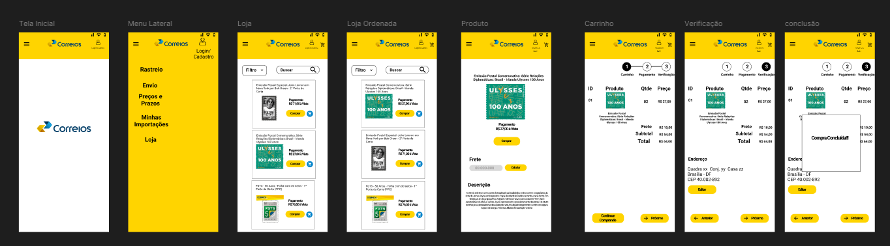

# Protótipo de Alta Fidelidade - Loja Online

## Introdução

Um protótipo de alta fidelidade é uma representação visual e interativa de um produto ou sistema que imita de perto o produto final em questões de design e interatividade. Criados geralmente com ferramentas de design gráfico e prototipagem, esses protótipos podem incluir elementos detalhados como cores, tipografia, imagens e interações complexas.

A principal finalidade de um protótipo de alta fidelidade é proporcionar uma visão mais precisa de como o produto final se apresentará. Eles são úteis quando a equipe busca validar e aprimorar a experiência do usuário com certa funcionalidade do sistema.

## Metodologia

Neste documento está o protótipo desenvolvido na ferramenta [FIGMA](https://www.figma.com/), e também a validação do protótipo de alta fidelidade referente aos  Requisitos Não Implementados: [AD30]((https://requisitos-de-software.github.io/2024.1-Correios/elicitacao/tecnicas/questionario/#funcionais)) e [AD31](https://requisitos-de-software.github.io/2024.1-Correios/elicitacao/tecnicas/questionario/#funcionais), no [AD30]((https://requisitos-de-software.github.io/2024.1-Correios/elicitacao/tecnicas/questionario/#funcionais)) o usuário tem a opção de retornar a etapas anteriores como por exemplo no fluxo das etapas de compra sem perder as informações já fornecidas e no requisito [AD31](https://requisitos-de-software.github.io/2024.1-Correios/elicitacao/tecnicas/questionario/#funcionais) o usuário tem a opção de filtragem dos produtos para facilitar a busca por algum item. A validação foi feita com a participante Thalia Faria, utilizando o método de entrevista. Os detalhes sobre o cronograma da entrevista estão na Tabela 1 abaixo:

Tabela 1 - Cronograma da Entrevista de Validação.

|Avaliador|Entrevistado| Horário de Início| Horário de Término| Data| Local|
|:---:|:----:|:----:|:----:|:----:|:-----:|
|[Elias F. Oliveira][EliasGH]| Thalia Faria | 21:00| 21:20 | 29/06/2024| Presencial|

Fonte: [Elias F. Oliveira][EliasGH]

Abaixo na tabela 2, está o perfil do Entrevistado:

Tabela 2 - Perfil do Entrevistado.

|Nome| Idade| Ocupação| Experiência e facilidade com tecnologia|
|:---:|:----:|:----:|:----:|
|Thalia Faria | 26 anos | Estudante |Média / Alta|

Fonte: [Elias F. Oliveira][EliasGH]

## Protótipo de Alta Fidelidade

Abaixo na figura 01 é mostrado o protótipo de alta fidelidade e logo abaixo temos o protótipo direto com a ferramenta figma.

Figura 01: Protótipo de Alta Fidelidade

Fonte: [Elias F. Oliveira][EliasGH]

Protótipo de Alta fidelidade

<iframe style="border: 1px solid rgba(0, 0, 0, 0.1);" width="800" height="450" src="https://www.figma.com/embed?embed_host=share&url=https%3A%2F%2Fwww.figma.com%2Fdesign%2FoIqY7JrIoyNuYORlTIfR73%2FApp-Coreios---Requisitos-de-Software%3Fnode-id%3D0-1%26t%3DU9CPwVaoOkJJHh7b-1" allowfullscreen></iframe>

Fonte: [Elias F. Oliveira][EliasGH]

## Aspestos Práticos

A entrevista foi conduzida pelo integrante [Elias F. Oliveira][EliasGH], e a entrevistada foi Thalia. A avaliação foi realizada com os seguintes materiais:

- Notebook;
- [Termo de Consentimento](../assets/Termo_de_consentimento-imagem&voz.pdf);
- Protótipo de Alta fidelidade.

## Aspectos Éticos

Nessa entrevista foram seguidos os príncipios éticos de pesquisas científicas envolvendo pessoas, e o nosso [Termo de Consentimento](../assets/Termo_de_consentimento-imagem&voz.pdf) livre e esclarecido que foi apresentado e aceito pelo participante. Isso foi feito para que o participante estivesse ciente sobre objetivos, riscos e benefícios da pesquisa antes de começar a entrevista de validação em si.

## Validação 

Vídeo 1 - Entrevista de Validação.

<iframe width="560" height="315" src="https://www.youtube.com/embed/w0WumDYDxsY" title="YouTube video player" frameborder="0" allow="accelerometer; autoplay; clipboard-write; encrypted-media; gyroscope; picture-in-picture; web-share" referrerpolicy="strict-origin-when-cross-origin" allowfullscreen></iframe>

Fonte: [Elias F. Oliveira][EliasGH]

## Resultados
A participante avaliou positivamente as duas funcionaildades implementadasque são descritas nos requisitos funcionais [AD30]((https://requisitos-de-software.github.io/2024.1-Correios/elicitacao/tecnicas/questionario/#funcionais)) e [AD31](https://requisitos-de-software.github.io/2024.1-Correios/elicitacao/tecnicas/questionario/#funcionais) não encontrando nenhuma inconsistência nas funcionalidades apresentadas no protótipo, a participante também não sugeriu nenhuma outra alteração ou nova funcionalidade para melhorar a realização das tarefas representadas no projeto.

## Histórico de Versões

| Versão | Data | Descrição | Autor(es) | Revisor(es) |
| :----: | :--: | --------- | ----------- | ------ |
| `1.0`  | 01/07/2024 | Criação do documento | [Elias F. Oliveira][EliasGH] | [Ricardo][RicardoGH] |

[ClaudioGH]: https://github.com/claudiohsc
[DaniloGH]: https://github.com/Danilo-Carvalho-Antunes
[EliasGH]: https://github.com/EliasOliver21
[GabrielBGH]: https://github.com/Bertolazi
[GabrielFGH]: https://github.com/MMcLovin
[PabloGH]: https://github.com/pabloheika
[RicardoGH]: https://www.github.com/avmricardo
