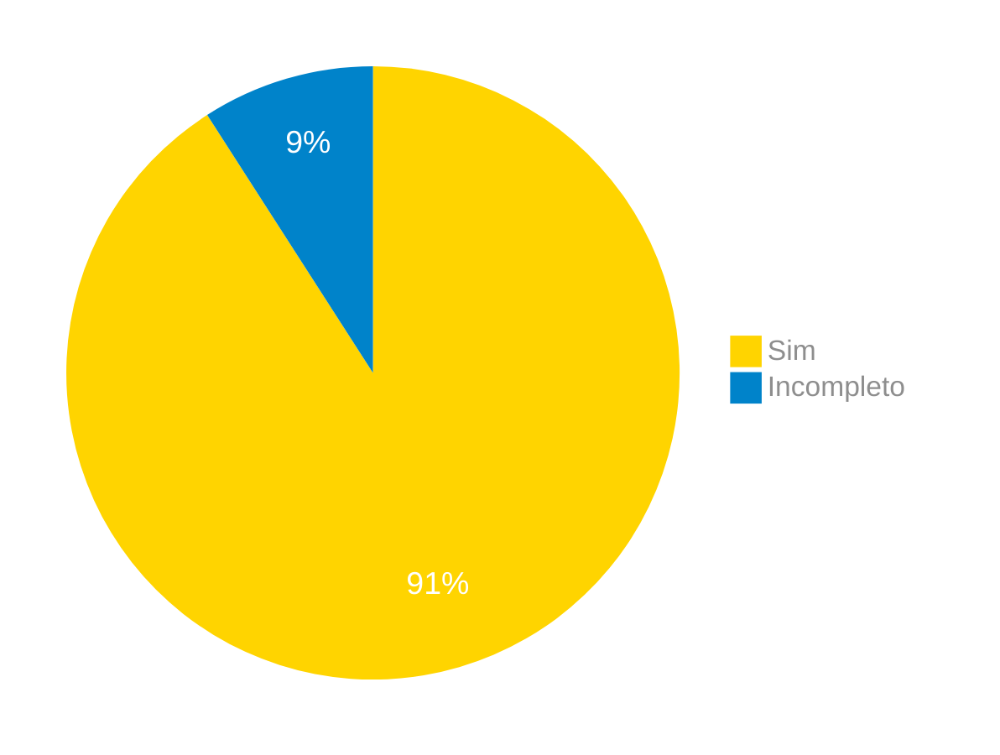

# Verificação do Artefato Perfil de Usuário

## Introdução

Neste artefato, está descrito os resultados da verificação do artefato de [Perfil de Usuário](https://requisitos-de-software.github.io/2024.1-Correios/elicitacao/perfil_de_usuario/perfil_de_usuario/) feito pelo [Grupo 03](https://requisitos-de-software.github.io/2024.1-Correios/) da disciplina de Requisitos de Software referente ao site [Correios](https://www.correios.com.br/). Lembrando que o foco não é apontar quem errou e sim os problemas presentes no artefato produzido, e por fim garantir os critérios de qualidade estabelecidos.

## Metodologia

Este artefato foi produzido por [Claudio Henrique][ClaudioGH] e verificado por [Danilo Carvalho][DaniloGH], seguindo a divisão planejada pelo grupo na [reunião 7](https://requisitos-de-software.github.io/2024.1-Correios/atas/ata7/). Para a verificação do artefato, foi utilizada a versão `1.2` datada do dia 23/04/2024. Adotamos a metodologia de inspeção por [checklist](#checklist-de-verificacao) neste processo. Podemos ver pela Tabela 1 de exemplo, que para cada item do checklist teremos: descrição do item em verificação, resposta à avaliação (pode ser "Sim", "Não", "Incompleto" ou "Não se Aplica"), o número da referência bibliográfica e um link para um print da referência que o fundamenta o item. Ao final, na seção de [Problemas Encontrados](#problemas-encontrados), são comentados os itens negativos.

Tabela 1 - Perguntas elaboradas de acordo com as referências bibliográficas.

|ID| Descrição | Avaliação | Referência| Print|
|:--:|:--:|:--:|:--:|:-:|
|1| O artefato possui uma explicação sobre o que é o Perfil do Usuário? | Sim | <a href="#ref1">REF1</a>|[pg 166](../../../assets/prints_verificacao/claudio/pg166-perfil.png) |
|2| Foram utilizados entrevistas ou questionários, para coletar dados para o perfil de usuário?| Sim  |  <a href="#ref1">REF1</a>| [pg 166](../../../assets/prints_verificacao/claudio/pg166-perfil.png)|
|3 | Com os dados coletados é possível identificar características de interesse(cargo, nível de instrução, atividades principais, faixa etária, experiência)?| Incompleto | <a href="#ref1">REF1</a> |[pg 166](../../../assets/prints_verificacao/claudio/pg166-perfil.png)|
| 4| A partir dos dados coletados, é possível agrupar os valores em grupos e faixas na qual os usuários se encaixam? |Sim | <a href="#ref1">REF1</a>. pg 166| |
| 5| Foi coletado dados sobre tarefas primárias realizadas no aplicativo? | Sim | <a href="#ref1">REF1</a>. [pg 166](../../../assets/prints_verificacao/claudio/pg166-perfil.png) |
| 6| A formulação das perguntas foi cuidadosa, evitando ambiguidades e mal-entendidos? |Sim | <a href="#ref1">REF1</a>. [pg 149](../../../assets/prints_verificacao/claudio/pg149-perguntas.png)|
|7| O questionário apresenta perguntas abertas e fechadas, na tentativa de obter informações mais detalhadas? |Sim |  <a href="#ref1">REF1</a> |[pg 151](../../../assets/prints_verificacao/claudio/pg151-abertas.png)|
|8| O perfil de usuário considera a faixa etária dos usuários? |Sim | <a href="#ref1">REF1</a>. pg 166|
|9| O perfil de usuário abrange informações sobre a experiência dos usuários? |Sim | <a href="#ref1">REF1</a>| [pg 166](../../../assets/prints_verificacao/claudio/pg166-perfil.png)|
|10| O perfil de usuário avalia a relação dos usuários com a tecnologia? | Sim| <a href="#ref1">REF1</a>| [pg 166](../../../assets/prints_verificacao/claudio/pg166-tecnologia.png)|
|11| O perfil de usuário descreve as atividades principais dos usuários? | Sim| <a href="#ref1">REF1</a>| [pg 166](../../../assets/prints_verificacao/claudio/pg166-tecnologia.png)|

Fonte: [Claudio Henrique](https://github.com/claudiohsc), 2024.

## Apresentação dos Dados

Aqui será apresentado os resultados do checklist e logo após as observações dos itens com resultado negativo.

### Checklist de verificação

Tabela 2 - Checklist preenchido na verificação

|ID| Descrição | Avaliação | Referência| Print|
|:--:|:--:|:--:|:--:|:-:|
|1| O artefato possui uma explicação sobre o que é o Perfil do Usuário? | Sim | <a href="#ref1">REF1</a>|[pg 166](../../../assets/prints_verificacao/claudio/pg166-perfil.png) |
|2| Foram utilizados entrevistas ou questionários, para coletar dados para o perfil de usuário?| Sim |  <a href="#ref1">REF1</a>| [pg 166](../../../assets/prints_verificacao/claudio/pg166-perfil.png)|
|3 | Com os dados coletados é possível identificar características de interesse(cargo, nível de instrução, atividades principais, faixa etária, experiência)?| Sim | <a href="#ref1">REF1</a> |[pg 166](../../../assets/prints_verificacao/claudio/pg166-perfil.png)|
| 4| A partir dos dados coletados, é possível agrupar os valores em grupos e faixas na qual os usuários se encaixam? | Sim | <a href="#ref1">REF1</a>. pg 166| |
| 5| Foi coletado dados sobre tarefas primárias realizadas no aplicativo? | Sim | <a href="#ref1">REF1</a>. [pg 166](../../../assets/prints_verificacao/claudio/pg166-perfil.png) |
| 6| A formulação das perguntas foi cuidadosa, evitando ambiguidades e mal-entendidos? | Sim | <a href="#ref1">REF1</a>. [pg 149](../../../assets/prints_verificacao/claudio/pg149-perguntas.png)|
|7| O questionário apresenta perguntas abertas e fechadas, na tentativa de obter informações mais detalhadas? | Incompleto |  <a href="#ref1">REF1</a> |[pg 151](../../../assets/prints_verificacao/claudio/pg151-abertas.png)|
|8| O perfil de usuário considera a faixa etária dos usuários? | Sim | <a href="#ref1">REF1</a>. pg 166|
|9| O perfil de usuário abrange informações sobre a experiência dos usuários? | Sim | <a href="#ref1">REF1</a>| [pg 166](../../../assets/prints_verificacao/claudio/pg166-perfil.png)|
|10| O perfil de usuário avalia a relação dos usuários com a tecnologia? | Sim | <a href="#ref1">REF1</a>| [pg 166](../../../assets/prints_verificacao/claudio/pg166-tecnologia.png)|
|11| O perfil de usuário descreve as atividades principais dos usuários? | Sim | <a href="#ref1">REF1</a>| [pg 166](../../../assets/prints_verificacao/claudio/pg166-tecnologia.png)|

Fonte: [Danilo Carvalho Antunes](DaniloGH), 2024.

### Gravação da verificação

    <iframe width="560" height="315" src="https://www.youtube.com/embed/tPgYX-HeqjA?si=umA22gnhvqr3l2bn" title="YouTube video player" frameborder="0" allow="accelerometer; autoplay; clipboard-write; encrypted-media; gyroscope; picture-in-picture; web-share" referrerpolicy="strict-origin-when-cross-origin" allowfullscreen></iframe>

    <a href="https://youtu.be/tPgYX-HeqjA"> Link para o vídeo </a>

### Problemas Encontrados

- ID 07: Descrição 
    - Avaliação: Incompleto
    - Comentário: Não está explícito se existe questões abertas no questionário feito para a criação do perfil de usuário.

### Sumário dos resultados

A seguir, apresentamos a Figura 1 com o gráfico de pizza do sumário dos resultados.

Figura 1 - Gráfico de pizza do sumário dos resultados.

Fonte: [Danilo Carvalho Antunes][DaniloGH], 2024.

## Bibliografia

> 1<a id="ref1">.</a> Barbosa, S. D. J.; Silva, B. S. da; Silveira, M. S.; Gasparini, I.; Darin, T.; Barbosa, G. D. J. (2021) Interação Humano-Computador e Experiência do usuário. Autopublicação. ISBN: 978-65-00-19677-1.

## Histórico de Versões

| Versão | Data | Descrição | Autor(es) | Revisor(es) |
| :----: | :--: | --------- | ----------- | ------ |
| `1.0`  | 27/06/2024 | Criação do documento | [Claudio Henrique][ClaudioGH] & [Danilo Carvalho Antunes][DaniloGH] | [Gabriel F.][GabrielFGH] |

[ClaudioGH]: https://github.com/claudiohsc
[DaniloGH]: https://github.com/Danilo-Carvalho-Antunes
[EliasGH]: https://github.com/EliasOliver21
[GabrielBGH]: https://github.com/Bertolazi
[GabrielFGH]: https://github.com/MMcLovin
[PabloGH]: https://github.com/pabloheika
[RicardoGH]: https://www.github.com/avmricardo