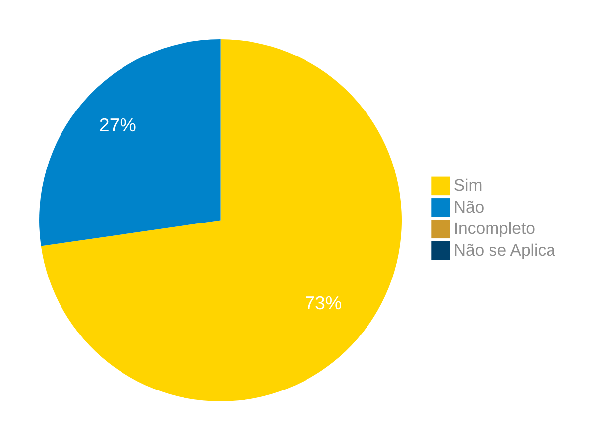

# Verificação do Artefato Personas

## Introdução
Este documento apresenta a verificação do artefato das [personas][Personas] do grupo [03][Grupo 03 Correios] da matéria de Requisitos de software, que utiliza no desenvolvimento do seu projeto o aplicativo dos Correios.

## Objetivo
O objetivo deste documento é apresentar e mostrar os erros encontrados no artefato da  [personas][Personas] do projeto realizado pelo grupo [03 - Correios][Grupo 03 Correios] da matéria de requisitos de software.

## Metodologia
A metodologia utilizada para verificar o artefato emprega o método de inspeção através da utilização de um checklist criado usando como base os principais conceitos ministrados na matéria de requisitos e também nas referências citadas ao final do documento.

### Checklist Personas

Abaixo temos respectivamente nas tabelas 01 e 02 o checklist de perguntas criado para realizar a verificação do artefato de [Personas][Personas].

Tabela 1 - Perguntas elaboradas de acordo com os objetivos.

|ID| Descrição | Avaliação | Referência|
|:--:|:--:|:--:|:--:|
|01| O documento possui personas primárias e secundárias? |  |IHC - Barbosa e Silva(Cap. 8.2 / [Pg.167][Pg.167], [Pg.168][Pg.168], [Pg.169][Pg.169], [Pg.170][Pg.170] e [Pg.171][Pg.171])|
|02| Existem pelo menos uma persona por papel de usuário? |  |IHC - Barbosa e Silva(Cap. 8.2 / [Pg.167][Pg.167], [Pg.168][Pg.168], [Pg.169][Pg.169], [Pg.170][Pg.170] e [Pg.171][Pg.171])|
|03| O documento apresenta a antipersona? |  |IHC - Barbosa e Silva(Cap. 8.2 / [Pg.167][Pg.167], [Pg.168][Pg.168], [Pg.169][Pg.169], [Pg.170][Pg.170] e [Pg.171][Pg.171])|
|04| O elenco de personas está dentro do escopo de 3 a 12 personas? |  |IHC - Barbosa e Silva(Cap. 8.2 / [Pg.167][Pg.167], [Pg.168][Pg.168], [Pg.169][Pg.169], [Pg.170][Pg.170] e [Pg.171][Pg.171])|
|05| As personas possuem os elementos: Identidade, status, objetivos, habilidades, tarefas, relacionamentos, requisitos e expectativas? |  |IHC - Barbosa e Silva(Cap. 8.2 / [Pg.167][Pg.167], [Pg.168][Pg.168], [Pg.169][Pg.169], [Pg.170][Pg.170] e [Pg.171][Pg.171])|
|06| Alguma persona tem seus objetivos pessoais violados? |  |IHC - Barbosa e Silva(Cap. 8.2 / [Pg.167][Pg.167], [Pg.168][Pg.168], [Pg.169][Pg.169], [Pg.170][Pg.170] e [Pg.171][Pg.171])|
|07| Foi elencado nas personas algum falso objetivo? ||IHC - Barbosa e Silva(Cap. 8.2 / [Pg.167][Pg.167], [Pg.168][Pg.168], [Pg.169][Pg.169], [Pg.170][Pg.170] e [Pg.171][Pg.171])|
|08| A persona primária possui uma solidez tangível(nível alto de especificidade) para colocar os pressupostos de design em perspectiva?|  |IHC - Barbosa e Silva(Cap. 8.2 / [Pg.169][Pg.169])|
|09| A persona primária possui elasticidade(nível baixo de especificidade)?|  |IHC - Barbosa e Silva(Cap. 8.2 / [Pg.169][Pg.169])|
|10| No documento é justificada a quantidade de personas? |  |IHC - Barbosa e Silva(Cap. 8.2 / [Pg.169][Pg.169])|
|11| As personas apresentam os objetivos: pessoais, corporativos e práticos?| |IHC - Barbosa e Silva(Cap. 8.2 / Pg.170[Pg.170])|

Fonte: [Elias F. Oliveira](https://github.com/EliasOliver21), 2024.

Tabela 2 - Checklist preenchido 

|ID| Descrição | Avaliação | Referência|
|:--:|:--:|:--:|:--:|
|01| O documento possui personas primárias e secundárias? | Sim |IHC - Barbosa e Silva(Cap. 8.2 / [Pg.167][Pg.167], [Pg.168][Pg.168], [Pg.169][Pg.169], [Pg.170][Pg.170] e [Pg.171][Pg.171])|
|02| Existem pelomenos uma persona por papel de usuário? | Sim |IHC - Barbosa e Silva(Cap. 8.2 / [Pg.167][Pg.167], [Pg.168][Pg.168], [Pg.169][Pg.169], [Pg.170][Pg.170] e [Pg.171][Pg.171])|
|03| O documento apresenta a antipersona? | Sim |IHC - Barbosa e Silva(Cap. 8.2 / [Pg.167][Pg.167], [Pg.168][Pg.168], [Pg.169][Pg.169], [Pg.170][Pg.170] e [Pg.171][Pg.171])|
|04| O elenco de personas está dentro do escopo de 3 a 12 personas? | Sim |IHC - Barbosa e Silva(Cap. 8.2 / [Pg.167][Pg.167], [Pg.168][Pg.168], [Pg.169][Pg.169], [Pg.170][Pg.170] e [Pg.171][Pg.171])|
|05| As personas possuem os elementos: Identidade, status, objetivos, habilidades, tarefas, relacionamentos, requisitos e expectativas? |  Sim|IHC - Barbosa e Silva(Cap. 8.2 / [Pg.167][Pg.167], [Pg.168][Pg.168], [Pg.169][Pg.169], [Pg.170][Pg.170] e [Pg.171][Pg.171])|
|06| Alguma persona tem seus objetivos pessoais violados? |Não  |IHC - Barbosa e Silva(Cap. 8.2 / [Pg.167][Pg.167], [Pg.168][Pg.168], [Pg.169][Pg.169], [Pg.170][Pg.170] e [Pg.171][Pg.171])|
|07| Foi elencado nas personas algum falso objetivo? |Não|IHC - Barbosa e Silva(Cap. 8.2 / [Pg.167][Pg.167], [Pg.168][Pg.168], [Pg.169][Pg.169], [Pg.170][Pg.170] e [Pg.171][Pg.171])|
|08| A persona primária possui uma solidez tangível(nível alto de especificidade) para colocar os pressupostos de design em perspectiva?| Sim |IHC - Barbosa e Silva(Cap. 8.2 / [Pg.169][Pg.169])|
|09| A persona primária possui elasticidade(nível baixo de especificidade)?| Não |IHC - Barbosa e Silva(Cap. 8.2 / [Pg.169][Pg.169])|
|10| No documento é justificada a quantidade de personas? | Sim |IHC - Barbosa e Silva(Cap. 8.2 / [Pg.169][Pg.169])|
|11| As personas apresentam os objetivos: pessoais, corporativos e práticos?| Sim|IHC - Barbosa e Silva(Cap. 8.2 / Pg.170[Pg.170])|

Fonte: [Claudio Henrique](https://github.com/claudiohsc), 2024.

## Gravação Identificando os Problemas

Vídeo 1 - Gravação Inspeção do Artefato

<iframe width="560" height="315" src="https://www.youtube.com/embed/D7yHTB-b71Y?si=XYWlyzS_CcjhPg3H" title="YouTube video player" frameborder="0" allow="accelerometer; autoplay; clipboard-write; encrypted-media; gyroscope; picture-in-picture; web-share" referrerpolicy="strict-origin-when-cross-origin" allowfullscreen></iframe>

Fonte: [Claudio Henrique](https://github.com/claudiohsc), 2024.

[Link do Vídeo](https://www.youtube.com/watch?v=D7yHTB-b71Y)

## Problemas Encontrados

Não foram encontrados problemas nesse artefato de Personas.

### Sumário dos resultados

<!-- Conte as quantidade de ocorrencias e coloque no Grafico a quantidade em cada tipo de avaliação (se não ouver incidencia de um tipo como "não se aplica", apague a linha do mesmo)-->
A seguir, apresentamos a Figura 1 com o gráfico de pizza do sumário dos resultados.

Figura 1 - Gráfico de pizza do sumário dos resultados.

Fonte: [Claudio Henrique][ClaudioGH], 2024.

## Bibliografia
> 1. Barbosa, S. D. J.; Silva, B. S. da; Silveira, M. S.; Gasparini, I.; Darin, T.; Barbosa, G. D. J. (2021) Interação Humano-Computador e Experiência do usuário. Autopublicação. ISBN: 978-65-00-19677-1.

## Histórico de Versões

| Versão | Data | Descrição | Autor(es) | Revisor(es) |
| :----: | :--: | --------- | ----------- | ------ |
| `1.0`  | 29/06/2024 | Criação do documento | [Elias F. Oliveira](https://github.com/EliasOliver21) | [Gabriel B.][GabrielBGH] |

[ClaudioGH]: https://github.com/claudiohsc
[DaniloGH]: https://github.com/Danilo-Carvalho-Antunes
[EliasGH]: https://github.com/EliasOliver21
[GabrielBGH]: https://github.com/Bertolazi
[GabrielFGH]: https://github.com/MMcLovin
[PabloGH]: https://github.com/pabloheika
[RicardoGH]: https://www.github.com/avmricardo

[Pg.167]: ../../../assets/imagens_referencias/personas/167.png
[Pg.168]: ../../../assets/imagens_referencias/personas/168.png
[Pg.169]: ../../../assets/imagens_referencias/personas/169.png
[Pg.170]: ../../../assets/imagens_referencias/personas/170.png
[Pg.171]: ../../../assets/imagens_referencias/personas/171.png

[Personas]: https://requisitos-de-software.github.io/2024.1-Correios/elicitacao/personas/
[Grupo 03 Correios]: https://requisitos-de-software.github.io/2024.1-Correios/