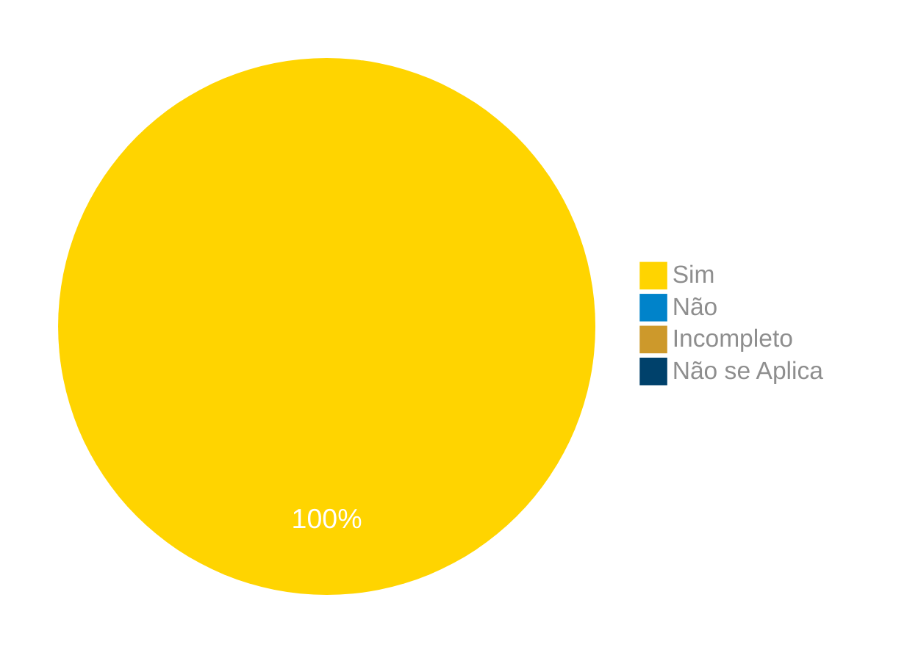

# Verificação do Artefato da Técnica de Priorização $100

## Introdução

Neste artefato, está descrito os resultados da verificação do artefato da [Técnica de Priorização $100](https://requisitos-de-software.github.io/2024.1-Correios/priorizacao/tecnicas/%24100/) feito pelo [Grupo 03](https://requisitos-de-software.github.io/2024.1-Correios/) da disciplina de Requisitos de Software referente ao site [Correios](https://www.correios.com.br/). Lembrando que o foco não é apontar quem errou e sim os problemas presentes no artefato produzido, e por fim garantir os critérios de qualidade estabelecidos.

## Metodologia

Este artefato foi produzido por [Claudio Henrique][ClaudioGH] e verificado por [Ricardo A.][RicardoGH], seguindo a divisão planejada pelo grupo na [reunião 7](https://requisitos-de-software.github.io/2024.1-Correios/atas/ata7/). Para a verificação do artefato, foi utilizada a versão `1.0` datada do dia 21/04/2024. Adotamos a metodologia de inspeção por [checklist](#checklist-de-verificacao) neste processo. Podemos ver pela Tabela 1 de exemplo, que para cada item do checklist teremos: descrição do item em verificação, resposta à avaliação (pode ser "Sim", "Não", "Incompleto" ou "Não se Aplica"), o número da referência bibliográfica e um link para um print da referência que o fundamenta o item. Ao final, na seção de [Problemas Encontrados](#problemas-encontrados), são comentados os itens negativos.

Tabela 1 - Perguntas elaboradas de acordo com as referências bibliográficas.

| ID | Descrição | Avaliação | Referência | Print |
|:--:| --------- | :-------: | :--------: | :---: |
| **1** | A equipe de priorização(usuário) recebeu 100 dólares imaginários para alocar aos requisitos? |  | [1.](#ref1) | [página 321][pag321] |
| **2** | Os membros da equipe alocaram dólares para "comprar" itens que desejam implementar? |  | [1.](#ref1) | [página 321][pag321] |
| **3** | Foi explicado ao usuário que os requisitos de maior prioridade deveriam receber mais dólares? |  | [1.](#ref1) | [página 321][pag321] |
| **4** | A equipe ficou sem dólares antes de alocar recursos a todos os requisitos? |  | [1.](#ref1) | [página 321][pag321] |
| **5** | Os requisitos de maior prioridade receberam mais dólares alocados? |  | [1.](#ref1) | [página 321][pag321] |
| **6** | Todos os participantes realizaram suas próprias alocações de dólares de forma independente (sem interferência do mediador ou de outros usuários)? |  | [1.](#ref1) | [página 321][pag321] |

[pag321]: ../../../../assets/prints_verificacao/claudio/pag321-part1.png
[pag322]: ../../../../assets/prints_verificacao/claudio/pag322-part2.png

Fonte: [Claudio Henrique](https://github.com/claudiohsc), 2024.

## Apresentação dos Dados

Aqui será apresentado os resultados do checklist e logo após as observações dos itens com resultado negativo.

### Checklist de verificação

Tabela 2 - Checklist preenchido na verificação

| ID | Descrição | Avaliação | Referência | Print |
|:--:| --------- | :-------: | :--------: | :---: |
| **1** | A equipe de priorização(usuário) recebeu 100 dólares imaginários para alocar aos requisitos? | Sim | [1.](#ref1) | [página 321][pag321] |
| **2** | Os membros da equipe alocaram dólares para "comprar" itens que desejam implementar? | Sim | [1.](#ref1) | [página 321][pag321] |
| **3** | Foi explicado ao usuário que os requisitos de maior prioridade deveriam receber mais dólares? | Sim | [1.](#ref1) | [página 321][pag321] |
| **4** | A equipe ficou sem dólares antes de alocar recursos a todos os requisitos? | Sim | [1.](#ref1) | [página 321][pag321] |
| **5** | Os requisitos de maior prioridade receberam mais dólares alocados? | Sim | [1.](#ref1) | [página 321][pag321] |
| **6** | Todos os participantes realizaram suas próprias alocações de dólares de forma independente (sem interferência do mediador ou de outros usuários)? | Sim | [1.](#ref1) | [página 321][pag321] |

Fonte: [Ricardo Augusto](https://github.com/avmricardo), 2024.

### Gravação da verificação

<!-- para o iframe do vídeo, bote width = 560 e height = 315 -->

<iframe width="560" height="315" src="https://www.youtube.com/embed/LLPuCIHrz_4?si=1lNRCsLLKWkDO0M9" title="YouTube video player" frameborder="0" allow="accelerometer; autoplay; clipboard-write; encrypted-media; gyroscope; picture-in-picture; web-share" referrerpolicy="strict-origin-when-cross-origin" allowfullscreen></iframe>

    <a href="https://youtu.be/LLPuCIHrz_4"> Link para o vídeo </a>

### Problemas Encontrados

<!--- Aqui será apresentado todos os problemas identificados durante o processo de verificação do artefato de link do artefato. --->

Não ocorreram problemas.

### Sumário dos resultados

<!-- Conte as quantidade de ocorrencias e coloque no Grafico a quantidade em cada tipo de avaliação (se não ouver incidencia de um tipo como "não se aplica", apague a linha do mesmo)-->
A seguir, apresentamos a Figura 1 com o gráfico de pizza do sumário dos resultados.

Figura 1 - Gráfico de pizza do sumário dos resultados.

Fonte: [Ricardo Augusto][RicardoGH], 2024.

## Bibliografia

> 1. Wiegers, K.E. (2013) Software Requirements. 3rd Edition. Microsoft Press, Redmond. Disponível em: https://www.microsoftpressstore.com/store/software-requirements-9780735679665. Acesso em: 27 de junho de 2024.

## Histórico de Versões

| Versão | Data | Descrição | Autor(es) | Revisor(es) |
| :----: | :--: | --------- | ----------- | ------ |
| `1.0`  | 27/06/2024 | Criação do documento | [Claudio Henrique][ClaudioGH] | [Pablo S.][PabloGH] |

[ClaudioGH]: https://github.com/claudiohsc
[DaniloGH]: https://github.com/Danilo-Carvalho-Antunes
[EliasGH]: https://github.com/EliasOliver21
[GabrielBGH]: https://github.com/Bertolazi
[GabrielFGH]: https://github.com/MMcLovin
[PabloGH]: https://github.com/pabloheika
[RicardoGH]: https://www.github.com/avmricardo