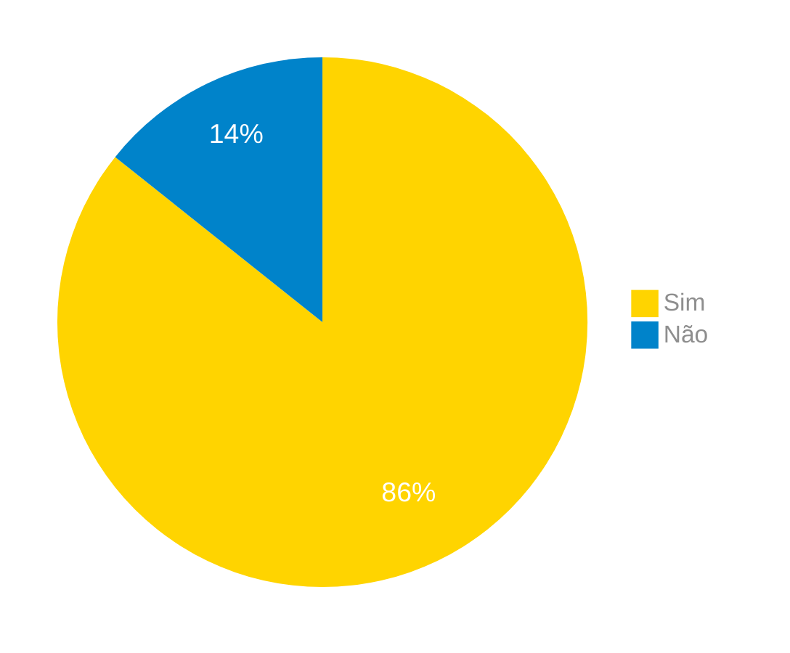

# Verificação do Artefato First Things First

## Introdução

Neste artefato, está descrito os resultados da verificação do artefato de [First Things First](https://requisitos-de-software.github.io/2024.1-Correios/priorizacao/tecnicas/firstThingsFirst/) feito pelo [Grupo 03](https://requisitos-de-software.github.io/2024.1-Correios/) da disciplina de Requisitos de Software referente ao aplicativo [Correios](https://www.correios.com.br/). Lembrando que o foco não é apontar quem errou e sim os problemas presentes no artefato produzido, e por fim garantir os critérios de qualidade estabelecidos.

## Metodologia

Este artefato foi produzido por [Danilo][DaniloGH] e verificado por [Gabriel F][GabrielFGH], seguindo a divisão planejada pelo grupo na [reunião 7](https://requisitos-de-software.github.io/2024.1-Correios/atas/ata7/). Para a verificação do artefato, foi utilizada a versão `1.0` datada do dia 24/04/2024. Adotamos a metodologia de inspeção por [checklist](#checklist-de-verificacao) neste processo. Podemos ver pela Tabela 1 de exemplo, que para cada item do checklist teremos: descrição do item em verificação, resposta à avaliação (pode ser "Sim", "Não", "Incompleto" ou "Não se Aplica"), o número da referência bibliográfica e um link para um print da referência que o fundamenta o item. Ao final, na seção de [Problemas Encontrados](#problemas-encontrados), são comentados os itens negativos.

Tabela 1 - Modelo da Verificação do First Things First.

| ID | Descrição | Avaliação | Referência | Print |
|:--:| --------- | :-------: | :--------: | :---: |
| **1** | A técnica de priorização identifica claramente os critérios utilizados para priorizar os requisitos? |  | [1.](#ref1) | [página 314](../../../../assets/prints_verificacao/danilo/Pagina314.jpeg) |
| **2** | A técnica de priorização foi aplicada de forma consistente em todos os requisitos do projeto? |  | [1.](#ref1) | [página 316](../../../../assets/prints_verificacao/danilo/Pagina316.jpeg) |
| **3** | A técnica de priorização considera o impacto dos requisitos no negócio? |  | [1.](#ref1) | [página 318](../../../../assets/prints_verificacao/danilo/Pagina318.jpeg) |
| **4** | A técnica de priorização leva em conta a viabilidade técnica dos requisitos? |  | [1.](#ref1) | [página 318](../../../../assets/prints_verificacao/danilo/Pagina318.jpeg) |
| **5** | A técnica de priorização foi documentada adequadamente, incluindo a justificativa para a priorização de cada requisito? |  | [1.](#ref1) | [página 320](#ref1) |
| **6** | A técnica de priorização foi revisada e validada por todas as partes interessadas? |  | [1.](#ref1) | [página 322](../../../../assets/prints_verificacao/danilo/Pagina322.jpeg) |
| **7** | A técnica de priorização foi realizada com a participação de um usuário? |  | [1.](#ref1) | [página 314](../../../../assets/prints_verificacao/danilo/Pagina314.jpeg) |

Fonte: [Danilo Carvalho Antunes][DaniloGH], 2024.

## Apresentação dos Dados

Aqui será apresentado os resultados do checklist e logo após as observações dos itens com resultado negativo.

### Checklist de verificação

Tabela 2 - Verificação.

| ID | Descrição | Avaliação | Referência | Print |
| --- | --- | --- | --- | --- |
| **1** | A técnica de priorização identifica claramente os critérios utilizados para priorizar os requisitos? | sim | [1.](#ref1) | [página 314](../../../../assets/prints_verificacao/danilo/Pagina314.jpeg) |
| **2** | A técnica de priorização foi aplicada de forma consistente em todos os requisitos do projeto? | não | [1.](#ref1) | [página 316](../../../../assets/prints_verificacao/danilo/Pagina316.jpeg) |
| **3** | A técnica de priorização considera o impacto dos requisitos no negócio? | sim | [1.](#ref1) | [página 318](../../../../assets/prints_verificacao/danilo/Pagina318.jpeg) |
| **4** | A técnica de priorização leva em conta a viabilidade técnica dos requisitos? | sim | [1.](#ref1) | [página 318](../../../../assets/prints_verificacao/danilo/Pagina318.jpeg) |
| **5** | A técnica de priorização foi documentada adequadamente, incluindo a justificativa para a priorização de cada requisito? | sim | [1.](#ref1) | [página 320](#ref1) |
| **6** | A técnica de priorização foi revisada e validada por todas as partes interessadas? | sim | [1.](#ref1) | [página 322](../../../../assets/prints_verificacao/danilo/Pagina322.jpeg) |
| **7** | A técnica de priorização foi realizada com a participação de um usuário? | sim | [1.](#ref1) | [página 314](../../../../assets/prints_verificacao/danilo/Pagina314.jpeg) |

Fonte: [Gabriel F. J. Silva][GabrielFGH], 2024.

### Gravação da verificação

    <iframe width="560" height="315" src="https://www.youtube.com/embed/alA1bT1J3yo" title="(Entrega 5.2) Verificação: First Things First" frameborder="0" allow="accelerometer; autoplay; clipboard-write; encrypted-media; gyroscope; picture-in-picture; web-share" referrerpolicy="strict-origin-when-cross-origin" allowfullscreen></iframe>

    <a href="https://www.youtube.com/watch?v=alA1bT1J3yo"> Link para o vídeo </a>

### Problemas Encontrados

- ID 02: A técnica de priorização foi aplicada de forma consistente em todos os requisitos do projeto?
    - Avaliação: não
    - Comentário: não foram usados todos os requisitos elicitados.

### Sumário dos resultados

<!-- Conte as quantidade de ocorrencias e coloque no Grafico a quantidade em cada tipo de avaliação (se não ouver incidencia de um tipo como "não se aplica", apague a linha do mesmo)-->
A seguir, apresentamos a Figura 1 com o gráfico de pizza do sumário dos resultados.

Figura 1 - Gráfico de pizza do sumário dos resultados.

Fonte: [Gabriel F. J. Silva][GabrielFGH], 2024.

## Bibliografia

> 1. Wiegers, K.E. (2013) Software Requirements. 3rd Edition. Microsoft Press, Redmond. Disponível em: https://www.microsoftpressstore.com/store/software-requirements-9780735679665. Acesso em: 29 de junho de 2024.

## Histórico de Versões

| Versão | Data | Descrição | Autor(es) | Revisor(es) |
| :----: | :--: | --------- | ----------- | ------ |
| `1.0`  | 29/06/2024 | Criação do documento | [Danilo Carvalho Antunes][DaniloGH] |  [Pablo S. Costa][PabloGH]  |
| `1.1`  | 01/07/2024 | Aplicação do checklist | [Gabriel F. J. Silva][GabrielFGH] | [Pablo S. Costa][PabloGH]  |

[ClaudioGH]: https://github.com/claudiohsc
[DaniloGH]: https://github.com/Danilo-Carvalho-Antunes
[EliasGH]: https://github.com/EliasOliver21
[GabrielBGH]: https://github.com/Bertolazi
[GabrielFGH]: https://github.com/MMcLovin
[PabloGH]: https://github.com/pabloheika
[RicardoGH]: https://www.github.com/avmricardo

