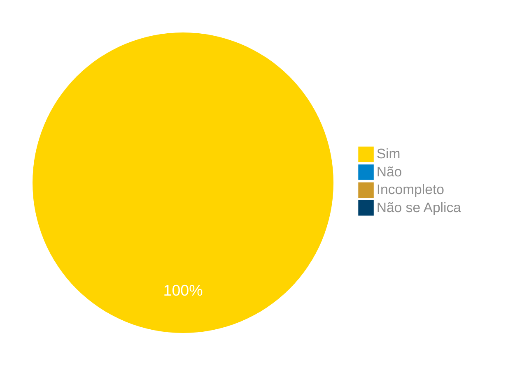

# Verificação do Artefato Personas

## Introdução
Este documento apresenta a verificação do artefato da técnica de priorização [in or out][In or out] do grupo [03][Grupo 03 Correios] da matéria de Requisitos de software, que utiliza no desenvolvimento do seu projeto o aplicativo dos Correios.

## Objetivo
O objetivo deste documento é apresentar e mostrar os erros encontrados no artefato da técnica de priorização [in or out][In or out] do projeto realizado pelo grupo [03 - Correios][Grupo 03 Correios] da matéria de requisitos de software.

## Metodologia
A metodologia utilizada para verificar o artefato emprega o método de inspeção através da utilização de um checklist criado usando como base os principais conceitos ministrados na matéria de requisitos e também nas referências citadas ao final do documento. Abaixo temos o checklist que foi criado pelo integrante [Elias F. Oliveira][EliasGH] e preenchido verificando o artefato da técnica de priorização [in or out][In or out] pelo integrante [Pablo][PabloGH].

### Checklist In or Out

Abaixo temos respectivamente nas tabelas 01 e 02 o checklist de perguntas criado para realizar a verificação do artefato de P

Tabela 1 - Perguntas elaboradas de acordo com os objetivos.

|ID| Descrição | Avaliação | Referência|
|:--:|:--:|:--:|:--:|
|01| A priorização foi feita com a participação de stakeholders?||Software Requirements  [Pg. 318][PG. 318]|
|02| A priorização foi feita tendo duas opções de escolha (In ou Out)?||Software Requirements  [Pg. 318][PG. 318]|
|03| Os requisitos priorizados são condizentes?||Software Requirements  [Pg. 318][PG. 318]|
|04| A priorização foi feita de forma correta?(Os requisitos priorizado possuem realmente uma maior prioridade com relação aos não priorizados)||Software Requirements  [Pg. 318][PG. 318]|

Fonte: [Elias F. Oliveira](https://github.com/EliasOliver21), 2024.

Tabela 2 - Checklist preenchido 

|ID| Descrição | Avaliação | Referência|
|:--:|:--:|:--:|:--:|
|01| A priorização foi feita com a participação de stakeholders?| Sim |Software Requirements  [Pg. 318][PG. 318]|
|02| A priorização foi feita tendo duas opções de escolha (In ou Out)?| Sim |Software Requirements  [Pg. 318][PG. 318]|
|03| Os requisitos priorizados são condizentes?| Sim |Software Requirements  [Pg. 318][PG. 318]|
|04| A priorização foi feita de forma correta?(Os requisitos priorizado possuem realmente uma maior prioridade com relação aos não priorizados)| Sim |Software Requirements  [Pg. 318][PG. 318]|

Fonte: [Gabriel B. Bertolazi][GabrielBGH], 2024.

## Gravação Identificando os Problemas

Gravação Inspeção do Artefato

<iframe width="560" height="315" src="https://www.youtube.com/embed/CkyH6Uk45sI?si=iIJh-qHpbX9f8K8f" title="YouTube video player" frameborder="0" allow="accelerometer; autoplay; clipboard-write; encrypted-media; gyroscope; picture-in-picture; web-share" referrerpolicy="strict-origin-when-cross-origin" allowfullscreen></iframe>

Fonte:[][], 2024.

[Link do Vídeo](https://youtu.be/CkyH6Uk45sI)

## Problemas Encontrados

Abaixo temos a lista dos problemas encontrados ordenados pelo ID de cada um:

Não foram identificadas falhas nos artefatos

### Sumário dos resultados

<!-- Conte as quantidade de ocorrencias e coloque no Grafico a quantidade em cada tipo de avaliação (se não ouver incidencia de um tipo como "não se aplica", apague a linha do mesmo)-->
A seguir, apresentamos a Figura 1 com o gráfico de pizza do sumário dos resultados.

Figura 1 - Gráfico de pizza do sumário dos resultados.

Fonte: [Gabriel B. Bertolazi][GabrielBGH], 2024.

## Bibliografia
> 1. Wiegers, Karl; Beatty, Joy.Software Requirements (Developer Best Practices), 3rd Edition, Microsoft Press, 2013.

## Histórico de Versões

| Versão | Data | Descrição | Autor(es) | Revisor(es) |
| :----: | :--: | --------- | ----------- | ------ |
| `1.0`  | 29/06/2024 | Criação do documento | [Elias F. Oliveira](https://github.com/EliasOliver21) | [Ricardo A.][RicardoGH] |

[ClaudioGH]: https://github.com/claudiohsc
[DaniloGH]: https://github.com/Danilo-Carvalho-Antunes
[EliasGH]: https://github.com/EliasOliver21
[GabrielBGH]: https://github.com/Bertolazi
[GabrielFGH]: https://github.com/MMcLovin
[PabloGH]: https://github.com/pabloheika
[RicardoGH]: https://www.github.com/avmricardo

[PG. 318]: ../../../../assets/prints_verificacao/elias/in_or_out/318.png

[In or out]: https://requisitos-de-software.github.io/2024.1-Correios/priorizacao/tecnicas/inorout/
[Grupo 03 Correios]: https://requisitos-de-software.github.io/2024.1-Correios/