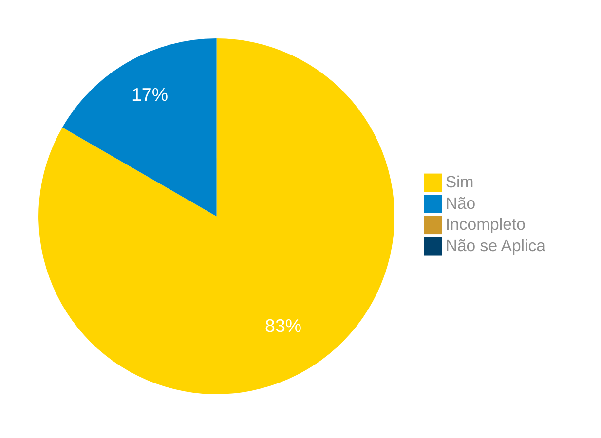

# Verificação do Artefato Análise Documental

## Introdução

Neste artefato, está descrito os resultados da verificação do artefato de [Análise Documental](https://requisitos-de-software.github.io/2024.1-Correios/elicitacao/tecnicas/analise-documental/) feito pelo [Grupo 03](https://requisitos-de-software.github.io/2024.1-Correios/) da disciplina de Requisitos de Software referente ao site [Correios](https://www.correios.com.br/). Lembrando que o foco não é apontar quem errou e sim os problemas presentes no artefato produzido, e por fim garantir os critérios de qualidade estabelecidos.

## Metodologia

Este artefato foi produzido por [Ricardo][RicardoGH] e verificado por [Cláudio][ClaudioGH], seguindo a divisão planejada pelo grupo na [reunião 7](https://requisitos-de-software.github.io/2024.1-Correios/atas/ata7/). Para a verificação do artefato, foi utilizada a versão `1.2` datada do dia 23/06/2024. Adotamos a metodologia de inspeção por [checklist](#checklist-de-verificacao) neste processo. Podemos ver pela Tabela 1 de exemplo, que para cada item do checklist teremos: descrição do item em verificação, resposta à avaliação (pode ser "Sim", "Não", "Incompleto" ou "Não se Aplica"), o número da referência bibliográfica e um link para um print da referência que o fundamenta o item. Ao final, na seção de [Problemas Encontrados](#problemas-encontrados), são comentados os itens negativos.

Tabela 1 - Perguntas elaboradas de acordo com as referências bibliográficas.

| ID | Descrição | Avaliação | Referência | Print |
|:--:| --------- | :-------: | :--------: | :---: |
| <a id="ck1">**1**</a> | Foram examinados documentos que especificam os requisitos do sistema atual ou de sistemas similares? |  | [1.](#ref1) | [página 128](../../../../assets/prints_verificacao/ricardo/analise-documental.png) |
| <a id="ck2">**2**</a> | Foi considerado se os documentos utilizados estão atualizados? |  | [1.](#ref1) | [página 128](../../../../assets/prints_verificacao/ricardo/analise-documental.png) |
| <a id="ck3">**3**</a> | Foram analisados relatórios de problemas e solicitações de melhoria coletados dos usuários? |  | [1.](#ref1) | [página 128](../../../../assets/prints_verificacao/ricardo/analise-documental.png) |
| <a id="ck4">**4**</a>| Caso tenham sido examinados sistemas existentes, foram identificadas funcionalidades que devem ser mantidas ou que são obsoletas? |  | [1.](#ref1) | [página 128](../../../../assets/prints_verificacao/ricardo/analise-documental.png) |
| <a id="ck5">**5**</a> | Foram considerados documentos que descrevem normas coorporativas, industriais ou legais que devem ser seguidas? |  | [1.](#ref1) | [página 128](../../../../assets/prints_verificacao/ricardo/analise-documental.png) |
| <a id="ck6">**6**</a> | Foram listados os documentos utilizados? |  | [1.](#ref1) | [página 128](../../../../assets/prints_verificacao/ricardo/analise-documental.png) |<a href="#ref1">1</a>. pg 128 |

Fonte: [Ricardo Augusto](https://github.com/avmricardo), 2024.

## Apresentação dos Dados

Aqui será apresentado os resultados do checklist e logo após as observações dos itens com resultado negativo.

### Checklist de verificação

Tabela 2 - Checklist preenchido na verificação

| ID | Descrição | Avaliação | Referência | Print |
|:--:| --------- | :-------: | :--------: | :---: |
| <a id="ck1">**1**</a> | Foram examinados documentos que especificam os requisitos do sistema atual ou de sistemas similares? | Sim | [1.](#ref1) | [página 128](../../../../assets/prints_verificacao/ricardo/analise-documental.png) |
| <a id="ck2">**2**</a> | Foi considerado se os documentos utilizados estão atualizados? | Sim | [1.](#ref1) | [página 128](../../../../assets/prints_verificacao/ricardo/analise-documental.png) |
| <a id="ck3">**3**</a> | Foram analisados relatórios de problemas e solicitações de melhoria coletados dos usuários? | Sim | [1.](#ref1) | [página 128](../../../../assets/prints_verificacao/ricardo/analise-documental.png) |
| <a id="ck4">**4**</a>| Caso tenham sido examinados sistemas existentes, foram identificadas funcionalidades que devem ser mantidas ou que são obsoletas? | Sim | [1.](#ref1) | [página 128](../../../../assets/prints_verificacao/ricardo/analise-documental.png) |
| <a id="ck5">**5**</a> | Foram considerados documentos que descrevem normas coorporativas, industriais ou legais que devem ser seguidas? | Não | [1.](#ref1) | [página 128](../../../../assets/prints_verificacao/ricardo/analise-documental.png) |
| <a id="ck6">**6**</a> | Foram listados os documentos utilizados? | Sim | [1.](#ref1) | [página 128](../../../../assets/prints_verificacao/ricardo/analise-documental.png) |<a href="#ref1">1</a>. pg 128 |

Fonte: [Claudio Henrique](https://github.com/claudiohsc), 2024.

### Gravação da verificação

<!-- para o iframe do vídeo, bote width = 560 e height = 315 -->

    <iframe width="560" height="315" src="https://www.youtube.com/embed/Q244fenBqJ4?si=PlARKWKmdpK95mu9" title="YouTube video player" frameborder="0" allow="accelerometer; autoplay; clipboard-write; encrypted-media; gyroscope; picture-in-picture; web-share" referrerpolicy="strict-origin-when-cross-origin" allowfullscreen></iframe>

    <a href="https://www.youtube.com/watch?v=Q244fenBqJ4"> Link para o vídeo </a>

### Problemas Encontrados

<!--- Aqui será apresentado todos os problemas identificados durante o processo de verificação do artefato de link do artefato. --->

- ID 05: Foram considerados documentos que descrevem normas coorporativas, industriais ou legais que devem ser seguidas?
    - Avaliação: Não
    - Comentário: Nesse caso não é um ponto negativo em si, visto que a análise foi feita com base em documentos que derivam do site dos correios, e não diretamente da empresa.

### Sumário dos resultados

<!-- Conte as quantidade de ocorrencias e coloque no Grafico a quantidade em cada tipo de avaliação (se não ouver incidencia de um tipo como "não se aplica", apague a linha do mesmo)-->
A seguir, apresentamos a Figura 1 com o gráfico de pizza do sumário dos resultados.

Figura 1 - Gráfico de pizza do sumário dos resultados.

Fonte: [][], 2024.

## Bibliografia

> 1<a id="ref1">.</a> Wiegers, K.E. **(2013) Software Requirements, 3rd Edition**. Microsoft Press, Redmond. Acesso em: 09 de Junho de 2024

## Referências bibliográficas

> 1. Wiegers, K.E. **(2013) Software Requirements, 3rd Edition**. Microsoft Press, Redmond. Acesso em: 09 de Junho de 2024

## Histórico de Versões

| Versão | Data | Descrição | Autor(es) | Revisor(es) |
| :----: | :--: | --------- | ----------- | ------ |
| `1.0`  | 27/06/2024 | Criação do documento | [Ricardo Augusto][RicardoGH] | [Elias O.][EliasGH] |

[ClaudioGH]: https://github.com/claudiohsc
[DaniloGH]: https://github.com/Danilo-Carvalho-Antunes
[EliasGH]: https://github.com/EliasOliver21
[GabrielBGH]: https://github.com/Bertolazi
[GabrielFGH]: https://github.com/MMcLovin
[PabloGH]: https://github.com/pabloheika
[RicardoGH]: https://www.github.com/avmricardo