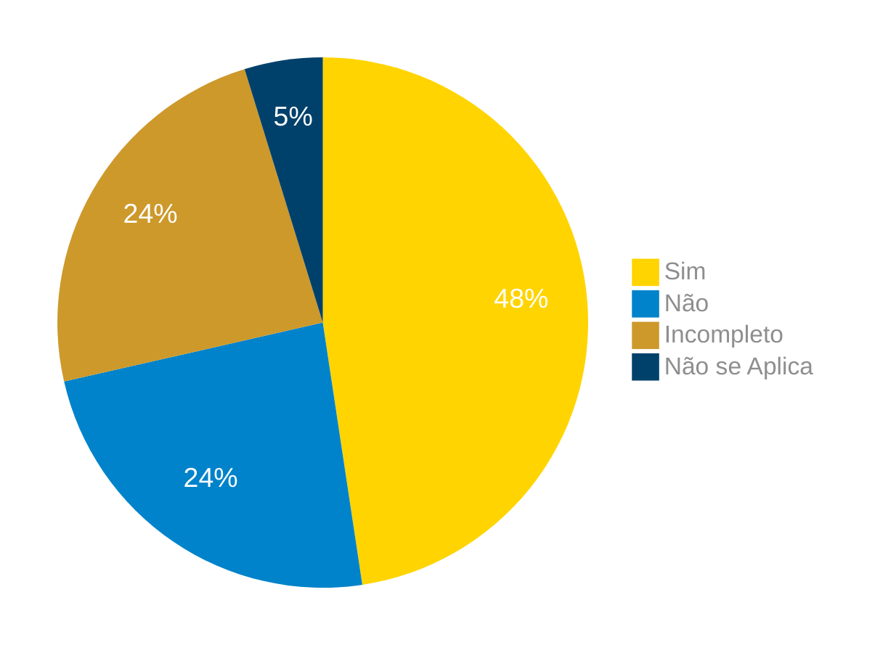

# Verificação do Artefato Brainstorming

## Introdução

Neste artefato, está descrito os resultados da verificação do artefato de [Brainstorming](https://requisitos-de-software.github.io/2024.1-Correios/elicitacao/tecnicas/brainstorming/) feito pelo [Grupo 03](https://requisitos-de-software.github.io/2024.1-Correios/#/README) da disciplina de Requisitos de Software, e referente ao aplicativo [Correios](https://www.correios.com.br/). Lembrando que o foco não é apontar quem errou e sim os problemas presentes no artefato produzido, e por fim garantir os critérios de qualidade estabelecidos.

## Metodologia

Este artefato foi verificado por [Gabriel B. Bertolazi][GabrielBGH], e verificado por [Gabriel F. J. Silva][GabrielFGH], seguindo a divisão planejada pelo grupo na [reunião 7](https://requisitos-de-software.github.io/2024.1-Correios/atas/ata7/).Para a verificação do artefato, foi utilizada a versão `1.4` datada do dia 23/06/2024. Adotamos a metodologia de inspeção por [checklist](#checklist-de-verificacao) (tabela 1) neste processo, em que para cada item do checklist teremos: descrição do item em verificação, resposta à avaliação (pode ser "Sim", "Não", "Incompleto" ou "Não se Aplica") e a fonte que o fundamenta. Ao final, na seção de [Problemas Encontrados](#problemas-encontrados), são comentados os itens negativos.

### Checklist de verificação

Tabela 1 - Perguntas elaboradas de acordo com os objetivos.

| ID | Descrição | Avaliação | Referência| Print |
|:--:| --------- | :-------: | :-------: | :-------: |
| **1** | Objetivo Claro: Defina o propósito do brainstorming, como levantar necessidades dos usuários ou gerar ideias para um projeto. |  | <a href="#ref1">1</a>. | [pg 152](../../../../assets/prints_verificacao/gabrielB/152.png) |
| **2** | Participantes: Escolha participantes com perfis semelhantes ou conduza sessões separadas para diferentes perfis. |  | <a href="#ref1">1</a>. pg 153 | [pg 153](../../../../assets/prints_verificacao/gabrielB/153.1.png) |
| **3** | Moderador: Tenha um moderador para guiar a sessão, esclarecer dúvidas e manter o foco. |  | <a href="#ref1">1</a>. | [pg 153](../../../../assets/prints_verificacao/gabrielB/153.2.png) |
| **4** | Regras da Sessão: Estabeleça regras claras, como evitar críticas e encorajar a criatividade. |  | <a href="#ref1">1</a>. | [pg 153](../../../../assets/prints_verificacao/gabrielB/153.3.png)|
| **5** | Participação Equilibrada: Assegurar que todos os participantes tiveram a oportunidade de expressar suas ideias e que ninguém dominou a sessão. |  | <a href="#ref1">1</a>. | [pg 152](../../../../assets/prints_verificacao/gabrielB/154.png) |

Fonte: [Gabriel B. Bertolazi][GabrielBGH], 2024.

## Apresentação dos Dados

### Verificação

Abaixo temos a realização em video e tabela 2 da verificação. 

Tabela 2 - check list preenchido.

| ID | Descrição | Avaliação | Observação |
| --- | --- | --- | --- |
| **1** | Objetivo Claro: Defina o propósito do brainstorming, como levantar necessidades dos usuários ou gerar ideias para um projeto. | |   |
| **2** | Participantes: Escolha participantes com perfis semelhantes ou conduza sessões separadas para diferentes perfis. |  | Existe uma seleção de participantes e é apresentados como usuários, porem não é especificado os perfis dos participantes. |
| **3** | Moderador: Tenha um moderador para guiar a sessão, esclarecer dúvidas e manter o foco. | |   |
| **4** | Regras da Sessão: Estabeleça regras claras, como evitar críticas e encorajar a criatividade. | |   |
| **5** | Participação Equilibrada: Assegurar que todos os participantes tiveram a oportunidade de expressar suas ideias e que ninguém dominou a sessão. | |   |

Fonte: [Gabriel F. J. Silva][GabrielFGH], 2024.

## Problemas Encontrados

ID xx - resumo
    - Avalição:
    - Observação:

### Sumário dos resultados

<!-- Conte as quantidade de ocorrencias e coloque no Grafico a quantidade em cada tipo de avaliação (se não ouver incidencia de um tipo como "não se aplica", apague a linha do mesmo)-->
A seguir, apresentamos a Figura 1 com o gráfico de pizza do sumário dos resultados.

Figura 1 - Gráfico de pizza do sumário dos resultados.

Fonte: [GAbriel B. Bertolazi][GabrielBGH], 2024.

## Bibliografia

> 1<a id="ref1">.</a> Barbosa, S. D. J.; Silva, B. S. da; Silveira, M. S.; Gasparini, I.; Darin, T.; Barbosa, G. D. J. (2021) Interação Humano-Computador e Experiência do usuário. Autopublicação. ISBN: 978-65-00-19677-1.
>
> 2<a id="ref2">.</a> REtraining - Guia facetado de Técnicas de Elicitação de Requisitos, Brainstorming. Disponível em: <https://retraining.inf.ufsc.br/guia/app/classificacoes/tecnicas-de-elicitacao-de-requisitos/entidades/tecnicas-de-elicitacao-de-requisitos-brainstorming>. Acesso em: 10 de junho de 2024.

## Histórico de Versões

| Versão | Data | Descrição | Autor(es) | Revisor(es) |
| :----: | :--: | --------- | ----------- | ------ |
| `1.0`  | 01/07/2024 | Criação do documento | [Gabriel B. Bertolazi][GabrielBGH] | [Ricardo A.][RicardoGH] |
[ClaudioGH]: https://github.com/claudiohsc
[DaniloGH]: https://github.com/Danilo-Carvalho-Antunes
[EliasGH]: https://github.com/EliasOliver21
[GabrielBGH]: https://github.com/Bertolazi
[GabrielFGH]: https://github.com/MMcLovin
[PabloGH]: https://github.com/pabloheika
[RicardoGH]: https://www.github.com/avmricardo