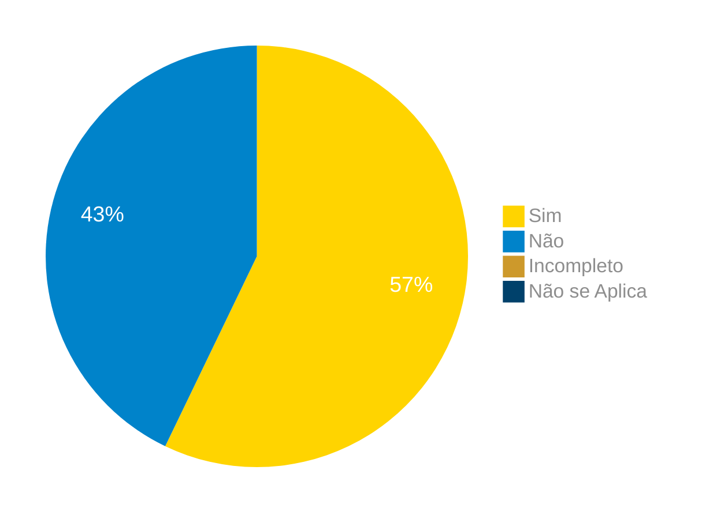

# Verificação da Técnica de Observação

## Introdução

Neste artefato, está descrito os resultados da verificação do artefato de elicitação de requisitos pela técnica de [Observação](link do artefato), feita pelo [Grupo 03](https://requisitos-de-software.github.io/2024.1-Correios/) da disciplina de Requisitos de Software, referente ao aplicativo [Correios](https://www.correios.com.br/). Lembrando que o foco não é apontar quem errou e sim os problemas presentes no artefato produzido, e por fim garantir os critérios de qualidade estabelecidos.

## Metodologia

Este artefato foi produzido por [Gabriel F. J. Silva][GabrielFGH] e verificado por [Gabriel B. Bertolazi][GabrielBGH], seguindo a divisão planejada pelo grupo na [reunião 7](https://requisitos-de-software.github.io/2024.1-Correios/atas/ata7/). Para a verificação do artefato, foi utilizada a versão `1.1` datada do dia 23/06/2024. Adotamos a metodologia de inspeção por [checklist](#checklist-de-verificacao) neste processo. Podemos ver pela Tabela 1 de exemplo, que para cada item do checklist teremos: descrição do item em verificação, resposta à avaliação (pode ser "Sim", "Não", "Incompleto" ou "Não se Aplica"), o número da referência bibliográfica e um link para um print da referência que o fundamenta o item. Ao final, na seção de [Problemas Encontrados](#problemas-encontrados), são comentados os itens negativos.

Tabela 1 - Perguntas elaboradas de acordo com as referências bibliográficas.

| ID | Descrição | Avaliação | Referência | Print |
|:--:| --------- | :-------: | :--------: | :---: |
| **1** | Foram determinadas as questões a serem respondidas durante ou após a observação? |  | [1.](#ref1) | [página 236][ref1-pg236] |
| **2** | Foram determinadas as atividades a serem observadas? |  | [1.](#ref1) | [página 236][ref1-pg236] |
| **3** | Foi definida a postura (passiva ou ativa) do observador? |  | [1.](#ref1) | [página 236][ref1-pg236] |
| **4** | O processo de observação foi realizada mais de uma vez? |  | [1.](#ref1) | [página 236][ref1-pg236] |
| **5** | Foram obtidas respostas para as questões levantadas? |  | [1.](#ref1) | [página 237][ref1-pg237] |
| **6** | De maneira à deixar as pessoas sendo observadas mais confortáveis, diminuindo as chances de interferências negativas, o observador apresenta a si mesmo e o método à elas? |  | [1.](#ref1) | [página 237][ref1-pg237] |
| **7** | Foi definida uma janela de tempo para a realização da observação? |  | [1.](#ref1) | [página 235][ref1-pg235] |

Fonte: [Gabriel F. J. Silva][GabrielFGH], 2024.

## Apresentação dos Dados

Aqui será apresentado os resultados do checklist e logo após as observações dos itens com resultado negativo.

### Checklist de verificação

Tabela 2 - Checklist preenchido na verificação

| ID | Descrição | Avaliação | Referência | Print |
|:--:| --------- | :-------: | :--------: | :---: |
| **1** | Foram determinadas as questões a serem respondidas durante ou após a observação? | Não | [1.](#ref1) | [página 236][ref1-pg236] |
| **2** | Foram determinadas as atividades a serem observadas? | Sim | [1.](#ref1) | [página 236][ref1-pg236] |
| **3** | Foi definida a postura (passiva ou ativa) do observador? | Sim | [1.](#ref1) | [página 236][ref1-pg236] |
| **4** | O processo de observação foi realizada mais de uma vez? | Não | [1.](#ref1) | [página 236][ref1-pg236] |
| **5** | Foram obtidas respostas para as questões levantadas? | Não | [1.](#ref1) | [página 237][ref1-pg237] |
| **6** | De maneira à deixar as pessoas sendo observadas mais confortáveis, diminuindo as chances de interferências negativas, o observador apresenta a si mesmo e o método à elas? | Sim | [1.](#ref1) | [página 237][ref1-pg237] |
| **7** | Foi definida uma janela de tempo para a realização da observação? | Sim | [1.](#ref1) | [página 235][ref1-pg235] |

Fonte: [Gabriel B. Bertolazi][GabrielBGH], 2024.

### Gravação da verificação

<!-- para o iframe do vídeo, bote width = 560 e height = 315 -->

    <iframe width="560" height="315" src="https://www.youtube.com/embed/8peit_fkZkU?si=LbUSiv9ByOWBezF2" title="YouTube video player" frameborder="0" allow="accelerometer; autoplay; clipboard-write; encrypted-media; gyroscope; picture-in-picture; web-share" referrerpolicy="strict-origin-when-cross-origin" allowfullscreen></iframe>

    <a href="https://youtu.be/8peit_fkZkU?si=eVR6YhkgmlxgaY_H"> Link para o vídeo </a>

### Problemas Encontrados

<!--- Aqui será apresentado todos os problemas identificados durante o processo de verificação do artefato de link do artefato. --->

- ID 01: Foram determinadas as questões a serem respondidas durante ou após a observação?
    - Avaliação: Não
    - Comentário: Não tem listado questões a serem feitas na entrevista

- ID 04: O processo de observação foi realizada mais de uma vez?
    - Avaliações: Não
    - Comentários: Não tem dito isso em lugar algum

- ID 05: Foram obtidas respostas para as questões levantadas?
    - Avaliações: Não
    - Comentários: Não tem listado questões a serem feitas na entrevista

### Sumário dos resultados

<!-- Conte as quantidade de ocorrencias e coloque no Grafico a quantidade em cada tipo de avaliação (se não ouver incidencia de um tipo como "não se aplica", apague a linha do mesmo)-->
A seguir, apresentamos a Figura 1 com o gráfico de pizza do sumário dos resultados.

Figura 1 - Gráfico de pizza do sumário dos resultados.

Fonte: [Gabriel B. Bertolazi][GabrielBGH], 2024.

## Bibliografia

> 1.  VAZQUEZ, CARLOS ; SIMÕES, GUILHERME. **Engenharia de requisitos: software orientado ao negócio**. [s.l.] Brasport, 10 de Agosto de 2016. Disponível em: <https://www.amazon.com.br/Engenharia-Requisitos-Software-Orientado-Neg%C3%B3cio/dp/8574527904>. Acesso em: 29 de Junho de 2024.

## Histórico de Versões

| Versão | Data | Descrição | Autor(es) | Revisor(es) |
| :----: | :--: | --------- | ----------- | ------ |
| `1.0`  | 28/06/2024 | Criação do documento | [Gabriel F. J. Silva][GabrielFGH] | [Pablo S.][PabloGH] |
| `1.1`  | 29/06/2024 | Criação do documento | [Gabriel B. Bertolazi][GabrielBGH] | [Pablo S.][PabloGH]  |

[ClaudioGH]: https://github.com/claudiohsc
[DaniloGH]: https://github.com/Danilo-Carvalho-Antunes
[EliasGH]: https://github.com/EliasOliver21
[GabrielBGH]: https://github.com/Bertolazi
[GabrielFGH]: https://github.com/MMcLovin
[PabloGH]: https://github.com/pabloheika
[RicardoGH]: https://www.github.com/avmricardo

[ref1-pg235]: ../../../../assets/prints_verificacao/gabrielF/Observação%20ref1%20-%20pag235.jpeg
[ref1-pg236]: ../../../../assets/prints_verificacao/gabrielF/Observação%20ref1%20-%20pag236.jpeg
[ref1-pg237]: ../../../../assets/prints_verificacao/gabrielF/Observação%20ref1%20-%20pag237.jpeg
[ref1-pg239]: ../../../../assets/prints_verificacao/gabrielF/Observação%20ref1%20-%20pag239.jpeg