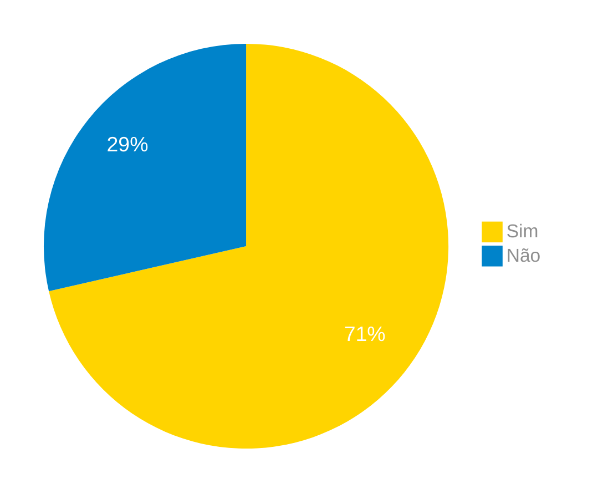

# Verificação do Artefato Elicitação por Questionário

## Introdução

Neste artefato, está descrito os resultados da verificação do artefato de [Elicitação por Questionário](../../../../elicitacao/tecnicas/questionario.md) feito pelo [Grupo 03](https://requisitos-de-software.github.io/2024.1-Correios/) da disciplina de Requisitos de Software referente ao aplicativo [Correios](https://www.correios.com.br/). Lembrando que o foco não é apontar quem errou e sim os problemas presentes no artefato produzido, e por fim garantir os critérios de qualidade estabelecidos.

## Metodologia

Este artefato foi produzido por [Pablo S. Costa][PabloGH] e verificado por [Pablo S. Costa][PabloGH], seguindo a divisão planejada pelo grupo na [reunião 7](https://requisitos-de-software.github.io/2024.1-Correios/atas/ata7/). Para a verificação do artefato, foi utilizada a versão `1.2` datada do dia 23/06/2024. Adotamos a metodologia de inspeção baseada no Método Fagan (1976) por [checklist](#checklist-de-verificacao) neste processo. Podemos ver pela Tabela 1 de exemplo, que para cada item do checklist teremos: descrição do item em verificação, resposta à avaliação (pode ser "Sim", "Não", "Incompleto" ou "Não se Aplica"), o número da referência bibliográfica e um link para um print da referência que o fundamenta o item. Ao final, na seção de [Problemas Encontrados](#problemas-encontrados), são comentados os itens negativos.

Tabela 1 - Perguntas elaboradas de acordo com as referências bibliográficas.

| ID | Descrição | Avaliação | Referência | Print |
| --- | --- | --- | --- | --- |
| 1 | Foram definidos os objetivos da pesquisa em questionário? |   | [Ref1](#ref1). 7.7.2.1 Preparação | [pg 178][f1] |
| 2 | Fui selecionado um público alvo? |   | [Ref1](#ref1).  7.7.2.1 Preparação | [pg 178][f1] |
| 3 | No questionário foram feitas perguntas para conhecer o público alvo e assim poder restringi as perguntas pelo publico? |   | [Ref1](#ref1). 7.7.2.1 Preparação | [pg 178][f2] |
| 4 | Foi realizado um teste com um pequeno grupo do público alvo para validar o questionário? |   | [Ref1](#ref1). 7.7.2.1 Preparação | [pg 179][f3] |
| 5 | Foram definidos os meios de distribuição do questionário mais adequados? |   | [Ref1](#ref1). 7.7.2.1 Preparação | [pg 179][f4] |
| 6 | Foi definido uma data limite para o recebimento de respostas no questionário? |   | [Ref1](#ref1). 7.7.2.1 Preparação | [pg 179][f5] |
| 7 | Foi feita a análise e consolidação das respostas? |   | [Ref1](#ref1). 7.7.2.2 Finalização | [pg 180][f6] |

Fonte: [Pablo S. Costa][PabloGH], 2024.

## Apresentação dos Dados

### Checklist de verificação

Tabela 2 - Checklist preenchido na verificação

| ID | Descrição | Avaliação | Referência | Print |
| --- | --- | --- | --- | --- |
| 1 | Foram definidos os objetivos da pesquisa em questionário? | Não | [Ref1](#ref1). 7.7.2.1 Preparação | [pg 178][f1] |
| 2 | Fui selecionado um público alvo? | Sim | [Ref1](#ref1).  7.7.2.1 Preparação | [pg 178][f1] |
| 3 | No questionário foram feitas perguntas para conhecer o público alvo e assim poder restringi as perguntas pelo publico? | Sim | [Ref1](#ref1). 7.7.2.1 Preparação | [pg 178][f2] |
| 4 | Foi realizado um teste com um pequeno grupo do público alvo para validar o questionário? | Não | [Ref1](#ref1). 7.7.2.1 Preparação | [pg 179][f3] |
| 5 | Foram definidos os meios de distribuição do questionário mais adequados? | Sim | [Ref1](#ref1). 7.7.2.1 Preparação | [pg 179][f4] |
| 6 | Foi definido uma data limite para o recebimento de respostas no questionário? | Sim | [Ref1](#ref1). 7.7.2.1 Preparação | [pg 179][f5] |
| 7 | Foi feita a análise e consolidação das respostas? | Sim | [Ref1](#ref1). 7.7.2.2 Finalização | [pg 180][f6] |

Fonte: [Pablo S. Costa][PabloGH], 2024.

### Gravação da verificação

    <iframe width="560" height="315" src="https://www.youtube.com/embed/-oFikBn7uQI?si=qZNS5N6VC3tqaTHc" title="YouTube video player" frameborder="0" allow="accelerometer; autoplay; clipboard-write; encrypted-media; gyroscope; picture-in-picture; web-share" referrerpolicy="strict-origin-when-cross-origin" allowfullscreen></iframe>

    <a href="https://youtu.be/-oFikBn7uQI"> Link para o vídeo </a>

### Problemas Encontrados

*   ID 1: Foram definidos os objetivos da pesquisa em questionário?
    *   Avaliação: Não
    *   Comentário: Não foram definidos os objetivos da pesquisa
        
*   ID 4: Foi realizado um teste com um pequeno grupo do público alvo para validar o questionário?
    *   Avaliação: Não
    *   Comentário: Não foi realizado um teste com um questionário

### Sumário dos resultados

A seguir, apresentamos a Figura 1 com o gráfico de pizza do sumário dos resultados.

Figura 1 - Gráfico de pizza do sumário dos resultados.

Fonte: [Pablo S. Costa][PabloGH], 2024.

## Bibliografia

> 1. VAZQUEZ, Carlos Eduardo. SIMÕES, Guilherme Siqueira. ENGENHARIA DE REQUISITOS - SOFTWARE ORIENTADO AO NEGÓCIO. Disponível em: Requisitos - Engenharia de Requisitos.

> 2. Fagan, Michael E. Design and Code Inspections to Reduce Errors in Program Development. IBM Systems Journal, Vol. 15, No. 3, 1976, pp. 182-211. 
>

## Histórico de Versões

| Versão | Data | Descrição | Autor(es) | Revisor(es) |
| :----: | :--: | --------- | ----------- | ------ |
| `1.0`  | 27/06/2024 | Criação do documento | [Pablo S. Costa][PabloGH] | [Danilo Carvlho Antunes][DaniloGH] |

[ClaudioGH]: https://github.com/claudiohsc
[DaniloGH]: https://github.com/Danilo-Carvalho-Antunes
[EliasGH]: https://github.com/EliasOliver21
[GabrielBGH]: https://github.com/Bertolazi
[GabrielFGH]: https://github.com/MMcLovin
[PabloGH]: https://github.com/pabloheika
[RicardoGH]: https://www.github.com/avmricardo
[f1]: ../../../../assets/prints_verificacao/pablo/quest/1.jpeg
[f2]: ../../../../assets/prints_verificacao/pablo/quest/2.jpeg
[f3]: ../../../../assets/prints_verificacao/pablo/quest/3.jpeg
[f4]: ../../../../assets/prints_verificacao/pablo/quest/4.jpeg
[f5]: ../../../../assets/prints_verificacao/pablo/quest/5.jpeg
[f6]: ../../../../assets/prints_verificacao/pablo/quest/6.jpeg