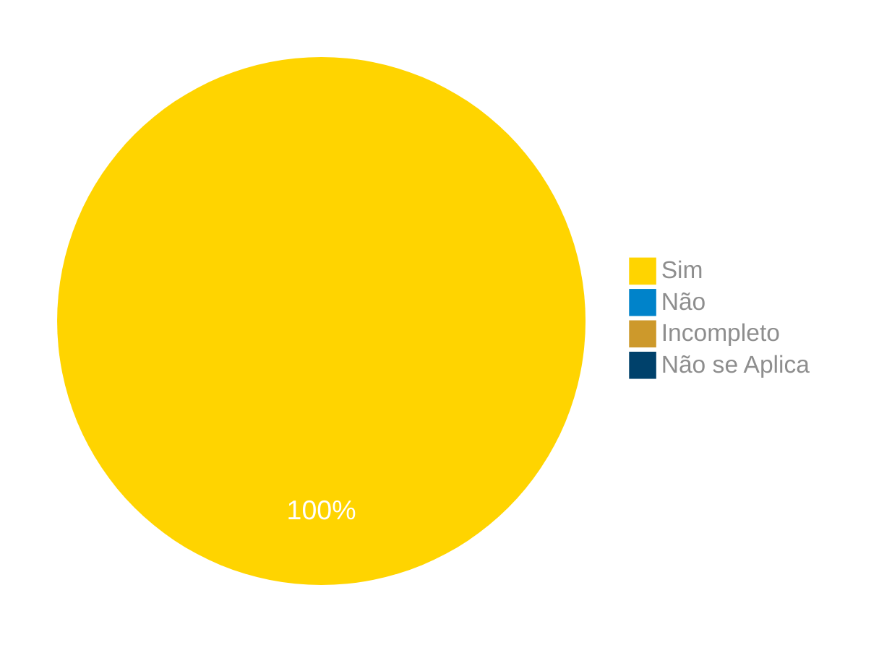

# Verificação do Artefato de Histórias de Usuário

## Introdução

Neste artefato, está descrito os resultados da verificação do artefato de [Histórias de Usuário](https://requisitos-de-software.github.io/2024.1-Correios/modelagem/agil/historias_de_usuario/) feito pelo [Grupo 03](https://requisitos-de-software.github.io/2024.1-Correios/) da disciplina de Requisitos de Software referente ao aplicativo [Correios](https://www.correios.com.br/). Lembrando que o foco não é apontar quem errou e sim os problemas presentes no artefato produzido, e por fim garantir os critérios de qualidade estabelecidos.

## Metodologia

Este artefato foi produzido por [Claudio Henrique][ClaudioGH] e verificado por [Ricardo A.][RicardoGH], seguindo a divisão planejada pelo grupo na [reunião 7](https://requisitos-de-software.github.io/2024.1-Correios/atas/ata7/). Para a verificação do artefato, foi utilizada a versão `1.1` datada do dia 27/05/2024. Adotamos a metodologia de inspeção por [checklist](#checklist-de-verificacao) neste processo. Podemos ver pela Tabela 1 de exemplo, que para cada item do checklist teremos: descrição do item em verificação, resposta à avaliação (pode ser "Sim", "Não", "Incompleto" ou "Não se Aplica"), o número da referência bibliográfica e um link para um print da referência que o fundamenta o item. Ao final, na seção de [Problemas Encontrados](#problemas-encontrados), são comentados os itens negativos.

Tabela 1 - Perguntas elaboradas de acordo com as referências bibliográficas.

| ID | Descrição | Avaliação | Referência | Print |
|:--:| --------- | :-------: | :--------: | :---: |
| **1** | As histórias de usuário descrevem uma funcionalidade que terá valor para os usuários do software? |  | [1.](#ref1) | [página 25](../../../../assets/prints_verificacao/claudio/pg25-us-1.png) |
| **2** | Todas as histórias de usuário são independentes uma das outras, afim de prevenir problemas de planejamento e priorização? |  | [1.](#ref1) | [página 26](../../../../assets/prints_verificacao/claudio/pg26-invest.png) |
| **3** | Todas as histórias de usuário são possíveis de serem testadas? |  | [1.](#ref1) | [página 26](../../../../assets/prints_verificacao/claudio/pg26-invest.png) |
| **4** | Todas as histórias de usuário possuem critérios de aceitação? |  | [1.](#ref1) | [página 27](../../../../assets/prints_verificacao/claudio/pg27-ca.png) |
| **5** | Todas as histórias de usuário são sucintas e explicativas? |  | [1.](#ref1) | [página 26](../../../../assets/prints_verificacao/claudio/pg26-invest.png) |
| **6** | Os critérios de aceitação estão definidos de forma que apresentem requisitos mínimos para uma história seja considerada completa? |  | [1.](#ref1) | [página 27](../../../../assets/prints_verificacao/claudio/pg27-us-ac.png) |

Fonte: [Claudio Henrique](https://github.com/claudiohsc), 2024.

## Apresentação dos Dados

Aqui será apresentado os resultados do checklist e logo após as observações dos itens com resultado negativo.

### Checklist de verificação

Tabela 2 - Checklist preenchido na verificação

| ID | Descrição | Avaliação | Referência | Print |
|:--:| --------- | :-------: | :--------: | :---: |
| **1** | As histórias de usuário descrevem uma funcionalidade que terá valor para os usuários do software? | Sim | [1.](#ref1) | [página 25](../../../../assets/prints_verificacao/claudio/pg25-us-1.png) |
| **2** | Todas as histórias de usuário são independentes uma das outras, afim de prevenir problemas de planejamento e priorização? | Sim | [1.](#ref1) | [página 26](../../../../assets/prints_verificacao/claudio/pg26-invest.png) |
| **3** | Todas as histórias de usuário são possíveis de serem testadas? | Sim | [1.](#ref1) | [página 26](../../../../assets/prints_verificacao/claudio/pg26-invest.png) |
| **4** | Todas as histórias de usuário possuem critérios de aceitação? | Sim | [1.](#ref1) | [página 27](../../../../assets/prints_verificacao/claudio/pg27-ca.png) |
| **5** | Todas as histórias de usuário são sucintas e explicativas? | Sim | [1.](#ref1) | [página 26](../../../../assets/prints_verificacao/claudio/pg26-invest.png) |
| **6** | Os critérios de aceitação estão definidos de forma que apresentem requisitos mínimos para uma história seja considerada completa? | Sim | [1.](#ref1) | [página 27](../../../../assets/prints_verificacao/claudio/pg27-us-ac.png) |

Fonte: [Ricardo Augusto](https://github.com/avmricardo), 2024.

### Gravação da verificação

<!-- para o iframe do vídeo, bote width = 560 e height = 315 -->

<iframe width="560" height="315" src="https://www.youtube.com/embed/BM0DgQ3d_bE?si=bClDbQ6xrcbVKK_U" title="YouTube video player" frameborder="0" allow="accelerometer; autoplay; clipboard-write; encrypted-media; gyroscope; picture-in-picture; web-share" referrerpolicy="strict-origin-when-cross-origin" allowfullscreen></iframe>

    <a href="https://youtu.be/BM0DgQ3d_bE"> Link para o vídeo </a>

### Problemas Encontrados

<!--- Aqui será apresentado todos os problemas identificados durante o processo de verificação do artefato de link do artefato. --->

Não ocorreram problemas.

### Sumário dos resultados

<!-- Conte as quantidade de ocorrencias e coloque no Grafico a quantidade em cada tipo de avaliação (se não ouver incidencia de um tipo como "não se aplica", apague a linha do mesmo)-->
A seguir, apresentamos a Figura 1 com o gráfico de pizza do sumário dos resultados.

Figura 1 - Gráfico de pizza do sumário dos resultados.

Fonte: [Ricardo Augusto][RicardoGH], 2024.

## Bibliografia

> 1. BALLE, R. ANDREA. Análise de Metodologias Ágeis: Conceitos, Aplicações e Relatos sobre XP e Scrum. UNIVERSIDADE FEDERAL DO RIO GRANDE DO SUL, 2011. Disponível em: https://lume.ufrgs.br/bitstream/handle/10183/31028/000782065.pdf?sequence=. Acesso em: 27 de junho de 2024.

## Histórico de Versões

| Versão | Data | Descrição | Autor(es) | Revisor(es) |
| :----: | :--: | --------- | ----------- | ------ |
| `1.0`  | 27/06/2024 | Criação do documento | [Cloáudio Henrique][ClaudioGH] | [Danilo C.][DaniloGH] |

[ClaudioGH]: https://github.com/claudiohsc
[DaniloGH]: https://github.com/Danilo-Carvalho-Antunes
[EliasGH]: https://github.com/EliasOliver21
[GabrielBGH]: https://github.com/Bertolazi
[GabrielFGH]: https://github.com/MMcLovin
[PabloGH]: https://github.com/pabloheika
[RicardoGH]: https://www.github.com/avmricardo