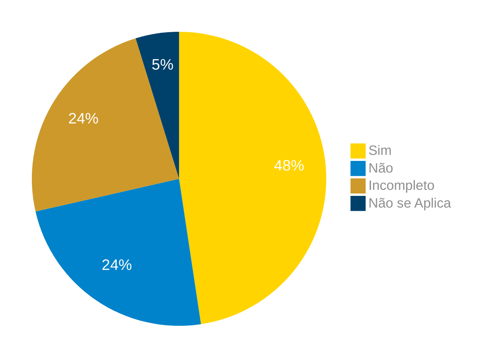

## Introdução

Neste artefato, está descrito os resultados da verificação do artefato de [Casos de uso](https://requisitos-de-software.github.io/2024.1-Correios/modelagem/casos_de_uso/#6-rastrear-encomendas) feito pelo [Grupo 03](https://requisitos-de-software.github.io/2024.1-Correios/) da disciplina de Requisitos de Software referente ao aplicativo [Correios](https://www.correios.com.br/). Lembrando que o foco não é apontar quem errou e sim os problemas presentes no artefato produzido, e por fim garantir os critérios de qualidade estabelecidos.

## Metodologia

Este artefato foi produzido por [Gabriel B. Bertolazi][GabrielBGH] e verificado por [Cláudo][ClaudioGH], seguindo a divisão planejada pelo grupo na [reunião 7](https://requisitos-de-software.github.io/2024.1-Correios/atas/ata7/). Para a verificação do artefato, foi utilizada a versão `1.0` datada do dia 14/05/2024. Adotamos a metodologia de inspeção por [checklist](#checklist-de-verificacao) neste processo. Podemos ver pela Tabela 1 de exemplo, que para cada item do checklist teremos: descrição do item em verificação, resposta à avaliação (pode ser "Sim", "Não", "Incompleto" ou "Não se Aplica"), o número da referência bibliográfica e um link para um print da referência que o fundamenta o item. Ao final, na seção de [Problemas Encontrados](#problemas-encontrados), são comentados os itens negativos.

 <strong> Tabela 1 - </strong>Especificação do Caso de uso

|ID|Descrição|Avaliação|Referência|Print|
| --- | -------------------- | --------- | ----------- | -----------|
|**01**| O caso de uso mostra uma execução completa da funcionalidade |  | <a id="anchor_1" href="#REF1">^1^</a> | [pg.105](../../../../assets/prints_verificacao/gabrielB/pg.105.png) |
|**02**| É possível notar o valor que essa funcionalidade traz para o usuário? |  | <a id="anchor_1" href="#REF1">^1^</a> | [pg.105](../../../../assets/prints_verificacao/gabrielB/pg.105.png) |
|**03**| O caso de uso é representado como uma elipse dentro do diagrama de caso de uso? |  | <a id="anchor_1" href="#REF1">^1^</a> | [pg.106](../../../../assets/prints_verificacao/gabrielB/pg.106.png) |
|**04**| O caso de uso possuem dentro deles casos de uso primário e secundários? |  | <a id="anchor_1" href="#REF1">^1^</a>  | [pg.106](../../../../assets/prints_verificacao/gabrielB/pg.106.png) |
|**05**| Fica claro quem é o autor do caso de uso em questão? |  | <a id="anchor_1" href="#REF1">^1^</a> | [pg.107](../../../../assets/prints_verificacao/gabrielB/pg.107.1.png) |
|**06**| É detalhado dentro dos casos de uso os passos em ordem que acontecem dentro do caso de uso? |  | <a id="anchor_1" href="#REF1">^1^</a> | [pg.107](../../../../assets/prints_verificacao/gabrielB/pg.107.2.png) |
|**07**| É possível perceber as condições para esse caso de uso acontecer? |  | <a id="anchor_1" href="#REF1">^1^</a> | [pg.107](../../../../assets/prints_verificacao/gabrielB/pg.107.2.png) |

Fonte: [Gabriel B. Bertolazi](https://github.com/Bertolazi), 2024

## Apresentação dos Dados

Aqui será apresentado os resultados do checklist e logo após as observações dos itens com resultado negativo.

### Checklist de verificação

Tabela 2 - Checklist preenchido na verificação

|ID|Descrição|Avaliação|Referência|
| --- | -------------------- | --------- | ----------- | 
|**01**| O caso de uso mostra uma execução completa da funcionalidade |  | <a id="anchor_1" href="#REF1">^1^</a> | 
|**02**| É possível notar o valor que essa funcionalidade traz para o usuário? |  | <a id="anchor_1" href="#REF1">^1^</a> | 
|**03**| O caso de uso é representado como uma elipse dentro do diagrama de caso de uso? |  | <a id="anchor_1" href="#REF1">^1^</a> |
|**04**| O caso de uso possuem dentro deles casos de uso primário e secundários? |  | <a id="anchor_1" href="#REF1">^1^</a>  |
|**05**| Fica claro quem é o autor do caso de uso em questão? |  | <a id="anchor_1" href="#REF1">^1^</a> | 
|**06**| É detalhado dentro dos casos de uso os passos em ordem que acontecem dentro do caso de uso? |  | <a id="anchor_1" href="#REF1">^1^</a> | 
|**07**| É possível perceber as condições para esse caso de uso acontecer? |  | <a id="anchor_1" href="#REF1">^1^</a> | 

Fonte: [Cláudo][ClaudioGH], 2024

### Gravação da verificação

<!-- para o iframe do vídeo, bote width = 560 e height = 315 -->

    <iframe width="560" height="315" src="https://www.youtube.com/embed" title="Apresentação 7 Interação Humano Computador 2024.1 - Grupo 3" frameborder="0" allow="accelerometer; autoplay; clipboard-write; encrypted-media; gyroscope; picture-in-picture; web-share" referrerpolicy="strict-origin-when-cross-origin" allowfullscreen></iframe>

    <a href="link"> Link para o vídeo </a>

## Problemas Encontrados

Aqui será apresentado todos os problemas identificados durante o processo de verificação do artefato [Caso de Uso](https://requisitos-de-software.github.io/2024.1-Correios/modelagem/casos_de_uso/#6-rastrear-encomendas).

- ID xx: Descrição
    - Avaliação: 
    - Comentário: 

### Sumário dos resultados

<!-- Conte as quantidade de ocorrencias e coloque no Grafico a quantidade em cada tipo de avaliação (se não ouver incidencia de um tipo como "não se aplica", apague a linha do mesmo)-->
A seguir, apresentamos a Figura 1 com o gráfico de pizza do sumário dos resultados.

Figura 1 - Gráfico de pizza do sumário dos resultados.

Fonte: [Cláudo][ClaudioGH], 2024.

## Bibliografia

<a id="REF3" href="#anchor_3">1. </a>REINEHR, Sheila. Engenharia de requisitos. [Insert Publisher Location]: Grupo A, 2020. E-book. ISBN 9786556900674. Disponível em: [https://integrada.minhabiblioteca.com.br/#/books/9786556900674/](https://integrada.minhabiblioteca.com.br/#/books/9786556900674/). Acesso em: 10 junho 2024.

## Histórico de Versões

| Versão | Data | Descrição | Autor(es) | Revisor(es) |
| :----: | :--: | --------- | ----------- | ------ |
| `1.0`  | 01/07/2024 | Criação do documento | [Gabriel B. Bertolazi][GabrielBGH] | [Danilo C.][DaniloGH] |

[ClaudioGH]: https://github.com/claudiohsc
[DaniloGH]: https://github.com/Danilo-Carvalho-Antunes
[EliasGH]: https://github.com/EliasOliver21
[GabrielBGH]: https://github.com/Bertolazi
[GabrielFGH]: https://github.com/MMcLovin
[PabloGH]: https://github.com/pabloheika
[RicardoGH]: https://www.github.com/avmricardo