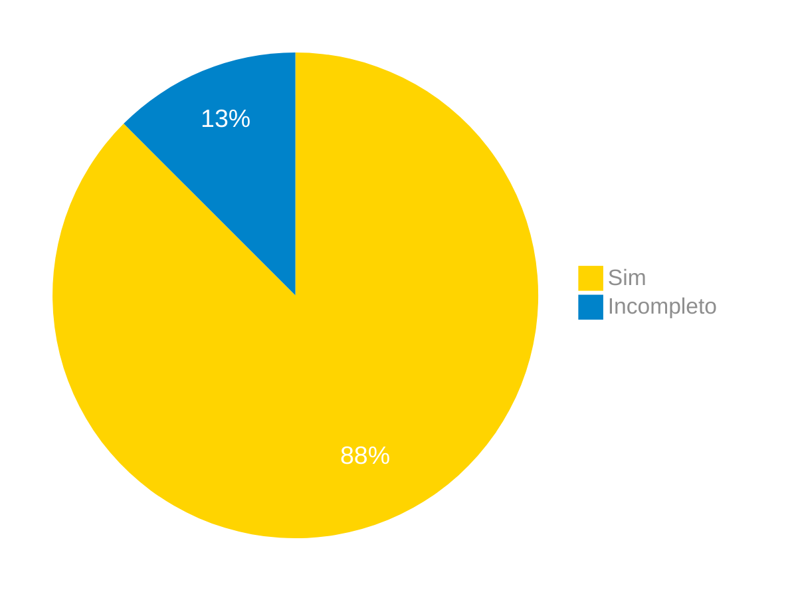
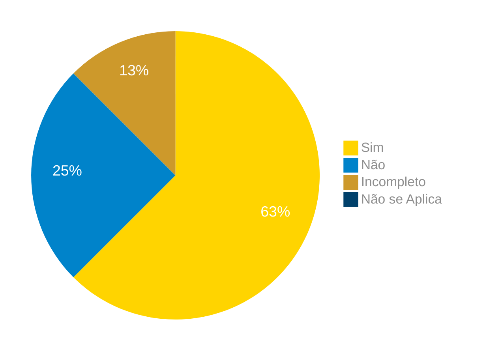
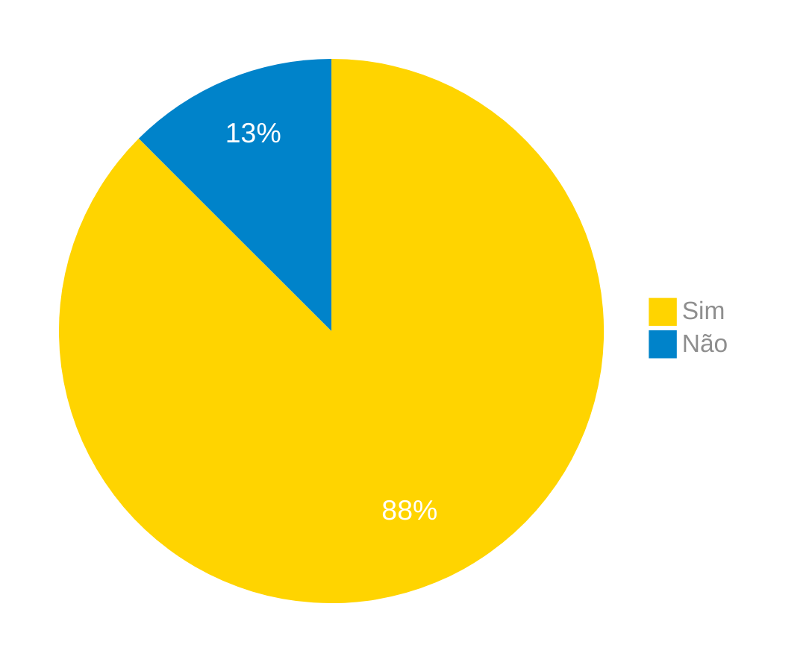
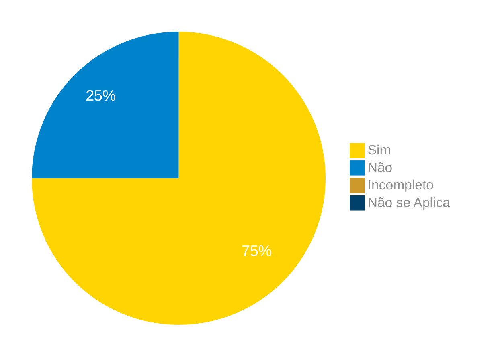
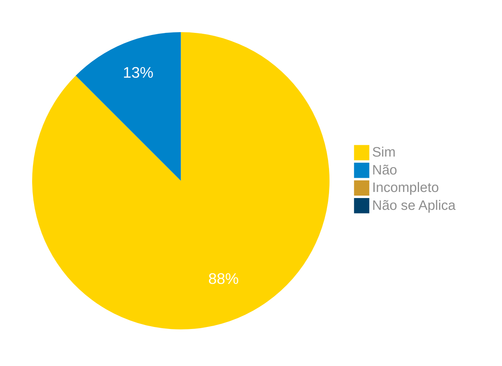
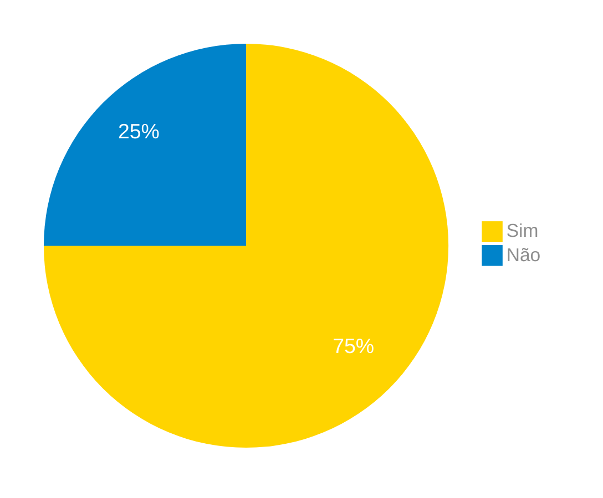
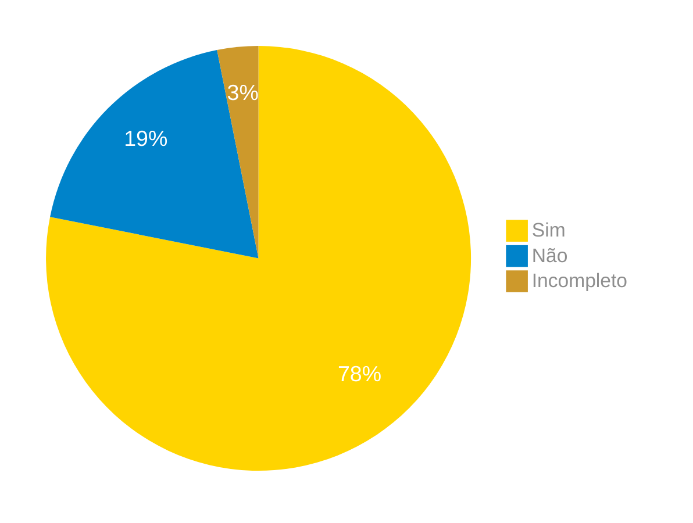

# Verificação do Artefato Cenários

## Introdução

Neste artefato, está descrito os resultados da verificação do artefato de [Cenários](../../../modelagem/cenarios.md) feito pelo [Grupo 03](https://requisitos-de-software.github.io/2024.1-Correios/) da disciplina de Requisitos de Software referente ao aplicativo [Correios](https://www.correios.com.br/). Lembrando que o foco não é apontar quem errou e sim os problemas presentes no artefato produzido, e por fim garantir os critérios de qualidade estabelecidos.

## Metodologia

Este artefato foi produzido por [Pablo S. Costa][PabloGH] e verificado por Cláudio, Danilo, Elias, Gabriel F. J. Silva, Pablo, Ricardo e Gabriel B. Bertolazi, seguindo a divisão planejada pelo grupo na [reunião 7](https://requisitos-de-software.github.io/2024.1-Correios/atas/ata7/). Para a verificação do artefato, foi utilizada a versão `1.0` datada do dia 18/05/2024. Adotamos a metodologia de inspeção baseada no Método Fagan (1976) por [checklist](#checklist-de-verificacao) neste processo. Podemos ver pela Tabela 1 de exemplo, que para cada item do checklist teremos: descrição do item em verificação, resposta à avaliação (pode ser "Sim", "Não", "Incompleto" ou "Não se Aplica"), o número da referência bibliográfica e um link para um print da referência que o fundamenta o item. Ao final, na seção de [Problemas Encontrados](#problemas-encontrados), são comentados os itens negativos.

Tabela 1 - Perguntas elaboradas de acordo com as referências bibliográficas.

| ID | Descrição | Avaliação | Referência | Print |
| --- | --- | --- | --- | --- |
| 1 | O cenário possui os elementos básicos: título, objetivos, contexto, atores, recursos, episódios e exceções? |   | [REF1](#ref1). | [pg 49][f1] |
| 2 | O modo para atingir o objetivo está descrito no cenário ? |   | [REF1](#ref1). | [pg 49][f1] |
| 3 | O contexto descreve o estado inicial: suas pré-condições, o local (físico) e o tempo? |   | [REF1](#ref1). | [pg 49][f1] |
| 4 | As características pessoais dos atores são relevantes ao cenário? |   | [REF2](#ref2). | [pg 172][f2] |
| 5 | Cada episódio representa uma ação realizada por um ator onde participam outros atores utilizando recursos disponíveis? |   | [REF1](#ref1). | [pg 49][f1] |
| 6 | Os cenários possuem alguma ligação com os léxicos? |   | [REF1](#ref1). | [pg 50][f3] |
| 7 | Os episódios do cenário seguem uma ordem lógica para atingir o objetivo? |   | [REF1](#ref1). | [pg 50][f4] |
| 8 | O título do cenário é autoexplicativo? |   | [REF1](#ref1). | [pg 49][f1] |

Fonte: [Pablo S. Costa][PabloGH], 2024.

## Apresentação dos Dados

Abaixo temos os checklists respondidos nas tabelas de 2 a 8 e seus respectivos vídeos de gravações logo em seguida temos os resultados obtidos os gráficos de pizza representando os resultados nas figuras de 1 a 7.

## Cenario - Calcular preços e prazos de entrega

### Checklist de verificação

Tabela 2 - Checklist preenchido na verificação

| ID | Descrição | Avaliação | Referência | Print |
| --- | --- | --- | --- | --- |
| 1 | O cenário possui os elementos básicos: título, objetivos, contexto, atores, recursos, episódios e exceções? | Sim  | [REF1](#ref1). | [pg 49][f1] |
| 2 | O modo para atingir o objetivo está descrito no cenário ? | Sim  | [REF1](#ref1). | [pg 49][f1] |
| 3 | O contexto descreve o estado inicial: suas pré-condições, o local (físico) e o tempo? | Sim  | [REF1](#ref1). | [pg 49][f1] |
| 4 | As características pessoais dos atores são relevantes ao cenário? | Sim  | [REF2](#ref2). | [pg 172][f2] |
| 5 | Cada episódio representa uma ação realizada por um ator onde participam outros atores utilizando recursos disponíveis? | Sim  | [REF1](#ref1). | [pg 49][f1] |
| 6 | Os cenários possuem alguma ligação com os léxicos? | Incompleto | [REF1](#ref1). | [pg 50][f3] |
| 7 | Os episódios do cenário seguem uma ordem lógica para atingir o objetivo? | Sim | [REF1](#ref1). | [pg 50][f4] |
| 8 | O título do cenário é autoexplicativo? | Sim  | [REF1](#ref1). | [pg 49][f1] |

Fonte: [Danilo Carvalho Antunes](https://github.com/), 2024.

### Gravação da verificação

    <iframe width="560" height="315" src="https://www.youtube.com/embed/TkEl4WtYtqQ?si=-naIcT9NP0eyhUVR" title="YouTube video player" frameborder="0" allow="accelerometer; autoplay; clipboard-write; encrypted-media; gyroscope; picture-in-picture; web-share" referrerpolicy="strict-origin-when-cross-origin" allowfullscreen></iframe>

    <a href="https://youtu.be/TkEl4WtYtqQ?si=G7Pv0D8N18T6DpjF"> Link para o vídeo </a>

### Problemas Encontrados

- ID 06: Os cenários possuem alguma ligação com os léxicos?
    - Avaliação: Incompleto
    - Comentário: Não possue Link direto para o Léxico

### Sumário dos resultados

A seguir, apresentamos a Figura 1 com o gráfico de pizza do sumário dos resultados.

Figura 1 - Gráfico de pizza do sumário dos resultados.

Fonte: [Danilo Carvlho Antunes][DaniloGH], 2024.

## Cenario - Realizar compras na loja online

### Checklist de verificação

Tabela 3 - Checklist preenchido na verificação

| ID | Descrição | Avaliação | Referência | Print |
| --- | --- | --- | --- | --- |
| 1 | O cenário possui os elementos básicos: título, objetivos, contexto, atores, recursos, episódios e exceções? | Sim | [REF1](#ref1). | [pg 49][f1] |
| 2 | O modo para atingir o objetivo está descrito no cenário ? | Sim | [REF1](#ref1). | [pg 49][f1] |
| 3 | O contexto descreve o estado inicial: suas pré-condições, o local (físico) e o tempo? | Incompleto | [REF1](#ref1). | [pg 49][f1] |
| 4 | As características pessoais dos atores são relevantes ao cenário? |  Não | [REF2](#ref2). | [pg 172][f2] |
| 5 | Cada episódio representa uma ação realizada por um ator onde participam outros atores utilizando recursos disponíveis? | Sim | [REF1](#ref1). | [pg 49][f1] |
| 6 | Os cenários possuem alguma ligação com os léxicos? | Não | [REF1](#ref1). | [pg 50][f3] |
| 7 | Os episódios do cenário seguem uma ordem lógica para atingir o objetivo? | Sim | [REF1](#ref1). | [pg 50][f4] |
| 8 | O título do cenário é autoexplicativo? | Sim | [REF1](#ref1). | [pg 49][f1] |

Fonte: [Gabriel B. Bertolazi](https://github.com/Bertolazi), 2024.

### Gravação da verificação

<!-- para o iframe do vídeo, bote width = 560 e height = 315 -->

<iframe width="560" height="315" src="https://www.youtube.com/embed/iIvIzGTYSmY?si=CSil42HaqSvChRPq" title="YouTube video player" frameborder="0" allow="accelerometer; autoplay; clipboard-write; encrypted-media; gyroscope; picture-in-picture; web-share" referrerpolicy="strict-origin-when-cross-origin" allowfullscreen></iframe>

    <a href="https://youtu.be/iIvIzGTYSmY"> Link para o vídeo </a>

### Problemas Encontrados

<!--- Aqui será apresentado todos os problemas identificados durante o processo de verificação do artefato de link do artefato. --->

- ID 03: O contexto descreve o estado inicial: suas pré-condições, o local (físico) e o tempo?
    - Avaliação: Incompleto
    - Comentário: Senti falta de um local físico e informações mais claras do contexto.

- ID 04: As características pessoais dos atores são relevantes ao cenário?
    - Avaliação: Não
    - Comentário: Características pessoasis indiferentes.

- ID 06: Os cenários possuem alguma ligação com os léxicos?
    - Avaliação: Não
    - Comentário: Não possui ligação nenhuma com léxicos

### Sumário dos resultados

<!-- Conte as quantidade de ocorrencias e coloque no Grafico a quantidade em cada tipo de avaliação (se não ouver incidencia de um tipo como "não se aplica", apague a linha do mesmo)-->
A seguir, apresentamos a Figura 2 com o gráfico de pizza do sumário dos resultados.

Figura 2 - Gráfico de pizza do sumário dos resultados.

Fonte: [Gabriel B. Bertolazi][GabrielBGH], 2024.

## Cenario - Realizar pré-postagem

### Checklist de verificação

Tabela 4 - Checklist preenchido na verificação

| ID | Descrição | Avaliação | Referência | Print |
| --- | --- | --- | --- | --- |
| 1 | O cenário possui os elementos básicos: título, objetivos, contexto, atores, recursos, episódios e exceções? | Sim | [REF1](#ref1). | [pg 49][f1] |
| 2 | O modo para atingir o objetivo está descrito no cenário ? | Sim | [REF1](#ref1). | [pg 49][f1] |
| 3 | O contexto descreve o estado inicial: suas pré-condições, o local (físico) e o tempo? | Sim | [REF1](#ref1). | [pg 49][f1] |
| 4 | As características pessoais dos atores são relevantes ao cenário? | Sim | [REF2](#ref2). | [pg 172][f2] |
| 5 | Cada episódio representa uma ação realizada por um ator onde participam outros atores utilizando recursos disponíveis? | Sim | [REF1](#ref1). | [pg 49][f1] |
| 6 | Os cenários possuem alguma ligação com os léxicos? | Não | [REF1](#ref1). | [pg 50][f3] |
| 7 | Os episódios do cenário seguem uma ordem lógica para atingir o objetivo? | Sim | [REF1](#ref1). | [pg 50][f4] |
| 8 | O título do cenário é autoexplicativo? | Sim | [REF1](#ref1). | [pg 49][f1] |

Fonte: [Pablo S. Costa][PabloGH], 2024.

### Gravação da verificação

<!-- para o iframe do vídeo, bote width = 560 e height = 315 -->

    <iframe width="560" height="315" src="https://www.youtube.com/embed/60oQ6ONhocc?si=6wWMLfMWB8FhFVEE" title="YouTube video player" frameborder="0" allow="accelerometer; autoplay; clipboard-write; encrypted-media; gyroscope; picture-in-picture; web-share" referrerpolicy="strict-origin-when-cross-origin" allowfullscreen></iframe>

    <a href="https://youtu.be/60oQ6ONhocc"> Link para o vídeo </a>

### Problemas Encontrados

<!--- Aqui será apresentado todos os problemas identificados durante o processo de verificação do artefato de link do artefato. --->

*   ID 6: Os cenários possuem alguma ligação com os léxicos?
    *   Avaliação: Não
    *   Comentário: Não foram usados léxicos no cenário.

### Sumário dos resultados

<!-- Conte as quantidade de ocorrencias e coloque no Grafico a quantidade em cada tipo de avaliação (se não ouver incidencia de um tipo como "não se aplica", apague a linha do mesmo)-->
A seguir, apresentamos a Figura 3 com o gráfico de pizza do sumário dos resultados.

Figura 3 - Gráfico de pizza do sumário dos resultados.

Fonte: [Pablo S. Costa][PabloGH], 2024.

## Cenario - Gerenciar minhas importações

### Checklist de verificação

Tabela 5 - Checklist preenchido na verificação

| ID | Descrição | Avaliação | Referência | Print |
| --- | --- | --- | --- | --- |
| 1 | O cenário possui os elementos básicos: título, objetivos, contexto, atores, recursos, episódios e exceções? | Sim  | [REF1](#ref1). | [pg 49][f1] |
| 2 | O modo para atingir o objetivo está descrito no cenário ? |  Sim | [REF1](#ref1). | [pg 49][f1] |
| 3 | O contexto descreve o estado inicial: suas pré-condições, o local (físico) e o tempo? | Sim  | [REF1](#ref1). | [pg 49][f1] |
| 4 | As características pessoais dos atores são relevantes ao cenário? |  Não | [REF2](#ref2). | [pg 172][f2] |
| 5 | Cada episódio representa uma ação realizada por um ator onde participam outros atores utilizando recursos disponíveis? | Sim  | [REF1](#ref1). | [pg 49][f1] |
| 6 | Os cenários possuem alguma ligação com os léxicos? |  Não | [REF1](#ref1). | [pg 50][f3] |
| 7 | Os episódios do cenário seguem uma ordem lógica para atingir o objetivo? |  Sim | [REF1](#ref1). | [pg 50][f4] |
| 8 | O título do cenário é autoexplicativo? |  Sim | [REF1](#ref1). | [pg 49][f1] |

Fonte: [Ricardo Augusto](https://github.com/avmricardo), 2024.

### Gravação da verificação

<!-- para o iframe do vídeo, bote width = 560 e height = 315 -->

<iframe width="560" height="315" src="https://www.youtube.com/embed/DoozSfU29q4?si=Srlc9LFGv7G2J2pB" title="YouTube video player" frameborder="0" allow="accelerometer; autoplay; clipboard-write; encrypted-media; gyroscope; picture-in-picture; web-share" referrerpolicy="strict-origin-when-cross-origin" allowfullscreen></iframe>

    <a href="https://youtu.be/DoozSfU29q4"> Link para o vídeo </a>

### Problemas Encontrados

<!--- Aqui será apresentado todos os problemas identificados durante o processo de verificação do artefato de link do artefato. --->

- ID 06: Os cenários possuem alguma ligação com os léxicos?
    - Avaliação: Não
    - Comentário: O artefato não cita o uso dos léxicos.

### Sumário dos resultados

<!-- Conte as quantidade de ocorrencias e coloque no Grafico a quantidade em cada tipo de avaliação (se não ouver incidencia de um tipo como "não se aplica", apague a linha do mesmo)-->
A seguir, apresentamos a Figura 4 com o gráfico de pizza do sumário dos resultados.

Figura 4 - Gráfico de pizza do sumário dos resultados.

Fonte: [Ricardo Augusto][RicardoGH], 2024.

## Cenario - Rastrear encomendas

### Checklist de verificação

Tabela 6 - Checklist preenchido na verificação

| ID | Descrição | Avaliação | Referência | Print |
| --- | --- | --- | --- | --- |
| 1 | O cenário possui os elementos básicos: título, objetivos, contexto, atores, recursos, episódios e exceções? |  Sim | [REF1](#ref1). | [pg 49][f1] |
| 2 | O modo para atingir o objetivo está descrito no cenário ? | Sim  | [REF1](#ref1). | [pg 49][f1] |
| 3 | O contexto descreve o estado inicial: suas pré-condições, o local (físico) e o tempo? | Sim  | [REF1](#ref1). | [pg 49][f1] |
| 4 | As características pessoais dos atores são relevantes ao cenário? | Sim  | [REF2](#ref2). | [pg 172][f2] |
| 5 | Cada episódio representa uma ação realizada por um ator onde participam outros atores utilizando recursos disponíveis? |  Sim | [REF1](#ref1). | [pg 49][f1] |
| 6 | Os cenários possuem alguma ligação com os léxicos? | Não  | [REF1](#ref1). | [pg 50][f3] |
| 7 | Os episódios do cenário seguem uma ordem lógica para atingir o objetivo? |  Sim | [REF1](#ref1). | [pg 50][f4] |
| 8 | O título do cenário é autoexplicativo? | Sim  | [REF1](#ref1). | [pg 49][f1] |

Fonte: [Claudio Henrique](https://github.com/claudiohsc), 2024.

### Gravação da verificação

<!-- para o iframe do vídeo, bote width = 560 e height = 315 -->

    <iframe width="560" height="315" src="https://www.youtube.com/embed/WxeaUba8WJ8?si=Kb6SbcNEviXA9F4Y" title="YouTube video player" frameborder="0" allow="accelerometer; autoplay; clipboard-write; encrypted-media; gyroscope; picture-in-picture; web-share" referrerpolicy="strict-origin-when-cross-origin" allowfullscreen></iframe>

    <a href="https://www.youtube.com/watch?v=WxeaUba8WJ8"> Link para o vídeo </a>

### Problemas Encontrados

<!--- Aqui será apresentado todos os problemas identificados durante o processo de verificação do artefato de link do artefato. --->

- ID 06: Os cenários possuem alguma ligação com os léxicos?
    - Avaliação: Não
    - Comentário: Os cenários para explicarem melhor ainda os seus itens ficariam melhor representados com ligações com os léxicos.

### Sumário dos resultados

<!-- Conte as quantidade de ocorrencias e coloque no Grafico a quantidade em cada tipo de avaliação (se não ouver incidencia de um tipo como "não se aplica", apague a linha do mesmo)-->
A seguir, apresentamos a Figura 5 com o gráfico de pizza do sumário dos resultados.

Figura 5 - Gráfico de pizza do sumário dos resultados.

Fonte: [Claudio Henrique][ClaudioGH], 2024.

## Cenario - Buscar por documentos perdidos:

### Checklist de verificação

Tabela 7 - Checklist preenchido na verificação

| ID | Descrição | Avaliação | Referência | Print |
| --- | --- | --- | --- | --- |
| 1 | O cenário possui os elementos básicos: título, objetivos, contexto, atores, recursos, episódios e exceções? |  Sim. | [REF1](#ref1). | [pg 49][f1] |
| 2 | O modo para atingir o objetivo está descrito no cenário ? | Sim.  | [REF1](#ref1). | [pg 49][f1] |
| 3 | O contexto descreve o estado inicial: suas pré-condições, o local (físico) e o tempo? |  Sim. | [REF1](#ref1). | [pg 49][f1] |
| 4 | As características pessoais dos atores são relevantes ao cenário? | Não.  | [REF2](#ref2). | [pg 172][f2] |
| 5 | Cada episódio representa uma ação realizada por um ator onde participam outros atores utilizando recursos disponíveis? |  Sim. | [REF1](#ref1). | [pg 49][f1] |
| 6 | Os cenários possuem alguma ligação com os léxicos? | Não.  | [REF1](#ref1). | [pg 50][f3] |
| 7 | Os episódios do cenário seguem uma ordem lógica para atingir o objetivo? |  Sim. | [REF1](#ref1). | [pg 50][f4] |
| 8 | O título do cenário é autoexplicativo? | Sim.  | [REF1](#ref1). | [pg 49][f1] |

Fonte: [Elias F. Oliveira][EliasGH], 2024.

### Gravação da verificação

<!-- para o iframe do vídeo, bote width = 560 e height = 315 -->

    <iframe width="560" height="315" src="https://www.youtube.com/embed/DL6YMQ-jcwk" title="Apresentação 7 Interação Humano Computador 2024.1 - Grupo 3" frameborder="0" allow="accelerometer; autoplay; clipboard-write; encrypted-media; gyroscope; picture-in-picture; web-share" referrerpolicy="strict-origin-when-cross-origin" allowfullscreen></iframe>

    <a href="https://youtu.be/DL6YMQ-jcwk"> Link para o vídeo </a>

### Problemas Encontrados

<!--- Aqui será apresentado todos os problemas identificados durante o processo de verificação do artefato de link do artefato. --->

- ID 06: Os cenários possuem alguma ligação com os léxicos?
    - Avaliação: Não.
    - Comentário: Não existe nenhuma ligação aos léxicos no cenário.

### Sumário dos resultados

<!-- Conte as quantidade de ocorrencias e coloque no Grafico a quantidade em cada tipo de avaliação (se não ouver incidencia de um tipo como "não se aplica", apague a linha do mesmo)-->
A seguir, apresentamos a Figura 6 com o gráfico de pizza do sumário dos resultados.

Figura 6 - Gráfico de pizza do sumário dos resultados.

Fonte: [Pablo S. Costa][PabloGH], 2024.

## Cenario - Mudar endereço de recebimento

### Checklist de verificação

Tabela 8 - Checklist preenchido na verificação

| ID  | Descrição | Avaliação | Referência | Print |
| :-: | --------- | :-------: | :--------: | :---: |
| 1 | O cenário possui os elementos básicos: título, objetivos, contexto, atores, recursos, episódios e exceções? | sim | [REF1](#ref1). | [pg 49][f1] |
| 2 | O modo para atingir o objetivo está descrito no cenário ? | sim | [REF1](#ref1). | [pg 49][f1] |
| 3 | O contexto descreve o estado inicial: suas pré-condições, o local (físico) e o tempo? | sim | [REF1](#ref1). | [pg 49][f1] |
| 4 | As características pessoais dos atores são relevantes ao cenário? | não | [REF2](#ref2). | [pg 172][f2] |
| 5 | Cada episódio representa uma ação realizada por um ator onde participam outros atores utilizando recursos disponíveis? | sim | [REF1](#ref1). | [pg 49][f1] |
| 6 | Os cenários possuem alguma ligação com os léxicos? | não | [REF1](#ref1). | [pg 50][f3] |
| 7 | Os episódios do cenário seguem uma ordem lógica para atingir o objetivo? | sim | [REF1](#ref1). | [pg 50][f4] |
| 8 | O título do cenário é autoexplicativo? | sim | [REF1](#ref1). | [pg 49][f1] |

Fonte: [Gabriel F. J. Silva][GabrielFGH], 2024.

### Gravação da verificação

<!-- para o iframe do vídeo, bote width = 560 e height = 315 -->

    <iframe width="560" height="315" src="https://www.youtube.com/embed/5u2Xs-2-XPg" title="(Entrega 5.2) Verificação:  Cenário &quot;Mudar Endereço de Recebimento&quot;" frameborder="0" allow="accelerometer; autoplay; clipboard-write; encrypted-media; gyroscope; picture-in-picture; web-share" referrerpolicy="strict-origin-when-cross-origin" allowfullscreen></iframe>   

    <a href="https://www.youtube.com/watch?v=5u2Xs-2-XPg"> Link para o vídeo </a>

### Problemas Encontrados

<!--- Aqui será apresentado todos os problemas identificados durante o processo de verificação do artefato de link do artefato. --->

- ID 04: As características pessoais dos atores são relevantes ao cenário?
    - Avaliação: não
    - Comentário: não estão descritas as características pessoais dos atores
- ID 06: Os cenários possuem alguma ligação com os léxicos?
    - Avaliação: não
    - Comentário: não há nada que indica uma ligação com o artefato de [Léxicos](https://requisitos-de-software.github.io/2024.1-Correios/modelagem/lexicos/)

### Sumário dos resultados

<!-- Conte as quantidade de ocorrencias e coloque no Grafico a quantidade em cada tipo de avaliação (se não ouver incidencia de um tipo como "não se aplica", apague a linha do mesmo)-->
A seguir, apresentamos a Figura 7 com o gráfico de pizza do sumário dos resultados.

Figura 7 - Gráfico de pizza do sumário dos resultados.

Fonte: [Gabriel F. J. Silva][GabrielFGH], 2024.

## Cenario - Receber em um local não residencial

### Checklist de verificação

Tabela 9 - Checklist preenchido na verificação

| ID  | Descrição | Avaliação | Referência | Print |
| :-: | --------- | :-------: | :--------: | :---: |
| 1 | O cenário possui os elementos básicos: título, objetivos, contexto, atores, recursos, episódios e exceções? | sim | [REF1](#ref1). | [pg 49][f1] |
| 2 | O modo para atingir o objetivo está descrito no cenário ? | sim | [REF1](#ref1). | [pg 49][f1] |
| 3 | O contexto descreve o estado inicial: suas pré-condições, o local (físico) e o tempo? | sim | [REF1](#ref1). | [pg 49][f1] |
| 4 | As características pessoais dos atores são relevantes ao cenário? | não | [REF2](#ref2). | [pg 172][f2] |
| 5 | Cada episódio representa uma ação realizada por um ator onde participam outros atores utilizando recursos disponíveis? | sim | [REF1](#ref1). | [pg 49][f1] |
| 6 | Os cenários possuem alguma ligação com os léxicos? | não | [REF1](#ref1). | [pg 50][f3] |
| 7 | Os episódios do cenário seguem uma ordem lógica para atingir o objetivo? | sim | [REF1](#ref1). | [pg 50][f4] |
| 8 | O título do cenário é autoexplicativo? | sim | [REF1](#ref1). | [pg 49][f1] |

Fonte: [Gabriel F. J. Silva](https://github.com/MMcLovin), 2024.

### Gravação da verificação

<!-- para o iframe do vídeo, bote width = 560 e height = 315 -->

    <iframe width="560" height="315" src="https://www.youtube.com/embed/vd2EoyDlJ8E" title="(Entrega 5.2) Verificação:  Cenário &quot;Receber em Local Não Residencial&quot;" frameborder="0" allow="accelerometer; autoplay; clipboard-write; encrypted-media; gyroscope; picture-in-picture; web-share" referrerpolicy="strict-origin-when-cross-origin" allowfullscreen></iframe>

    <a href="https://www.youtube.com/watch?v=vd2EoyDlJ8E"> Link para o vídeo </a>

### Problemas Encontrados

<!--- Aqui será apresentado todos os problemas identificados durante o processo de verificação do artefato de link do artefato. --->

- ID 04: As características pessoais dos atores são relevantes ao cenário?
    - Avaliação: não
    - Comentário: não estão descritas as características pessoais dos atores
- ID 06: Os cenários possuem alguma ligação com os léxicos?
    - Avaliação: não
    - Comentário: não há nada que indica uma ligação com o artefato de [Léxicos](https://requisitos-de-software.github.io/2024.1-Correios/modelagem/lexicos/)

### Sumário dos resultados

<!-- Conte as quantidade de ocorrencias e coloque no Grafico a quantidade em cada tipo de avaliação (se não ouver incidencia de um tipo como "não se aplica", apague a linha do mesmo)-->
A seguir, apresentamos a Figura 8 com o gráfico de pizza do sumário dos resultados.

Figura 8 - Gráfico de pizza do sumário dos resultados.

Fonte: [Gabriel F. J. Silva](https://github.com/MMcLovin), 2024.

## Sumário total dos resultados

<!-- Conte as quantidade de ocorrencias e coloque no Grafico a quantidade em cada tipo de avaliação (se não ouver incidencia de um tipo como "não se aplica", apague a linha do mesmo)-->
A seguir, apresentamos a Figura 9 com o gráfico de pizza do sumário total dos resultados.

Figura 9 - Gráfico de pizza do sumário total dos resultados.

Fonte: [Pablo S. Costa][PabloGH], 2024.

## Referências Bibliograficas

> 1. Fagan, Michael E. Design and Code Inspections to Reduce Errors in Program Development. IBM Systems Journal, Vol. 15, No. 3, 1976, pp. 182-211. 
>

## Bibliografia

> 1. LEITE, Julio, BALANGUER, Frederico, MAIORANA, Vanessa. Enhancing a Requirements Baseline with Scenarios.IEEE, 1997. Disponível em: <https://www-di.inf.puc-rio.br/~julio/bnncap3.pdf>

> 2. Barbosa, S. D. J.; Silva, B. S. da; Silveira, M. S.; Gasparini, I.; Darin, T.; Barbosa, G. D. J. (2021) Interação Humano-Computador e Experiência do usuário. Autopublicação. ISBN: 978-65-00-19677-1. 

> 3. Fagan, Michael E. Design and Code Inspections to Reduce Errors in Program Development. IBM Systems Journal, Vol. 15, No. 3, 1976, pp. 182-211. 
>

## Histórico de Versões

| Versão | Data | Descrição | Autor(es) | Revisor(es) |
| :----: | :--: | --------- | ----------- | ------ |
| `1.0`  | 27/06/2024 | Criação do documento | [Pablo S. Costa][PabloGH] | [Claudio H][ClaudioGH] |

[ClaudioGH]: https://github.com/claudiohsc
[DaniloGH]: https://github.com/Danilo-Carvalho-Antunes
[EliasGH]: https://github.com/EliasOliver21
[GabrielBGH]: https://github.com/Bertolazi
[GabrielFGH]: https://github.com/MMcLovin
[PabloGH]: https://github.com/pabloheika
[RicardoGH]: https://www.github.com/avmricardo
[f1]: ../../../assets/prints_verificacao/pablo/cenarios/1.jpeg
[f2]: ../../../assets/prints_verificacao/pablo/cenarios/2.jpeg
[f3]: ../../../assets/prints_verificacao/pablo/cenarios/3.jpeg
[f4]: ../../../assets/prints_verificacao/pablo/cenarios/4.jpeg