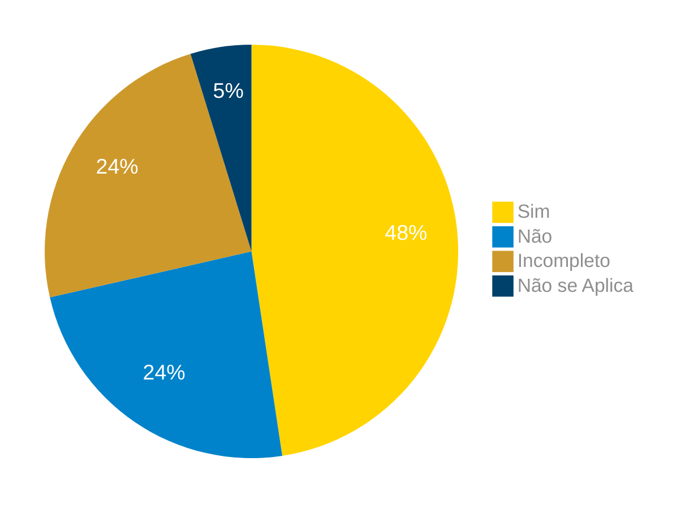

# Verificação da Especificação Suplementar

## Introdução

Neste artefato, está descrito os resultados da verificação do artefato de [Especificação Suplementar](link do artefato) feito pelo [Grupo 03](https://requisitos-de-software.github.io/2024.1-Correios/) da disciplina de Requisitos de Software referente ao aplicativo [Correios](https://www.correios.com.br/). Lembrando que o foco não é apontar quem errou e sim os problemas presentes no artefato produzido, e por fim garantir os critérios de qualidade estabelecidos.

## Metodologia

Este artefato foi produzido por [Gabriel F. J. Silva][GabrielFGH] e verificado por [Ricardo Augusto][RicardoGH], seguindo a divisão planejada pelo grupo na [reunião 7](https://requisitos-de-software.github.io/2024.1-Correios/atas/ata7/). Para a verificação do artefato, foi utilizada a versão `2.0` datada do dia 24/06/2024. Adotamos a metodologia de inspeção por [checklist](#checklist-de-verificacao) neste processo. Podemos ver pela Tabela 1 de exemplo, que para cada item do checklist teremos: descrição do item em verificação, resposta à avaliação (pode ser "Sim", "Não", "Incompleto" ou "Não se Aplica"), o número da referência bibliográfica e um link para um print da referência que o fundamenta o item. Ao final, na seção de [Problemas Encontrados](#problemas-encontrados), são comentados os itens negativos.

Tabela 1 - Perguntas elaboradas de acordo com as referências bibliográficas.

| ID  | Descrição | Avaliação | Referência |
| :-: | --------- | :-------: | :--------: |
|**01**| O artefato de especificação suplementar utiliza a metodologia FURPS?| | Requisitos – Aula 13(slides. [28][Slide 28] e [29][Slide 29])|
|**02**| Apresenta os requisitos em funcionalidade? | | Requisitos – Aula 13(slides. [28][Slide 28] e [29][Slide 29])|
|**03**| Os requisitos apresentados são verificáveis?| | [FURPS+ - QualidadeBR][FURPS Qualidade-BR]| 
|**04**| Em usabilidade os requisitos não funcionais levam em consideração a prevenção de erros? | | Requisitos – Aula 13(slides. [28][Slide 28] e [29][Slide 29])|
|**05**| Em usabilidade os requisitos não funcionais levam em consideração a estética e design? | | [FURPS+ - QualidadeBR][FURPS Qualidade-BR]|
|**06**| Os requisitos não funcionais apresentados são verificáveis? | | [FURPS+ - QualidadeBR][FURPS Qualidade-BR]|
|**07**| Em Confiabilidade os requisitos não funcionais levam em consideração possibilidade de recuperação? | | Requisitos – Aula 13(slides. [28][Slide 28] e [29][Slide 29])|
|**08**| Em Confiabilidade os requisitos não funcionais levam em consideração possibilidade de previsão? | | [FURPS+ - QualidadeBR][FURPS Qualidade-BR]|
|**09**| Em Confiabilidade os requisitos não funcionais levam em consideração tempo médio entre falhas? | | [FURPS+ - QualidadeBR][FURPS Qualidade-BR]|
|**10**| Os requisitos não funcionais apresentados são verificáveis? | | Requisitos – Aula 13(slides. [28][Slide 28] e [29][Slide 29])|
|**11**| Em Desempenho os requisitos não funcionais levam em consideração tempo de resposta?  | | [FURPS+ - QualidadeBR][FURPS Qualidade-BR]|
|**12**| Em Desempenho os requisitos não funcionais levam em consideração Utilização da CPU?| | [FURPS+ - QualidadeBR][FURPS Qualidade-BR]|
|**13**| Em Desempenho os requisitos não funcionais levam em consideração capacidade de carga e disponibilidade da aplicação? | | [FURPS+ - QualidadeBR][FURPS Qualidade-BR]|
|**14**| Os requisitos não funcionais apresentados são verificáveis? | | [FURPS+ - QualidadeBR][FURPS Qualidade-BR]|
|**15**| Em suportabilidade os requisitos não funcionais levam em consideração a testabilidade, adaptabilidade, manutenibilidade, compatibilidade, configurabilidade, instalabilidade, escalabilidade? | | Requisitos – Aula 13(slides. [28][Slide 28] e [29][Slide 29])|
|**16**| Os requisitos não funcionais apresentados são verificáveis? | | Especificação Suplementar do MINISTÉRIO DA CIÊNCIA(Pgs. [5][PG. 5], [6][PG. 6] e [7][PG. 7])|
|**17**| O documento informa em qual plataforma o sistema opera? | | Especificação Suplementar do MINISTÉRIO DA CIÊNCIA(Pgs. [5][PG. 5], [6][PG. 6] e [7][PG. 7])|
|**18**| O documento apresenta outros requitos não-funcionais como: requistos de design, implementação, interface ou físicos? | | [FURPS+ - QualidadeBR][FURPS Qualidade-BR]|

Fonte: [Gabriel F. J. Silva](https://github.com/MMcLovin) e [Elias F. Oliveira](https://github.com/EliasOliver21) , 2024.

## Apresentação dos Dados

Abaixo temos os dados obtidos na verificação, presentes na Tabela 02 até Tabela 08. Após, temos o sumário das respostas na seção [Sumário dos Resultados](#sumario-dos-resultados) em forma de gráfico, Figura 1.

### F: Funcionalidade

Tabela 2 - Perguntas elaboradas.

| ID  | Descrição | Avaliação | Referência |
| :-: | --------- | :-------: | :--------: |
|**01**| O artefato de especificação suplementar utiliza a metodologia FURPS?| não se aplica |Requisitos – Aula 13(slides. [28][Slide 28] e [29][Slide 29])|
|**02**| Apresenta os requisitos em funcionalidade? | não se aplica |Requisitos – Aula 13(slides. [28][Slide 28] e [29][Slide 29])|
|**03**| Os requisitos apresentados são verificáveis?| não se aplica |[FURPS+ - QualidadeBR][FURPS Qualidade-BR]| 
|**04**| Em usabilidade os requisitos não funcionais levam em consideração a prevenção de erros? | |Requisitos – Aula 13(slides. [28][Slide 28] e [29][Slide 29])|
|**05**| Em usabilidade os requisitos não funcionais levam em consideração a estética e design? | |[FURPS+ - QualidadeBR][FURPS Qualidade-BR]|
|**06**| Os requisitos não funcionais apresentados são verificáveis?  | |[FURPS+ - QualidadeBR][FURPS Qualidade-BR]|
|**07**| Em Confiabilidade os requisitos não funcionais levam em consideração possibilidade de recuperação? | não se aplica |Requisitos – Aula 13(slides. [28][Slide 28] e [29][Slide 29])|
|**08**| Em Confiabilidade os requisitos não funcionais levam em consideração possibilidade de previsão? | não se aplica |[FURPS+ - QualidadeBR][FURPS Qualidade-BR]|
|**09**| Em Confiabilidade os requisitos não funcionais levam em consideração tempo médio entre falhas? | não se aplica |[FURPS+ - QualidadeBR][FURPS Qualidade-BR]|
|**10**| Os requisitos não funcionais apresentados são verificáveis? | não se aplica |Requisitos – Aula 13(slides. [28][Slide 28] e [29][Slide 29])|
|**11**| Em Desempenho os requisitos não funcionais levam em consideração tempo de resposta?  | não se aplica |[FURPS+ - QualidadeBR][FURPS Qualidade-BR]|
|**12**| Em Desempenho os requisitos não funcionais levam em consideração Utilização da CPU?| não se aplica |[FURPS+ - QualidadeBR][FURPS Qualidade-BR]|
|**13**| Em Desempenho os requisitos não funcionais levam em consideração capacidade de carga e disponibilidade da aplicação? | não se aplica |[FURPS+ - QualidadeBR][FURPS Qualidade-BR]|
|**14**| Os requisitos não funcionais apresentados são verificáveis? | não se aplica |[FURPS+ - QualidadeBR][FURPS Qualidade-BR]|
|**15**| Em suportabilidade os requisitos não funcionais levam em consideração a testabilidade, adaptabilidade, manutenibilidade, compatibilidade, configurabilidade, instalabilidade, escalabilidade? | não se aplica |Requisitos – Aula 13(slides. [28][Slide 28] e [29][Slide 29])|
|**16**| Os requisitos não funcionais apresentados são verificáveis? | não se aplica |Especificação Suplementar do MINISTÉRIO DA CIÊNCIA(Pgs. [5][PG. 5], [6][PG. 6] e [7][PG. 7])|
|**17**| O documento informa em qual plataforma o sistema opera? | não se aplica |Especificação Suplementar do MINISTÉRIO DA CIÊNCIA(Pgs. [5][PG. 5], [6][PG. 6] e [7][PG. 7])|
|**18**| O documento apresenta outros requitos não-funcionais como: requistos de design, implementação, interface ou físicos? | não se aplica |[FURPS+ - QualidadeBR][FURPS Qualidade-BR]|

Fonte: [Claudio Henrique](https://github.com/claudiohsc) , 2024.

#### Problemas Encontrados

Abaixo estão os problemas encontrados com base no checklist de verificação aplicado ao artefato de Especificação Suplementar para [F (Funcionalidade)](https://requisitos-de-software.github.io/2024.1-Correios/modelagem/especificacao_suplementar/#funcionalidade).

- **ID XX: Descrição** 
    - Avaliação: 
    - Comentário:

### U: Usabilidade (Usability)

Tabela 2 - Perguntas elaboradas.

| ID  | Descrição | Avaliação | Referência |
| :-: | --------- | :-------: | :--------: |
|**01**| O artefato de especificação suplementar utiliza a metodologia FURPS?| não se aplica |Requisitos – Aula 13(slides. [28][Slide 28] e [29][Slide 29])|
|**02**| Apresenta os requisitos em funcionalidade? | não se aplica |Requisitos – Aula 13(slides. [28][Slide 28] e [29][Slide 29])|
|**03**| Os requisitos apresentados são verificáveis?| não se aplica |[FURPS+ - QualidadeBR][FURPS Qualidade-BR]| 
|**04**| Em usabilidade os requisitos não funcionais levam em consideração a prevenção de erros? | |Requisitos – Aula 13(slides. [28][Slide 28] e [29][Slide 29])|
|**05**| Em usabilidade os requisitos não funcionais levam em consideração a estética e design? | |[FURPS+ - QualidadeBR][FURPS Qualidade-BR]|
|**06**| Os requisitos não funcionais apresentados são verificáveis?  | |[FURPS+ - QualidadeBR][FURPS Qualidade-BR]|
|**07**| Em Confiabilidade os requisitos não funcionais levam em consideração possibilidade de recuperação? | não se aplica |Requisitos – Aula 13(slides. [28][Slide 28] e [29][Slide 29])|
|**08**| Em Confiabilidade os requisitos não funcionais levam em consideração possibilidade de previsão? | não se aplica |[FURPS+ - QualidadeBR][FURPS Qualidade-BR]|
|**09**| Em Confiabilidade os requisitos não funcionais levam em consideração tempo médio entre falhas? | não se aplica |[FURPS+ - QualidadeBR][FURPS Qualidade-BR]|
|**10**| Os requisitos não funcionais apresentados são verificáveis? | não se aplica |Requisitos – Aula 13(slides. [28][Slide 28] e [29][Slide 29])|
|**11**| Em Desempenho os requisitos não funcionais levam em consideração tempo de resposta?  | não se aplica |[FURPS+ - QualidadeBR][FURPS Qualidade-BR]|
|**12**| Em Desempenho os requisitos não funcionais levam em consideração Utilização da CPU?| não se aplica |[FURPS+ - QualidadeBR][FURPS Qualidade-BR]|
|**13**| Em Desempenho os requisitos não funcionais levam em consideração capacidade de carga e disponibilidade da aplicação? | não se aplica |[FURPS+ - QualidadeBR][FURPS Qualidade-BR]|
|**14**| Os requisitos não funcionais apresentados são verificáveis? | não se aplica |[FURPS+ - QualidadeBR][FURPS Qualidade-BR]|
|**15**| Em suportabilidade os requisitos não funcionais levam em consideração a testabilidade, adaptabilidade, manutenibilidade, compatibilidade, configurabilidade, instalabilidade, escalabilidade? | não se aplica |Requisitos – Aula 13(slides. [28][Slide 28] e [29][Slide 29])|
|**16**| Os requisitos não funcionais apresentados são verificáveis? | não se aplica |Especificação Suplementar do MINISTÉRIO DA CIÊNCIA(Pgs. [5][PG. 5], [6][PG. 6] e [7][PG. 7])|
|**17**| O documento informa em qual plataforma o sistema opera? | não se aplica |Especificação Suplementar do MINISTÉRIO DA CIÊNCIA(Pgs. [5][PG. 5], [6][PG. 6] e [7][PG. 7])|
|**18**| O documento apresenta outros requitos não-funcionais como: requistos de design, implementação, interface ou físicos? | não se aplica |[FURPS+ - QualidadeBR][FURPS Qualidade-BR]|

Fonte: [Claudio Henrique](https://github.com/claudiohsc) , 2024.

#### Problemas Encontrados

Abaixo estão os problemas encontrados com base no checklist de verificação aplicado ao artefato de Especificação Suplementar para [U (Usabilidade)](https://requisitos-de-software.github.io/2024.1-Correios/modelagem/especificacao_suplementar/#usabilidade).

- **ID XX: Descrição** 
    - Avaliação: 
    - Comentário:

### R: Confiabilidade (Reliability)

Tabela 4 - Perguntas elaboradas.

| ID  | Descrição | Avaliação | Referência |
| :-: | --------- | :-------: | :--------: |
|**01**| O artefato de especificação suplementar utiliza a metodologia FURPS?| não se aplica |Requisitos – Aula 13(slides. [28][Slide 28] e [29][Slide 29])|
|**02**| Apresenta os requisitos em funcionalidade? | não se aplica |Requisitos – Aula 13(slides. [28][Slide 28] e [29][Slide 29])|
|**03**| Os requisitos apresentados são verificáveis?| não se aplica |[FURPS+ - QualidadeBR][FURPS Qualidade-BR]| 
|**04**| Em usabilidade os requisitos não funcionais levam em consideração a prevenção de erros? | não se aplica |Requisitos – Aula 13(slides. [28][Slide 28] e [29][Slide 29])|
|**05**| Em usabilidade os requisitos não funcionais levam em consideração a estética e design? | não se aplica |[FURPS+ - QualidadeBR][FURPS Qualidade-BR]|
|**06**| Os requisitos não funcionais apresentados são verificáveis? | não se aplica |[FURPS+ - QualidadeBR][FURPS Qualidade-BR]|
|**07**| Em Confiabilidade os requisitos não funcionais levam em consideração possibilidade de recuperação? ||Requisitos – Aula 13(slides. [28][Slide 28] e [29][Slide 29])|
|**08**| Em Confiabilidade os requisitos não funcionais levam em consideração possibilidade de previsão? ||[FURPS+ - QualidadeBR][FURPS Qualidade-BR]|
|**09**| Em Confiabilidade os requisitos não funcionais levam em consideração tempo médio entre falhas? ||[FURPS+ - QualidadeBR][FURPS Qualidade-BR]|
|**10**| Os requisitos não funcionais apresentados são verificáveis? | não se aplica |Requisitos – Aula 13(slides. [28][Slide 28] e [29][Slide 29])|
|**11**| Em Desempenho os requisitos não funcionais levam em consideração tempo de resposta?  | não se aplica |[FURPS+ - QualidadeBR][FURPS Qualidade-BR]|
|**12**| Em Desempenho os requisitos não funcionais levam em consideração Utilização da CPU?| não se aplica |[FURPS+ - QualidadeBR][FURPS Qualidade-BR]|
|**13**| Em Desempenho os requisitos não funcionais levam em consideração capacidade de carga e disponibilidade da aplicação? | não se aplica |[FURPS+ - QualidadeBR][FURPS Qualidade-BR]|
|**14**| Os requisitos não funcionais apresentados são verificáveis? | não se aplica |[FURPS+ - QualidadeBR][FURPS Qualidade-BR]|
|**15**| Em suportabilidade os requisitos não funcionais levam em consideração a testabilidade, adaptabilidade, manutenibilidade, compatibilidade, configurabilidade, instalabilidade, escalabilidade? | | Requisitos – Aula 13(slides. [28][Slide 28] e [29][Slide 29])|
|**16**| Os requisitos não funcionais apresentados são verificáveis? | não se aplica |Especificação Suplementar do MINISTÉRIO DA CIÊNCIA(Pgs. [5][PG. 5], [6][PG. 6] e [7][PG. 7])|
|**17**| O documento informa em qual plataforma o sistema opera? | não se aplica |Especificação Suplementar do MINISTÉRIO DA CIÊNCIA(Pgs. [5][PG. 5], [6][PG. 6] e [7][PG. 7])|
|**18**| O documento apresenta outros requitos não-funcionais como: requistos de design, implementação, interface ou físicos? | não se aplica |[FURPS+ - QualidadeBR][FURPS Qualidade-BR]|

Fonte: [Danilo Carvalho Antunes](https://github.com/Danilo-Carvalho-Antunes).

#### Problemas Encontrados

Abaixo estão os problemas encontrados com base no checklist de verificação aplicado ao artefato de Especificação Suplementar para [R (Confiabilidade)](https://requisitos-de-software.github.io/2024.1-Correios/modelagem/especificacao_suplementar/#confiabilidade).

- **ID XX: Descrição** 
    - Avaliação: 
    - Comentário:

### Desempenho (Performance)

Tabela 5 - Perguntas elaboradas.

| ID  | Descrição | Avaliação | Referência |
| :-: | --------- | :-------: | :--------: |
|**01**| O artefato de especificação suplementar utiliza a metodologia FURPS?|  |Requisitos – Aula 13(slides. [28][Slide 28] e [29][Slide 29])|
|**02**| Apresenta os requisitos em funcionalidade? | | Requisitos – Aula 13(slides. [28][Slide 28] e [29][Slide 29])|
|**03**| Os requisitos apresentados são verificáveis?| | [FURPS+ - QualidadeBR][FURPS Qualidade-BR]| 
|**04**| Em usabilidade os requisitos não funcionais levam em consideração a prevenção de erros? | não se aplica |Requisitos – Aula 13(slides. [28][Slide 28] e [29][Slide 29])|
|**05**| Em usabilidade os requisitos não funcionais levam em consideração a estética e design? | não se aplica |[FURPS+ - QualidadeBR][FURPS Qualidade-BR]|
|**06**| Os requisitos não funcionais apresentados são verificáveis? | não se aplica |[FURPS+ - QualidadeBR][FURPS Qualidade-BR]|
|**07**| Em Confiabilidade os requisitos não funcionais levam em consideração possibilidade de recuperação? | não se aplica |Requisitos – Aula 13(slides. [28][Slide 28] e [29][Slide 29])|
|**08**| Em Confiabilidade os requisitos não funcionais levam em consideração possibilidade de previsão? | não se aplica |[FURPS+ - QualidadeBR][FURPS Qualidade-BR]|
|**09**| Em Confiabilidade os requisitos não funcionais levam em consideração tempo médio entre falhas? | não se aplica | [FURPS+ - QualidadeBR][FURPS Qualidade-BR]|
|**10**| Os requisitos não funcionais apresentados são verificáveis? | | Requisitos – Aula 13(slides. [28][Slide 28] e [29][Slide 29])|
|**11**| Em Desempenho os requisitos não funcionais levam em consideração tempo de resposta?  |  |[FURPS+ - QualidadeBR][FURPS Qualidade-BR]|
|**12**| Em Desempenho os requisitos não funcionais levam em consideração Utilização da CPU?|  |[FURPS+ - QualidadeBR][FURPS Qualidade-BR]|
|**13**| Em Desempenho os requisitos não funcionais levam em consideração capacidade de carga e disponibilidade da aplicação? |  |[FURPS+ - QualidadeBR][FURPS Qualidade-BR]|
|**14**| Os requisitos não funcionais apresentados são verificáveis? | | [FURPS+ - QualidadeBR][FURPS Qualidade-BR]|
|**15**| Em suportabilidade os requisitos não funcionais levam em consideração a testabilidade, adaptabilidade, manutenibilidade, compatibilidade, configurabilidade, instalabilidade, escalabilidade? | não se aplica | Requisitos – Aula 13(slides. [28][Slide 28] e [29][Slide 29])|
|**16**| Os requisitos não funcionais apresentados são verificáveis? | | Especificação Suplementar do MINISTÉRIO DA CIÊNCIA(Pgs. [5][PG. 5], [6][PG. 6] e [7][PG. 7])|
|**17**| O documento informa em qual plataforma o sistema opera? | | Especificação Suplementar do MINISTÉRIO DA CIÊNCIA(Pgs. [5][PG. 5], [6][PG. 6] e [7][PG. 7])|
|**18**| O documento apresenta outros requitos não-funcionais como: requistos de design, implementação, interface ou físicos? |  |[FURPS+ - QualidadeBR][FURPS Qualidade-BR]|

Fonte: [GAbriel B. Bertolazi](https://github.com/Bertolazi).

#### Problemas Encontrados
Abaixo estão os problemas encontrados com base no checklist de verificação aplicado ao artefato de Especificação Suplementar para [R (Desempenho)](https://requisitos-de-software.github.io/2024.1-Correios/modelagem/especificacao_suplementar/#desempenho).

- **ID XX: Descrição** 
    - Avaliação: 
    - Comentário:

### S: Suporte (Supportability)

Tabela 6 - Perguntas elaboradas.

| ID  | Descrição | Avaliação | Referência |
| :-: | --------- | :-------: | :--------: |
|**01**| O artefato de especificação suplementar utiliza a metodologia FURPS? | não se aplica |  Requisitos – Aula 13(slides. [28][Slide 28] e [29][Slide 29])|
|**02**| Apresenta os requisitos em funcionalidade? | não se aplica | Requisitos – Aula 13(slides. [28][Slide 28] e [29][Slide 29])|
|**03**| Os requisitos apresentados são verificáveis?| não se aplica | [FURPS+ - QualidadeBR][FURPS Qualidade-BR]| 
|**04**| Em usabilidade os requisitos não funcionais levam em consideração a prevenção de erros? | não se aplica | Requisitos – Aula 13(slides. [28][Slide 28] e [29][Slide 29])|
|**05**| Em usabilidade os requisitos não funcionais levam em consideração a estética e design? | não se aplica | [FURPS+ - QualidadeBR][FURPS Qualidade-BR]|
|**06**| Os requisitos não funcionais apresentados são verificáveis? | não se aplica | [FURPS+ - QualidadeBR][FURPS Qualidade-BR]|
|**07**| Em Confiabilidade os requisitos não funcionais levam em consideração possibilidade de recuperação? | não se aplica | Requisitos – Aula 13(slides. [28][Slide 28] e [29][Slide 29])|
|**08**| Em Confiabilidade os requisitos não funcionais levam em consideração possibilidade de previsão? | não se aplica | [FURPS+ - QualidadeBR][FURPS Qualidade-BR]|
|**09**| Em Confiabilidade os requisitos não funcionais levam em consideração tempo médio entre falhas? | não se aplica | [FURPS+ - QualidadeBR][FURPS Qualidade-BR]|
|**10**| Os requisitos não funcionais apresentados são verificáveis? | não se aplica | Requisitos – Aula 13(slides. [28][Slide 28] e [29][Slide 29])|
|**11**| Em Desempenho os requisitos não funcionais levam em consideração tempo de resposta?  | não se aplica | [FURPS+ - QualidadeBR][FURPS Qualidade-BR]|
|**12**| Em Desempenho os requisitos não funcionais levam em consideração Utilização da CPU?| não se aplica | [FURPS+ - QualidadeBR][FURPS Qualidade-BR]|
|**13**| Em Desempenho os requisitos não funcionais levam em consideração capacidade de carga e disponibilidade da aplicação? | não se aplica | [FURPS+ - QualidadeBR][FURPS Qualidade-BR]|
|**14**| Os requisitos não funcionais apresentados são verificáveis? | não se aplica | [FURPS+ - QualidadeBR][FURPS Qualidade-BR]|
|**15**| Em suportabilidade os requisitos não funcionais levam em consideração a testabilidade, adaptabilidade, manutenibilidade, compatibilidade, configurabilidade, instalabilidade, escalabilidade? | não se aplica | Requisitos – Aula 13(slides. [28][Slide 28] e [29][Slide 29])|
|**16**| Os requisitos não funcionais apresentados são verificáveis? | | Especificação Suplementar do MINISTÉRIO DA CIÊNCIA(Pgs. [5][PG. 5], [6][PG. 6] e [7][PG. 7])|
|**17**| O documento informa em qual plataforma o sistema opera? |  |Especificação Suplementar do MINISTÉRIO DA CIÊNCIA(Pgs. [5][PG. 5], [6][PG. 6] e [7][PG. 7])|
|**18**| O documento apresenta outros requitos não-funcionais como: requistos de design, implementação, interface ou físicos? |  |[FURPS+ - QualidadeBR][FURPS Qualidade-BR]|

Fonte: .

#### Problemas Encontrados

Abaixo estão os problemas encontrados com base no checklist de verificação aplicado ao artefato de Especificação Suplementar para [S (Suporte)](https://requisitos-de-software.github.io/2024.1-Correios/modelagem/especificacao_suplementar/#suportabilidade).

- **ID XX: Descrição** 
    - Avaliação: 
    - Comentário:

### +: Restrições de Design

Tabela 7 - Perguntas elaboradas.

| ID  | Descrição | Avaliação | Referência |
| :-: | --------- | :-------: | :--------: |
| 01 | O artefato de especificação suplementar utiliza a metodologia FURPS? |  | Requisitos – Aula 13(slides. [28][Slide 28] e [29][Slide 29]) |
| 02 | Apresenta os requisitos em funcionalidade? |  | Requisitos – Aula 13(slides. [28][Slide 28] e [29][Slide 29]) |
| 03 | Os requisitos apresentados são verificáveis? |  | [FURPS+ - QualidadeBR][FURPS Qualidade-BR] |
| 04 | Em usabilidade os requisitos não funcionais levam em consideração a prevenção de erros? | não se aplica | Requisitos – Aula 13(slides. [28][Slide 28] e [29][Slide 29]) |
| 05 | Em usabilidade os requisitos não funcionais levam em consideração a estética e design? | não se aplica | [FURPS+ - QualidadeBR][FURPS Qualidade-BR] |
| 06 | Os requisitos não funcionais apresentados são verificáveis? | não se aplica | [FURPS+ - QualidadeBR][FURPS Qualidade-BR] |
| 07 | Em Confiabilidade os requisitos não funcionais levam em consideração possibilidade de recuperação? | não se aplica | Requisitos – Aula 13(slides. [28][Slide 28] e [29][Slide 29]) |
| 08 | Em Confiabilidade os requisitos não funcionais levam em consideração possibilidade de previsão? | não se aplica | [FURPS+ - QualidadeBR][FURPS Qualidade-BR] |
| 09 | Em Confiabilidade os requisitos não funcionais levam em consideração tempo médio entre falhas? | não se aplica | [FURPS+ - QualidadeBR][FURPS Qualidade-BR] |
| 10 | Os requisitos não funcionais apresentados são verificáveis? | não se aplica | Requisitos – Aula 13(slides. [28][Slide 28] e [29][Slide 29]) |
| 11 | Em Desempenho os requisitos não funcionais levam em consideração tempo de resposta? | não se aplica | [FURPS+ - QualidadeBR][FURPS Qualidade-BR] |
| 12 | Em Desempenho os requisitos não funcionais levam em consideração Utilização da CPU? | não se aplica | [FURPS+ - QualidadeBR][FURPS Qualidade-BR] |
| 13 | Em Desempenho os requisitos não funcionais levam em consideração capacidade de carga e disponibilidade da aplicação? | não se aplica | [FURPS+ - QualidadeBR][FURPS Qualidade-BR] |
| 14 | Os requisitos não funcionais apresentados são verificáveis? | não se aplica | [FURPS+ - QualidadeBR][FURPS Qualidade-BR] |
| 15 | Em suportabilidade os requisitos não funcionais levam em consideração a testabilidade, adaptabilidade, manutenibilidade, compatibilidade, configurabilidade, instalabilidade, escalabilidade? | não se aplica | Requisitos – Aula 13(slides. [28][Slide 28] e [29][Slide 29]) |
| 16 | Os requisitos não funcionais apresentados são verificáveis? | não se aplica | Especificação Suplementar do MINISTÉRIO DA CIÊNCIA(Pgs. [5][PG. 5], [6][PG. 6] e [7][PG. 7]) |
| 17 | O documento informa em qual plataforma o sistema opera? | não se aplica | Especificação Suplementar do MINISTÉRIO DA CIÊNCIA(Pgs. [5][PG. 5], [6][PG. 6] e [7][PG. 7]) |
| 18 | O documento apresenta outros requitos nã-funcionais como: requistos de design, implementação, interface ou físicos? |  | [FURPS+ - QualidadeBR][FURPS Qualidade-BR] |

Fonte: [Pablo S. Costa](https://www.github.com/pabloheika).

#### Problemas Encontrados

Abaixo estão os problemas encontrados com base no checklist de verificação aplicado ao artefato de Especificação Suplementar para [+ (Restrições de Design)](https://requisitos-de-software.github.io/2024.1-Correios/modelagem/especificacao_suplementar/#restricoes-de-design).

- **ID XX: Descrição** 
    - Avaliação: 
    - Comentário:

### +: Ajuda e Documentação/Interfaces

Tabela 8 - Perguntas elaboradas.

| ID  | Descrição | Avaliação | Referência |
| :-: | --------- | :-------: | :--------: |
|**01**| O artefato de especificação suplementar utiliza a metodologia FURPS?| |Requisitos – Aula 13(slides. [28][Slide 28] e [29][Slide 29])|
|**02**| Apresenta os requisitos em funcionalidade? ||Requisitos – Aula 13(slides. [28][Slide 28] e [29][Slide 29])|
|**03**| Os requisitos apresentados são verificáveis?||[FURPS+ - QualidadeBR][FURPS Qualidade-BR]| 
|**04**| Em usabilidade os requisitos não funcionais levam em consideração a prevenção de erros? | não se aplica |Requisitos – Aula 13(slides. [28][Slide 28] e [29][Slide 29])|
|**05**| Em usabilidade os requisitos não funcionais levam em consideração a estética e design? | não se aplica |[FURPS+ - QualidadeBR][FURPS Qualidade-BR]|
|**06**| Os requisitos não funcionais apresentados são verificáveis? | não se aplica |[FURPS+ - QualidadeBR][FURPS Qualidade-BR]|
|**07**| Em Confiabilidade os requisitos não funcionais levam em consideração possibilidade de recuperação? | não se aplica |Requisitos – Aula 13(slides. [28][Slide 28] e [29][Slide 29])|
|**08**| Em Confiabilidade os requisitos não funcionais levam em consideração possibilidade de previsão? | não se aplica |[FURPS+ - QualidadeBR][FURPS Qualidade-BR]|
|**09**| Em Confiabilidade os requisitos não funcionais levam em consideração tempo médio entre falhas? | não se aplica |[FURPS+ - QualidadeBR][FURPS Qualidade-BR]|
|**10**| Os requisitos não funcionais apresentados são verificáveis? | não se aplica |Requisitos – Aula 13(slides. [28][Slide 28] e [29][Slide 29])|
|**11**| Em Desempenho os requisitos não funcionais levam em consideração tempo de resposta? | não se aplica | [FURPS+ - QualidadeBR][FURPS Qualidade-BR]|
|**12**| Em Desempenho os requisitos não funcionais levam em consideração Utilização da CPU?| não se aplica |[FURPS+ - QualidadeBR][FURPS Qualidade-BR]|
|**13**| Em Desempenho os requisitos não funcionais levam em consideração capacidade de carga e disponibilidade da aplicação? | não se aplica |[FURPS+ - QualidadeBR][FURPS Qualidade-BR]|
|**14**| Os requisitos não funcionais apresentados são verificáveis? | não se aplica |[FURPS+ - QualidadeBR][FURPS Qualidade-BR]|
|**15**| Em suportabilidade os requisitos não funcionais levam em consideração a testabilidade, adaptabilidade, manutenibilidade, compatibilidade, configurabilidade, instalabilidade, escalabilidade? | não se aplica |Requisitos – Aula 13(slides. [28][Slide 28] e [29][Slide 29])|
|**16**| Os requisitos não funcionais apresentados são verificáveis? | não se aplica |Especificação Suplementar do MINISTÉRIO DA CIÊNCIA(Pgs. [5][PG. 5], [6][PG. 6] e [7][PG. 7])|
|**17**| O documento informa em qual plataforma o sistema opera? | |Especificação Suplementar do MINISTÉRIO DA CIÊNCIA(Pgs. [5][PG. 5], [6][PG. 6] e [7][PG. 7])|
|**18**| O documento apresenta outros requitos não-funcionais como: requistos de design, implementação, interface ou físicos? | |[FURPS+ - QualidadeBR][FURPS Qualidade-BR]|

Fonte: [Ricardo Augusto](https://www.github.com/avmricardo), 2024.

#### Problemas Encontrados

Abaixo estão os problemas encontrados com base no checklist de verificação aplicado ao artefato de Especificação Suplementar para [+ (Ajuda e Documentação)](https://requisitos-de-software.github.io/2024.1-Correios/modelagem/especificacao_suplementar/#ajuda-e-documentacao).

- **ID XX: Descrição** 
    - Avaliação: 
    - Comentário:

### Gravação da verificação

<!-- para o iframe do vídeo, bote width = 560 e height = 315 -->

    <iframe width="560" height="315" src="https://www.youtube.com/embed" title="Apresentação 7 Interação Humano Computador 2024.1 - Grupo 3" frameborder="0" allow="accelerometer; autoplay; clipboard-write; encrypted-media; gyroscope; picture-in-picture; web-share" referrerpolicy="strict-origin-when-cross-origin" allowfullscreen></iframe>

    <a href="link"> Link para o vídeo </a>

## Sumário dos resultados

<!-- Conte as quantidade de ocorrencias e coloque no Grafico a quantidade em cada tipo de avaliação (se não ouver incidencia de um tipo como "não se aplica", apague a linha do mesmo)-->
A seguir, apresentamos a Figura 1 com o gráfico de pizza do sumário dos resultados.

Figura 1 - Gráfico de pizza do sumário dos resultados.

Fonte: [][], 2024.

## Bibliografia

> 1. Especificação Suplementar do MINISTÉRIO DA CIÊNCIA, TECNOLOGIA, INOVAÇÕES E COMUNICAÇÕES. Disponível em: <https://aprender3.unb.br/pluginfile.php/2845018/mod_resource/content/2/SiglaProjeto_EspecificacaoSuplementar.pdf>. Acessado em 10/06/2024.
> 2. Requisitos – Aula 13 - Milene Serrano e Maurício Serrano. Disponível em: <https://aprender3.unb.br/pluginfile.php/2845007/mod_resource/content/1/Requisitos%20-%20Aula%20013a.pdf>. Acessado em : 09/06/2024.
> 3. [FURPS+ - QualidadeBR][FURPS Qualidade-BR] Disponível em: <https://qualidadebr.wordpress.com/2008/07/10/furps/#:~:text=FURPS%2B%20%C3%A9%20um%20sistema%20para,Rational%20Unified%20Process%20(RUP)%3A>Acessado em : 09/06/2024.

## Histórico de Versões

| Versão | Data | Descrição | Autor(es) | Revisor(es) |
| :----: | :--: | --------- | ----------- | ------ |
| `1.0`  | 01/07/2024 | Criação do documento | [Gabriel F. J. Silva](https://github.com/EliasOliver21) | [Ricardo A.][RicardoGH] |

[ClaudioGH]: https://github.com/claudiohsc
[DaniloGH]: https://github.com/Danilo-Carvalho-Antunes
[EliasGH]: https://github.com/EliasOliver21
[GabrielBGH]: https://github.com/Bertolazi
[GabrielFGH]: https://github.com/MMcLovin
[PabloGH]: https://github.com/pabloheika
[RicardoGH]: https://www.github.com/avmricardo

[Slide 28]: ../../../assets/imagens_referencias/especificacao_suplementar/slide-28.png
[Slide 29]: ../../../assets/imagens_referencias/especificacao_suplementar/slide-29.png
[FURPS Qualidade-BR]: ../../../assets/imagens_referencias/especificacao_suplementar/furps.png
[PG. 5]: ../../../assets/imagens_referencias/especificacao_suplementar/ME_5.png
[PG. 6]: ../../../assets/imagens_referencias/especificacao_suplementar/ME_6.png
[PG. 7]: ../../../assets/imagens_referencias/especificacao_suplementar/ME_7.png
