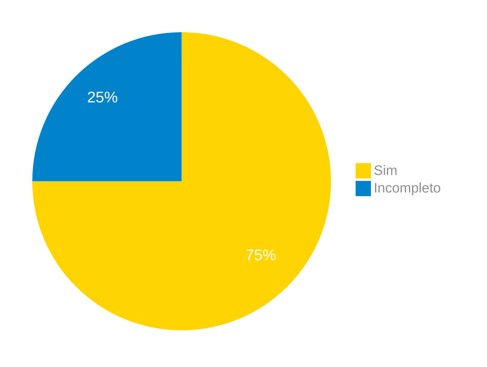

# Verificação do Artefato Léxicos

## Introdução

Neste artefato, está descrito os resultados da verificação do artefato de [Léxicos](https://requisitos-de-software.github.io/2024.1-Correios/modelagem/lexicos/) feito pelo [Grupo 03](https://requisitos-de-software.github.io/2024.1-Correios/) da disciplina de Requisitos de Software referente ao site [Correios](https://www.correios.com.br/). Lembrando que o foco não é apontar quem errou e sim os problemas presentes no artefato produzido, e por fim garantir os critérios de qualidade estabelecidos.

## Metodologia

Este artefato foi produzido por [Ricardo][RicardoGH] e verificado por [Danilo][DaniloGH], seguindo a divisão planejada pelo grupo na [reunião 7](https://requisitos-de-software.github.io/2024.1-Correios/atas/ata7/). Para a verificação do artefato, foi utilizada a versão `1.0` datada do dia 15/05/2024. Adotamos a metodologia de inspeção por [checklist](#checklist-de-verificacao) neste processo. Podemos ver pela Tabela 1 de exemplo, que para cada item do checklist teremos: descrição do item em verificação, resposta à avaliação (pode ser "Sim", "Não", "Incompleto" ou "Não se Aplica"), o número da referência bibliográfica e um link para um print da referência que o fundamenta o item. Ao final, na seção de [Problemas Encontrados](#problemas-encontrados), são comentados os itens negativos.

Tabela 1 - Perguntas elaboradas de acordo com as referências bibliográficas.

| ID | Descrição | Avaliação | Referência | Print |
|:--:| --------- | :-------: | :--------: | :---: |
| **1** | Temos os quatro tipos de léxicos (Sujeito, Verbo, Objeto e estado)? |  | [1.](#ref1) | [página 4](../../../assets/prints_verificacao/ricardo/lexicos.png) |
| **2** | Os símbolos constituem de forma correta o que é apresentado posteriormente nos léxicos? |  | [1.](#ref1) | [página 4](../../../assets/prints_verificacao/ricardo/lexicos.png) |
| **3** | A noção dos léxicos está bem descrita de acordo com a definição? |  | [1.](#ref1) | [página 4](../../../assets/prints_verificacao/ricardo/lexicos.png) |
| **4** | O impacto dos léxicos está bem descrito de acordo com a definição? |  | [1.](#ref1) | [página 4](../../../assets/prints_verificacao/ricardo/lexicos.png) |

Fonte: [Ricardo Augusto](https://github.com/avmricardo), 2024.

## Apresentação dos Dados

Aqui será apresentado os resultados do checklist e logo após as observações dos itens com resultado negativo.

### Checklist de verificação

Tabela 2 - Checklist preenchido na verificação

| ID | Descrição | Avaliação | Referência | Print |
|:--:| --------- | :-------: | :--------: | :---: |
| **1** | Temos os quatro tipos de léxicos (Sujeito, Verbo, Objeto e estado)? | Incompleto | [1.](#ref1) | [página 4](../../../assets/prints_verificacao/ricardo/lexicos.png) |
| **2** | Os símbolos constituem de forma correta o que é apresentado posteriormente nos léxicos? | Sim | [1.](#ref1) | [página 4](../../../assets/prints_verificacao/ricardo/lexicos.png) |
| **3** | A noção dos léxicos está bem descrita de acordo com a definição? | Sim | [1.](#ref1) | [página 4](../../../assets/prints_verificacao/ricardo/lexicos.png) |
| **4** | O impacto dos léxicos está bem descrito de acordo com a definição? | Sim | [1.](#ref1) | [página 4](../../../assets/prints_verificacao/ricardo/lexicos.png) |

Fonte: [Danilo Carvalho Antunes](DaniloGH), 2024.

### Gravação da verificação

    <iframe width="560" height="315" src="https://www.youtube.com/embed/O-bQYgPaK3Y?si=8dJyewLyHNvOTms0" title="YouTube video player" frameborder="0" allow="accelerometer; autoplay; clipboard-write; encrypted-media; gyroscope; picture-in-picture; web-share" referrerpolicy="strict-origin-when-cross-origin" allowfullscreen></iframe>

    <a href="https://youtu.be/O-bQYgPaK3Y"> Link para o vídeo </a>

### Problemas Encontrados

- ID 01: Descrição
    - Avaliação: Temos os quatro tipos de léxicos (Sujeito, Verbo, Objeto e estado)?
    - Comentário: O léxico de Sujeito não foi realizado, acredito estar misturado com o léxico de Objeto.

### Sumário dos resultados

A seguir, apresentamos a Figura 1 com o gráfico de pizza do sumário dos resultados.

Figura 1 - Gráfico de pizza do sumário dos resultados.

Fonte: [Danilo Carvalho Antunes][DaniloGH], 2024.

## Bibliografia

> 1.  SAYÃO, Miriam, CARVALHO, Gustavo. Construção do léxico de aplicações. Information and Human Language Technology, 4th Workshop, Ribeirão Preto, 2006. Disponível em: <http://www.nilc.icmc.usp.br/til/til2006/0030.pdf>. Acesso em: 16/05/2024.

## Referências bibliográficas

> 1. SAYÃO, Miriam, CARVALHO, Gustavo. Construção do léxico de aplicações. Information and Human Language Technology, 4th Workshop, Ribeirão Preto, 2006. Disponível em: <http://www.nilc.icmc.usp.br/til/til2006/0030.pdf>. Acesso em: 16/05/2024.

## Histórico de Versões

| Versão | Data | Descrição | Autor(es) | Revisor(es) |
| :----: | :--: | --------- | ----------- | ------ |
| `1.0`  | 27/06/2024 | Criação do documento | [Ricardo Augusto][RicardoGH] | [Claudio H.][ClaudioGH] |

[ClaudioGH]: https://github.com/claudiohsc
[DaniloGH]: https://github.com/Danilo-Carvalho-Antunes
[EliasGH]: https://github.com/EliasOliver21
[GabrielBGH]: https://github.com/Bertolazi
[GabrielFGH]: https://github.com/MMcLovin
[PabloGH]: https://github.com/pabloheika
[RicardoGH]: https://www.github.com/avmricardo