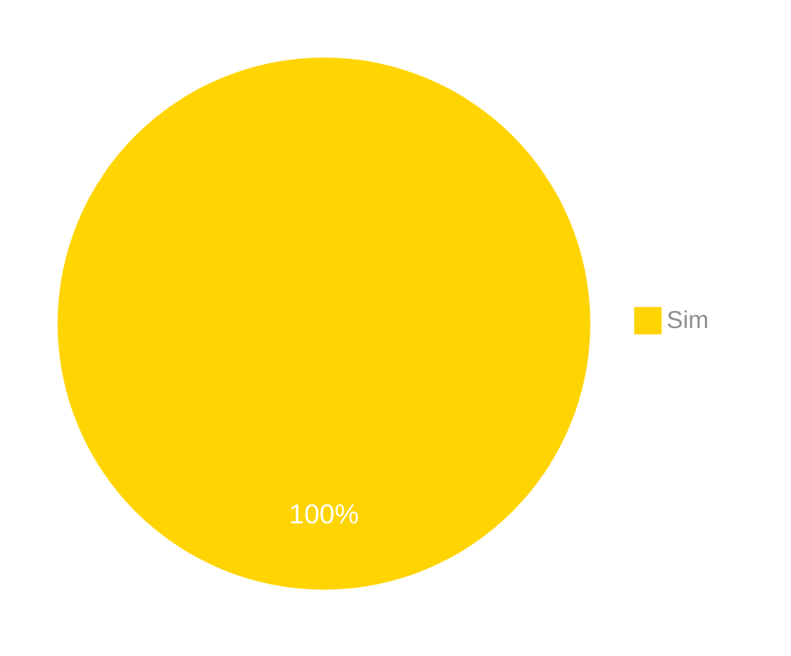

# Verificação do Backward-From

## Introdução

Neste artefato, está descrito os resultados da verificação do artefato de [Backward-From](https://requisitos-de-software.github.io/2024.1-Correios/pos-rastreabilidade/backward-from/) feito pelo [Grupo 03](https://requisitos-de-software.github.io/2024.1-Correios/) da disciplina de Requisitos de Software referente ao aplicativo [Correios](https://www.correios.com.br/). Lembrando que o foco não é apontar quem errou e sim os problemas presentes no artefato produzido, e por fim garantir os critérios de qualidade estabelecidos.

## Metodologia

Este artefato foi produzido por [Gabriel B. Bertolazi][GabrielBGH] e verificado por [Danilo][DaniloGH], seguindo a divisão planejada pelo grupo na [reunião 7](https://requisitos-de-software.github.io/2024.1-Correios/atas/ata7/). Para a verificação do artefato, foi utilizada a versão `1.0` datada do dia 23/06/2024. Adotamos a metodologia de inspeção baseada no Método Fagan (1976) por [checklist](#checklist-de-verificacao) neste processo. Podemos ver pela Tabela 1 de exemplo, que para cada item do checklist teremos: descrição do item em verificação, resposta à avaliação (pode ser "Sim", "Não", "Incompleto" ou "Não se Aplica"), o número da referência bibliográfica e um link para um print da referência que o fundamenta o item. Ao final, na seção de [Problemas Encontrados](#problemas-encontrados), são comentados os itens negativos.

Tabela 1 - Perguntas elaboradas de acordo com as referências bibliográficas.

| ID | Descrição | Avaliação | Referência | Print |
|:--:| --------- | :-------: | :--------: | :---: |
| **1** | O Backward-from liga seus requisitos às suas fontes? |  | <a id="anchor_1" href="#REF1">^1^</a> | [pg.04](../../../assets/prints_verificacao/gabrielB/pg.04.png) |
| **2** | Os requisitos elicitados possuem rastreabilidade de acordo com os documentos antes feitos pelo grupo? |  | <a id="anchor_1" href="#REF1">^1^</a> | [pg.6](../../../assets/prints_verificacao/gabrielB/pg.06.png) |
| **3** | O artefato em avaliação possui os elos de rastreabilidade? |  | <a id="anchor_1" href="#REF1">^1^</a> | [pg.07](../../../assets/prints_verificacao/gabrielB/pg07.1.png) |
| **4** | Foi utilizado como metodologia para execução do backward-from o metamodelo de Toranzo? |  | <a id="anchor_1" href="#REF1">^1^</a> | [pg.07](../../../assets/prints_verificacao/gabrielB/pg.07.png) |
| **5** | Dentro do backward-from tem o nome e a descrição do requisito na tabela? |  | <a id="anchor_1" href="#REF1">^1^</a> | [pg.12](../../../assets/prints_verificacao/gabrielB/pg.12.png) |
| **6** | Dentro do backward-from tem o documento fonte de onde ele foi rastreado? |  | <a id="anchor_1" href="#REF1">^1^</a> | [pg.12](../../../assets/prints_verificacao/gabrielB/pg.12.png) |
| **7** | Dentro do backward-from tem se o requisito está implementado ou não? |  | <a id="anchor_1" href="#REF1">^1^</a> | [pg.12](../../../assets/prints_verificacao/gabrielB/pg.12.png) |

Fonte: [Gabriel B. Bertolazi][GabrielBGH], 2024.

## Apresentação dos Dados

Aqui será apresentado os resultados do checklist e logo após as observações dos itens com resultado negativo.

### Checklist de verificação

Tabela 2 - Checklist preenchido na verificação

| ID | Descrição | Avaliação | Referência | Print |
|:--:| --------- | :-------: | :--------: | :---: |
| **1** | O Backward-from liga seus requisitos às suas fontes? | Sim | <a id="anchor_1" href="#REF1">^1^</a> | [pg.04](../../../assets/prints_verificacao/gabrielB/pg.04.png) |
| **2** | Os requisitos elicitados possuem rastreabilidade de acordo com os documentos antes feitos pelo grupo? | Sim | <a id="anchor_1" href="#REF1">^1^</a> | [pg.6](../../../assets/prints_verificacao/gabrielB/pg.06.png) |
| **3** | O artefato em avaliação possui os elos de rastreabilidade? | Sim | <a id="anchor_1" href="#REF1">^1^</a> | [pg.07](../../../assets/prints_verificacao/gabrielB/pg07.1.png) |
| **4** | Foi utilizado como metodologia para execução do backward-from o metamodelo de Toranzo? | Sim | <a id="anchor_1" href="#REF1">^1^</a> | [pg.07](../../../assets/prints_verificacao/gabrielB/pg.07.png) |
| **5** | Dentro do backward-from tem o nome e a descrição do requisito na tabela? | Sim | <a id="anchor_1" href="#REF1">^1^</a> | [pg.12](../../../assets/prints_verificacao/gabrielB/pg.12.png) |
| **6** | Dentro do backward-from tem o documento fonte de onde ele foi rastreado? | Sim | <a id="anchor_1" href="#REF1">^1^</a> | [pg.12](../../../assets/prints_verificacao/gabrielB/pg.12.png) |
| **7** | Dentro do backward-from tem se o requisito está implementado ou não? | Sim | <a id="anchor_1" href="#REF1">^1^</a> | [pg.12](../../../assets/prints_verificacao/gabrielB/pg.12.png) |

Fonte: [Danilo][DaniloGH], 2024.

### Gravação da verificação

    <iframe width="560" height="315" src="https://www.youtube.com/embed/XtKxRGs_Q7Y?si=6ItsG9Ysrh4DsVfe" title="YouTube video player" frameborder="0" allow="accelerometer; autoplay; clipboard-write; encrypted-media; gyroscope; picture-in-picture; web-share" referrerpolicy="strict-origin-when-cross-origin" allowfullscreen></iframe>

    <a href="https://youtu.be/XtKxRGs_Q7Y"> Link para o vídeo </a>

### Problemas Encontrados

**Sem Problemas encontrados**

### Sumário dos resultados

A seguir, apresentamos a Figura 1 com o gráfico de pizza do sumário dos resultados.

Figura 1 - Gráfico de pizza do sumário dos resultados.

Fonte: [Danilo][DaniloGH], 2024.

## Referências Bibliograficas

> 1. SAYÃO, Miriam; LEITE, Julio. **Rastreabilidade de Requisitos**. PUC-Rio: Departamento de Informática, ISSN 0103-9741, Rio de Janeiro, 2005. Disponível em: <https://www-di.inf.puc-rio.br/~julio/rastre.pdf>. Acesso em: 20 de junho de 2024.

## Bibliografia

> 1. SAYÃO, Miriam; LEITE, Julio. **Rastreabilidade de Requisitos**. PUC-Rio: Departamento de Informática, ISSN 0103-9741, Rio de Janeiro, 2005. Disponível em: <https://www-di.inf.puc-rio.br/~julio/rastre.pdf>. Acesso em: 21 de junho de 2024.

## Histórico de Versões

| Versão | Data | Descrição | Autor(es) | Revisor(es) |
| :----: | :--: | --------- | ----------- | ------ |
| `1.0`  | 01/07/2024 | Criação do documento | [Gabriel B. Bertolazi][GabrielBGH] | [Pablo S.][PabloGH] |

[ClaudioGH]: https://github.com/claudiohsc
[DaniloGH]: https://github.com/Danilo-Carvalho-Antunes
[EliasGH]: https://github.com/EliasOliver21
[GabrielBGH]: https://github.com/Bertolazi
[GabrielFGH]: https://github.com/MMcLovin
[PabloGH]: https://github.com/pabloheika
[RicardoGH]: https://www.github.com/avmricardo