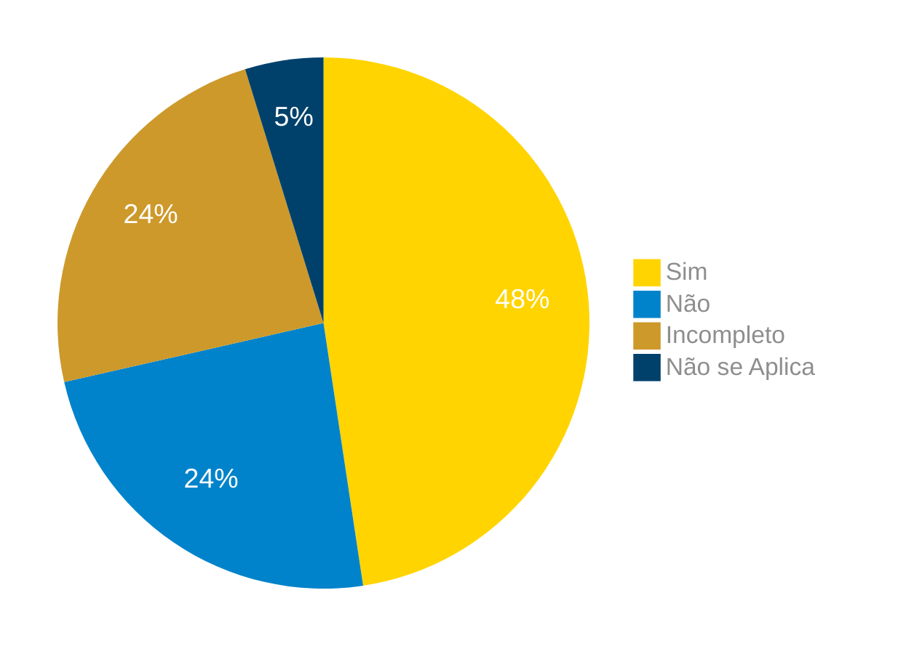

# Verificação da Matriz de Rastreabilidade

## Introdução

Neste artefato, está descrito os resultados da verificação do artefato de [Matriz de Rastrabilidade](https://requisitos-de-software.github.io/2024.1-Correios/pos-rastreabilidade/matriz/) feito pelo [Grupo 03](https://requisitos-de-software.github.io/2024.1-Correios/) da disciplina de Requisitos de Software referente ao aplicativo [Correios](https://www.correios.com.br/). Lembrando que o foco não é apontar quem errou e sim os problemas presentes no artefato produzido, e por fim garantir os critérios de qualidade estabelecidos.

## Metodologia

Este artefato foi produzido por [Gabriel F. J. Silva][GabrielFGH] e verificado por [Elias F. Olvieira][EliasGH], seguindo a divisão planejada pelo grupo na [reunião 7](https://requisitos-de-software.github.io/2024.1-Correios/atas/ata7/). Para a verificação do artefato, foi utilizada a versão `1.0` datada do dia 24/06/2024. Adotamos a metodologia de inspeção por [checklist](#checklist-de-verificacao) neste processo. Podemos ver pela Tabela 1 de exemplo, que para cada item do checklist teremos: descrição do item em verificação, resposta à avaliação (pode ser "Sim", "Não", "Incompleto" ou "Não se Aplica"), o número da referência bibliográfica e um link para um print da referência que o fundamenta o item. Ao final, na seção de [Problemas Encontrados](#problemas-encontrados), são comentados os itens negativos.

Tabela 1 - Perguntas elaboradas de acordo com as referências bibliográficas.

| ID | Descrição | Avaliação | Referência | Print |
|:--:| --------- | :-------: | :--------: | :---: |
| **1** | A matriz faz a ligação dos requisitos com os artefatos relacionados à ele durante o desenvolvimento do projeto? |  | [1.](#ref1) e [2.](#ref2) | [página 126][ref1-pg126] e [página 13][ref2-pg13] |
| **2** | A matriz faz a ligação dos requisitos com as suas fontes? |  | [1.](#ref1) | [página 126][ref1-pg126] |
| **3** | A matriz apresenta possíveis interdepêndencias entre requisitos funcionais e não-funcionais? |  | [2.](#ref2) | [página 13][ref2-pg13] |

Fonte: [Gabriel F. J. Silva][GabrielFGH], 2024.

## Apresentação dos Dados

Aqui será apresentado os resultados do checklist e logo após as observações dos itens com resultado negativo.

### Checklist de verificação

Tabela 2 - Checklist preenchido na verificação

| ID | Descrição | Avaliação | Referência | Print |
|:--:| --------- | :-------: | :--------: | :---: |
| **1** | A matriz faz a ligação dos requisitos com os artefatos relacionados à ele durante o desenvolvimento do projeto? | Sim. | [1.](#ref1) e [2.](#ref2) | [página 126][ref1-pg126] e [página 13][ref2-pg13] |
| **2** | A matriz faz a ligação dos requisitos com as suas fontes? | Sim. | [1.](#ref1) | [página 126][ref1-pg126] |
| **3** | A matriz apresenta possíveis interdepêndencias entre requisitos funcionais e não-funcionais? | Não. | [2.](#ref2) | [página 13][ref2-pg13] |

Fonte: [Elias F. Olvieira][EliasGH], 2024.

### Gravação da verificação

<!-- para o iframe do vídeo, bote width = 560 e height = 315 -->

    <iframe width="560" height="315" src="https://www.youtube.com/embed/MkWgCZJlnTs" title="Apresentação 7 Interação Humano Computador 2024.1 - Grupo 3" frameborder="0" allow="accelerometer; autoplay; clipboard-write; encrypted-media; gyroscope; picture-in-picture; web-share" referrerpolicy="strict-origin-when-cross-origin" allowfullscreen></iframe>

    <a href="https://youtu.be/MkWgCZJlnTs"> Link para o vídeo </a>

### Problemas Encontrados

<!--- Aqui será apresentado todos os problemas identificados durante o processo de verificação do artefato de link do artefato. --->

- ID 03: Descrição
    - Avaliação: Não.
    - Comentário: O artefato não apresenta uma relação de interdependência entre os requisitos funcionais e não-funcionais.

### Sumário dos resultados

<!-- Conte as quantidade de ocorrencias e coloque no Grafico a quantidade em cada tipo de avaliação (se não ouver incidencia de um tipo como "não se aplica", apague a linha do mesmo)-->
A seguir, apresentamos a Figura 1 com o gráfico de pizza do sumário dos resultados.

Figura 1 - Gráfico de pizza do sumário dos resultados.

Fonte: [Elias F. Olvieira][EliasGH], 2024.

## Bibliografia

> 1.  Pohl, Klaus; Rupp, Chris. **Requirements engineering fundamentals : a study guide for the certified professional for requirements engineering exam, foundation level, IREB compliant, 2nd edition** . International Requirements Engineering Board, 2015. Acesso em: 30 de junho de 2024.
> 2. SAYÃO, Miriam; LEITE, Julio. **Rastreabilidade de Requisitos**. PUC-Rio: Departamento de Informática, ISSN 0103-9741, Rio de Janeiro, 2005. Disponível em: https://www-di.inf.puc-rio.br/~julio/rastre.pdf. Acesso em: 30 de junho de 2024.

## Histórico de Versões

| Versão | Data | Descrição | Autor(es) | Revisor(es) |
| :----: | :--: | --------- | ----------- | ------ |
| `1.0`  | 30/06/2024 | Criação do documento | [Gabriel F. J. Silva][GabrielFGH] | [Claudio H.][ClaudioGH] |

[ClaudioGH]: https://github.com/claudiohsc
[DaniloGH]: https://github.com/Danilo-Carvalho-Antunes
[EliasGH]: https://github.com/EliasOliver21
[GabrielBGH]: https://github.com/Bertolazi
[GabrielFGH]: https://github.com/MMcLovin
[PabloGH]: https://github.com/pabloheika
[RicardoGH]: https://www.github.com/avmricardo

[ref1-pg126]: ../../../assets/prints_verificacao/gabrielF/Matriz%20ref1%20-%20pg126.jpeg
[ref2-pg13]: ../../../assets/prints_verificacao/gabrielF/Matriz%20ref2%20-%20pg13.jpeg