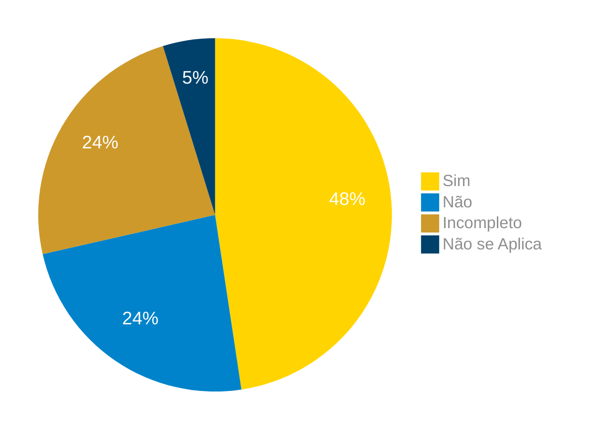

# Verificação do Artefato Rich Picture

## Introdução

Neste artefato, está descrito os resultados da verificação do artefato de [Rich Picture](https://requisitos-de-software.github.io/2024.1-Correios/pre-rastreabilidade/richpicture/) feito pelo [Grupo 03](https://requisitos-de-software.github.io/2024.1-Correios/) da disciplina de Requisitos de Software referente ao aplicativo [Correios](https://www.correios.com.br/). Lembrando que o foco não é apontar quem errou e sim os problemas presentes no artefato produzido, e por fim garantir os critérios de qualidade estabelecidos.

## Metodologia

Este artefato foi produzido por [Danilo][DaniloGH] e verificado por [Elias][EliasGH], seguindo a divisão planejada pelo grupo na [reunião 7](https://requisitos-de-software.github.io/2024.1-Correios/atas/ata7/). Para a verificação do artefato, foi utilizada a versão `1.2` datada do dia 14/04/2024. Adotamos a metodologia de inspeção por [checklist](#checklist-de-verificacao) neste processo. Podemos ver pela Tabela 1 de exemplo, que para cada item do checklist teremos: descrição do item em verificação, resposta à avaliação (pode ser "Sim", "Não", "Incompleto" ou "Não se Aplica"), o número da referência bibliográfica e um link para um print da referência que o fundamenta o item. Ao final, na seção de [Problemas Encontrados](#problemas-encontrados), são comentados os itens negativos.

Tabela 1 - Perguntas elaboradas de acordo com as referências bibliográficas.

| ID | Descrição | Avaliação | Referência | Print |
|:--:| --------- | :-------: | :--------: | :---: |
| **1** | O artefato possui os 5 componentes necessários para um Rich Picture, sendo eles atores, operações, dados, fluxo e limite? |  | [2.](#ref1) | [página 4](../../../assets/prints_verificacao/danilo/Pagina4.RichPicture.jpeg) |
| **2** | O artefato utiliza imagens e diagramas para representar conceitos e relações de maneira clara e eficaz? |  | [2.](#ref1) | [página 2](../../../assets/prints_verificacao/danilo/Pagina2.RichPicture.jpeg) |
| **3** | O artefato identifica todos os atores relevantes no domínio do problema? |  | [2.](#ref1) | [página 4](../../../assets/prints_verificacao/danilo/Pagina4.RichPicture.jpeg) |
| **4** | O artefato especifica as operações que cada ator deve realizar? |  | [2.](#ref1) | [página 4](../../../assets/prints_verificacao/danilo/Pagina4.RichPicture.jpeg) |
| **5** | O artefato mostra claramente os requisitos de dados de cada operação? |  | [2.](#ref1) | [página 4](../../../assets/prints_verificacao/danilo/Pagina4.RichPicture.jpeg) |
| **6** | O artefato define claramente a direção do fluxo de dados entre atores, operações e armazenamentos de dados? |  | [2.](#ref1) | [página 4](../../../assets/prints_verificacao/danilo/Pagina4.RichPicture.jpeg) |
| **7** | O artefato inclui uma linha de limite do sistema para definir a área de responsabilidade? |  | [2.](#ref1) | [página 4](../../../assets/prints_verificacao/danilo/Pagina4.RichPicture.jpeg) |
| **8** | O artefato está livre de excessiva verbosidade, mantendo o foco em imagens e diagramas? |  | [2.](#ref1) | [página 2](../../../assets/prints_verificacao/danilo/Pagina2.RichPicture.jpeg) |
| **9** | O artefato foi desenvolvido iterativamente, com edições e melhorias ao longo do tempo? |  | [2.](#ref1) | [página 2](../../../assets/prints_verificacao/danilo/Pagina2.RichPicture.jpeg) |

Fonte: [Danilo Carvalho Antunes](DaniloGH), 2024.

## Apresentação dos Dados

Aqui será apresentado os resultados do checklist e logo após as observações dos itens com resultado negativo.

### Checklist de verificação

Tabela 2 - Verificação.

| ID | Descrição | Avaliação | Referência | Print |
|:--:| --------- | :-------: | :--------: | :---: |
| **1** | O artefato possui os 5 componentes necessários para um Rich Picture, sendo eles atores, operações, dados, fluxo e limite? | Sim. | [2.](#ref1) | [página 4](../../../assets/prints_verificacao/danilo/Pagina4.RichPicture.jpeg) |
| **2** | O artefato utiliza imagens e diagramas para representar conceitos e relações de maneira clara e eficaz? | Sim. | [2.](#ref1) | [página 2](../../../assets/prints_verificacao/danilo/Pagina2.RichPicture.jpeg) |
| **3** | O artefato identifica todos os atores relevantes no domínio do problema? | Sim. | [2.](#ref1) | [página 4](../../../assets/prints_verificacao/danilo/Pagina4.RichPicture.jpeg) |
| **4** | O artefato especifica as operações que cada ator deve realizar? | Sim. | [2.](#ref1) | [página 4](../../../assets/prints_verificacao/danilo/Pagina4.RichPicture.jpeg) |
| **5** | O artefato mostra claramente os requisitos de dados de cada operação? | Sim. | [2.](#ref1) | [página 4](../../../assets/prints_verificacao/danilo/Pagina4.RichPicture.jpeg) |
| **6** | O artefato define claramente a direção do fluxo de dados entre atores, operações e armazenamentos de dados? | Sim. | [2.](#ref1) | [página 4](../../../assets/prints_verificacao/danilo/Pagina4.RichPicture.jpeg) |
| **7** | O artefato inclui uma linha de limite do sistema para definir a área de responsabilidade? | Sim. | [2.](#ref1) | [página 4](../../../assets/prints_verificacao/danilo/Pagina4.RichPicture.jpeg) |
| **8** | O artefato está livre de excessiva verbosidade, mantendo o foco em imagens e diagramas? | Sim. | [2.](#ref1) | [página 2](../../../assets/prints_verificacao/danilo/Pagina2.RichPicture.jpeg) |
| **9** | O artefato foi desenvolvido iterativamente, com edições e melhorias ao longo do tempo? | Incompleto. | [2.](#ref1) | [página 2](../../../assets/prints_verificacao/danilo/Pagina2.RichPicture.jpeg) |

Fonte: [Elias F. Oliveira][EliasGH], 2024.

### Gravação da verificação

    <iframe width="560" height="315" src="https://www.youtube.com/embed/w9-kGdLJ5ZY" title="Apresentação 7 Interação Humano Computador 2024.1 - Grupo 3" frameborder="0" allow="accelerometer; autoplay; clipboard-write; encrypted-media; gyroscope; picture-in-picture; web-share" referrerpolicy="strict-origin-when-cross-origin" allowfullscreen></iframe>

    <a href="https://youtu.be/w9-kGdLJ5ZY"> Link para o vídeo </a>

### Problemas Encontrados

- ID 09: O artefato foi desenvolvido iterativamente, com edições e melhorias ao longo do tempo?
    - Avaliação: Incompleto.
    - Comentário: Mesmo tendo passado um longo período desde ultima e única modificação no rich picture, até agora não foram feitos novas mudanças.

### Sumário dos resultados

<!-- Conte as quantidade de ocorrencias e coloque no Grafico a quantidade em cada tipo de avaliação (se não ouver incidencia de um tipo como "não se aplica", apague a linha do mesmo)-->
A seguir, apresentamos a Figura 1 com o gráfico de pizza do sumário dos resultados.

Figura 1 - Gráfico de pizza do sumário dos resultados.

Fonte: [][], 2024.

## Bibliografia

> 1. Barbosa, S. D. J.; Silva, B. S. da; Silveira, M. S.; Gasparini, I.; Darin, T.; Barbosa, G. D. J. (2021) Interação Humano-Computador e Experiência do usuário. Autopublicação. ISBN: 978-65-00-19677-1. 

> 2. Introducing Rich Pictures - Rich Picture Drawing Guidelines (Diretrizes para desenhar Rich Pictures)Arquivo

## Histórico de Versões

| Versão | Data | Descrição | Autor(es) | Revisor(es) |
| :----: | :--: | --------- | ----------- | ------ |
| `1.0`  | 29/06/2024 | Criação do documento | [Danilo Carvalho Antunes][DaniloGH] | [Gabriel B.][GabrielBGH] |

[ClaudioGH]: https://github.com/claudiohsc
[DaniloGH]: https://github.com/Danilo-Carvalho-Antunes
[EliasGH]: https://github.com/EliasOliver21
[GabrielBGH]: https://github.com/Bertolazi
[GabrielFGH]: https://github.com/MMcLovin
[PabloGH]: https://github.com/pabloheika
[RicardoGH]: https://www.github.com/avmricardo